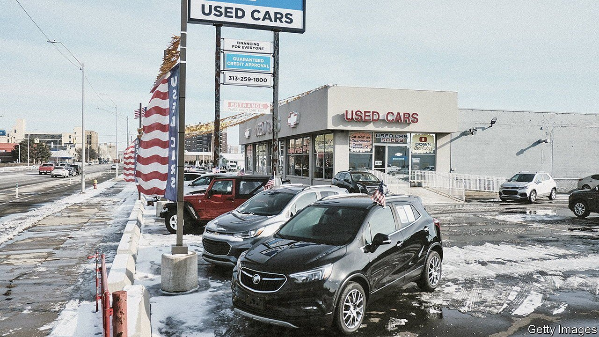
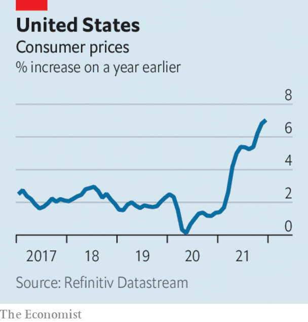

###### The world this week

# Business 

#####  

 

> Jan 13th 2022 

 


America’s annual rate of  inflation jumped to 7% in December, its highest level since June 1982. Several factors are sustaining rising prices, including a tighter labour market. The unemployment rate dropped to 3.9% at the end of 2021; average hourly wages rose by almost 5%. Jerome Powell, chairman of the Federal Reserve, this week described inflation as a “severe threat” to the economy, and reiterated his commitment that the Fed is ready to increase interest rates, and at a fast pace if need be. “It’s a long road to normal from where we are,” he said.

The IMF told emerging economies to prepare for the Fed’s policy tightening, warning that faster rate increases could unsettle global markets, and may lead to capital outflows and currency depreciation in those countries.


The euro zone’s annual inflation rate crept up to 5% last month, another record high for the currency bloc. Energy prices were again the main factor. Wholesale natural-gas prices surged in December, and were up again this week, in a market that is acutely sensitive to , which provides about half of the EU’s gas imports.

Argentina’s central bank raised its key interest rate from 38% to 40%. In December the IMF suggested Argentina’s “appropriate” monetary policy would be to lift interest rates above inflation, which is running at an annual rate of 51%.

Take-Two Interactive, the company behind console games such as “Grand Theft Auto” and “Red Dead Redemption”, agreed to buy Zynga, a pioneer in mobile gaming that is best known for titles such as “FarmVille” and “Mafia Wars”, in a deal worth $12.7bn.

A financial incentive

Citigroup was reportedly preparing to fire, by the end of January, employees who have not been vaccinated against covid-19 (unless they are exempt). Around 90% of the bank’s staff in America have been jabbed. That number is expected to go up soon.

Car sales rose in China last year for the first time since 2017, driven by sales of electric and plug-in hybrid vehicles, which were up by 170%. New-energy vehicles made up 15% of overall passenger-car sales.

America’s National Labour Relations Board said that a new vote for workers at an Amazon warehouse in Alabama on whether to unionise will begin on February 4th and last two months. The retailer is adamantly opposed to letting the unions in. A vote at the Alabama facility last year, which was seen as a crucial test for supporters of unionisation, resulted in a resounding no, but amid claims of worker intimidation the NLRB decided there should be a re-run. In December Amazon reached an agreement with the NLRB to make it easier for its employees to organise.

Despite the easing of travel restrictions in the latter half of 2021, Heathrow airport said that its passenger numbers were lower last year than in 2020, when lockdowns were first rolled out. Flights to Asia, where some borders remain shut, were down by 40%. The emergence of Omicron in December led to a wave of cancellations.

The government of India stepped in to rescue Vodafone Idea, the country’s third-largest mobile provider. The company has lost tens of millions of subscribers in a price war that started when low-cost Jio entered the market in 2016. The rescue plan will leave the state as Vodafone Idea’s biggest shareholder with a stake of 36%, and dilute the holdings of its other big investors, Vodafone Group, a British company, and Aditya Birla, an Indian conglomerate.

Storms and floods caused substantially higher losses for insurers in 2021, the industry’s fourth-costliest year ever for natural disasters, according to Munich Re. Assets worth $280bn were destroyed around the world, almost half of that sum in America. Hurricane Ida resulted in $65bn-worth of overall losses, the flooding in Germany $54bn, winter storms and frosts in the United States $30.1bn, floods in China’s Henan province $16.5bn and an earthquake in Japan $7.7bn.

The sentencing of Elizabeth Holmes, recently convicted for fraud at Theranos, will take place in September. The delay is linked to “ongoing proceedings in a related matter”, according to a court filing.

Corporate purpose statement

Unilever, which has pushed the mantra of environmentalism and sustainability more than most, came in for some withering criticism from an investor. Pointing to the poor performance of the conglomerate’s stock, Fundsmith, an investment firm based in London, said Unilever was “obsessed” with displaying its credentials. Referring to one of its best-known brands, Fundsmith observed that a “company which feels it has to define the purpose of Hellmann’s mayonnaise has in our view clearly lost the plot.”

