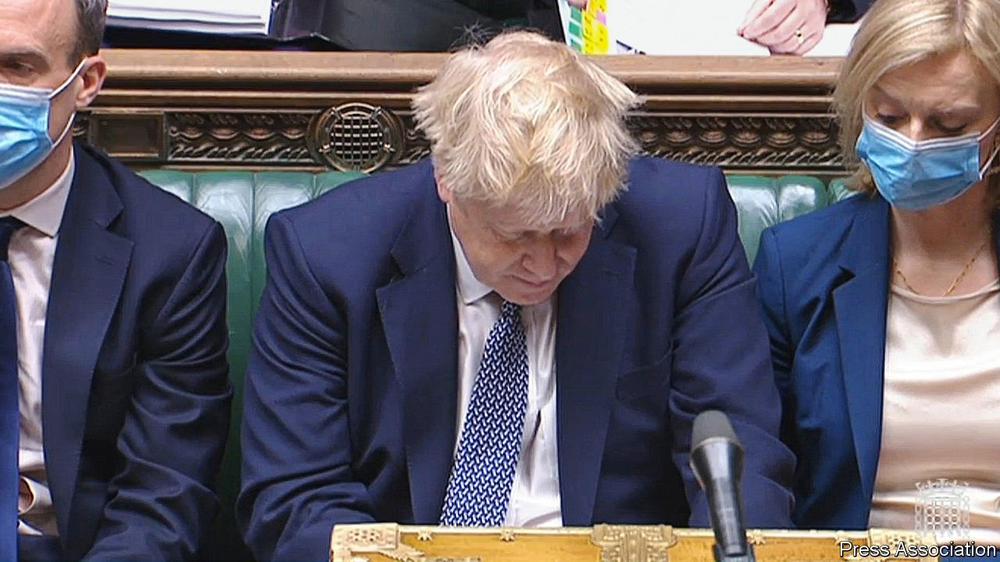
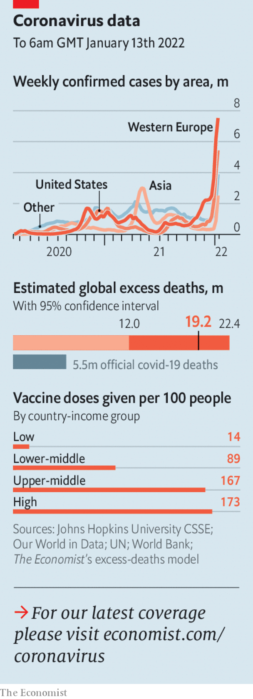

###### The world this week

# Politics 

#####  

 

> Jan 13th 2022 

 as more evidence emerged of Downing Street’s disregard for stringent restrictions introduced early in the pandemic. In an excruciating appearance before the House of Commons the British prime minister struggled to explain why he attended a bring-your-own-booze get-together in Number 10’s garden in May 2020, when people were allowed to meet only one other person outdoors. He described it as a “work-related” event. Some MPs in his Conservative Party called on him to resign.


Negotiations between Russia and America over the future of  were inconclusive. Vladimir Putin, Russia’s president, has demanded a veto over future NATO expansion, and an end to NATO military aid to countries such as Ukraine, which he currently threatens. America refused, but offered to talk about arms control. Mr Putin deployed more military hardware to the Ukrainian border, where he has stationed an estimated 100,000 troops.

Other , shored up the rule of its president, Kassym-Zhomart Tokayev. After a mob seized an airport, Mr Tokayev had requested help from a military alliance of former Soviet states. He blamed the unrest on “terrorists” and unspecified foreigners. Many observers suspected the violence stemmed from a power struggle between Mr Tokayev and Nursultan Nazarbayev, his predecessor and patron. Russia said that order had been largely restored and it would start pulling back its troops.

A court in Germany sentenced Anwar Raslan, a former Syrian colonel, to life in prison for crimes against humanity. Mr Raslan was linked to the torture of more than 4,000 people at a prison in Syria. He had sought refuge in Germany after defecting from the Assad regime. It was the world’s first criminal case involving state-sponsored torture in Syria.

David Sassoli, the president of the European Parliament, died from complications following a bout of pneumonia. Mr Sassoli, an Italian social democrat, had fought to increase the parliament’s power as a way of deepening the EU’s democratic accountability.

Polish prosecutors vowed to charge the head of Poland’s independent judges association, for recommending in an interview that Poland comply with rulings made by the EU’s top court and curb political meddling with the judiciary. The prosecutors demanded that a news website turn over records of the interview.

Hungary for change

A general election in Hungary will be held on April 3rd, the government said. An alliance of all major opposition parties is trying to unseat Viktor Orban, the illiberal populist who has been the country's prime minister since 2010.

Pedro Sánchez, Spain’s prime minister, called on the EU to consider reclassifying covid-19 as an endemic disease rather than a pandemic. He hopes to see restrictions loosened. The WHO said it was too soon to declare covid endemic. It added that half of Europe could catch Omicron within two months.

Aung San Suu Kyi, Myanmar’s de facto leader until a coup last February, was found guilty by a military court of breaking covid rules and possessing walkie-talkies. She was sentenced to four years. A previous ruling found her guilty of other trumped-up charges.

North Korea tested what it claimed was a hypersonic missile. It was the second test within a week and the third of a missile with hypersonic capabilities. America imposed sanctions on five North Koreans who it says are part of the weapons programme.

The UN halted aid work in parts of ’s Tigray region because of air strikes by the government. Little food, medicine or aid has reached Tigray since the start of a civil war more than a year ago, leaving millions of people at risk of starving.

West African countries imposed economic sanctions and closed their borders with Mali after the junta running the country said it would delay elections to late 2025, instead of holding them in February this year as promised.

Joe Biden pressed Republicans in the Senate to back reforms of electoral procedures, claiming that American democracy was at a crossroads. A pair of bills under consideration would make election day a holiday, and give the federal government more power to step in if states try to limit methods of voting, such as postal ballots. Mr Biden said Senate Democrats would stop Republicans from filibustering the legislation.

California’s governor, Gavin Newsom, laid out a plan that would extend Medicaid, a federal-state health-insurance programme for hard-up people, to illegal immigrants, regardless of age. If it passes, California would be the first American state to allow this.

Doctors in Baltimore carried out the . The pig had been genetically modified to reduce the chance of its heart being rejected. Pigs’ heart valves are already used in medical procedures.

 


The premier of Quebec said that his government would soon impose a “significant” tax on residents of the Canadian province who refuse to be vaccinated, arguing that they put a financial burden on people who have been jabbed.

Tianjin, a city just 100km from Beijing, was subjected to tighter restrictions, after the first locally transmitted cases of the Omicron variant of covid-19 in China were detected. The government is ramping up its zero-covid strategy ahead of the Beijing Winter Olympics. Three port workers in Dalian, another northern city, were jailed for between 39 and 57 months for not wearing protective gear while handling cargo.

Double fault

The saga over whether  can remain in Australia played out like a tennis rally. Although a judge said the unvaccinated Serb could stay, the government was less keen. Amid the back and forth covid cases surged in Melbourne, which hosts the Australian Open.

