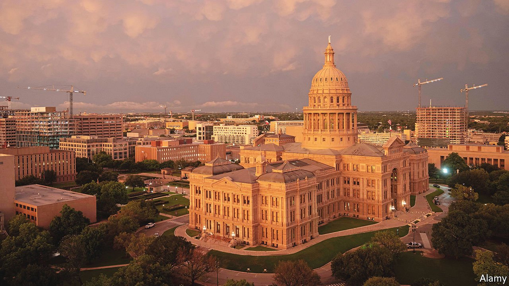

###### An American boom town

# As Austin thrives as a tech hub, will it avoid San Francisco’s problems? 

##### The capital of Texas will have to grapple with the downsides of growth 

 

> Jan 15th 2022 

ELON MUSK has predicted that Austin will be “the biggest boom town that America has seen in 50 years”. From 2010 to 2020 its metro area had the second-fastest growth in the country—its population expanded by a third. Already America’s 11th-largest city, Austin could soon displace Silicon Valley’s San Jose in the top ten.

If the proliferation of oil rigs was once the symbol of Texas’s vibrancy, today it is the number of cranes assembling new skyscrapers in Austin, muses Evan Smith, boss of the  Texas Tribune, a newspaper. Meta, née Facebook, recently confirmed expansion plans there, leasing 33 floors in what will be the city’s tallest building when completed next year. Mr Musk’s Tesla and Oracle, a software giant, have moved their headquarters to Texas’s capital city.


Bay Area residents have flocked there, seeking a higher quality of life in a place with no state income tax, lower housing costs and fewer covid-19 restrictions. Austin’s politics are the closest to San Francisco’s of any Texan city. Austinites embrace the motto “Keep Austin Weird”, cultivating a funky creativity. University of Texas (UT) at Austin helps churn out brainy workers. Jay Hartzell, UT’s president, is the former dean of the business school and promotes close ties with local firms.

Jim Breyer, a prominent venture capitalist, created a second headquarters for his investment firm in Austin and moved there himself after noticing that younger entrepreneurs were put off by the Bay Area’s high cost of housing. “The Bay Area is untouchable when it comes to the next-generation, deep technologies around AI and quantum and the venture opportunities,” he predicts. But he wanted a base somewhere where young people building companies could afford to live.

The arrival of Californians and others is leading to problems that are similar to San Francisco’s but on a smaller scale. Austin has some of the worst congestion of any Texan city. Billions of dollars are being spent expanding public transit and widening a major thoroughfare, but such projects will take years. “We don’t have those things yet, and we still have more people coming, so there’s going to be an awkward period of time as we go from here to there,” explains Steve Adler, Austin’s mayor.

After voters decriminalised public camping in 2019, homelessness became more visible in Austin, with people occupying parks and public spaces in scenes reminiscent of San Francisco. Last May voters reinstated a ban, making it illegal for the homeless to camp in public spaces. Most public spaces have been cleared.

But the problem of homelessness remains, and the rising cost of housing could make it worse. Between March 2020 and November 2021 the average home value in Austin increased by 56% (the second-biggest jump of any city or town after Kalispell, Montana), and a further 20% rise is expected in 2022, according to Zillow, a real-estate firm. In October mortgage payments as a share of income were the eighth-least-affordable of any metro area in America. UT has begun paying out signing bonuses to woo professors. “We used to call professors in California and tell them how much they’d save by moving to Austin,” says Mr Hartzell. Now other universities “are playing the trick on us”.

To increase the supply of housing, pro-growth politicians and residents will have to battle a cohort of longtime locals who oppose changing the character of the city. Some think “if we don’t build it, they won’t come”, explains one politician, identifying a form of neighbourhood protectionism similar to the Bay Area’s. The city is trying to enact a change to its zoning code to make it easier to increase density, but residents sued; the case is still making its way through the court. Without more housing, Austin risks losing artists, musicians and the creative class that has made the city so attractive to others, says Mr Adler.

As it seeks to confront the downside of being a boom town, Austin has a few things going for it. For one, there is a lot of land in driving distance of Austin. Thirty minutes in any direction one can find dwellings that are far more affordable, compared with the more landlocked Bay Area. It is also earlier in its “life-cycle”, which means “the city and state leadership have an opportunity to do things creatively that may very well work,” predicts Mr Breyer. This could include doing more to prioritise infrastructure, housing affordability and the fight against homelessness.

There is also a strong desire among many of Austin’s new arrivals to avoid recreating the Bay Area. “The people who are coming here are very mindful of not repeating the same mistakes,” says Patrick McKenna, a techie who moved from there and is a founder of One America Works, which connects talent with new tech hubs. He warns of the risk of local communities not sharing in the prosperity that tech firms create for their employees and shareholders, as happened in San Francisco, driving inequality and fanning a backlash.

Red and blueberry

Conventional wisdom suggests that as more Californians move to Texas, the Lone Star state will become more Democratic. Yet Austin is already blue. (Rick Perry, a former governor, once described Austin as the “blueberry in the tomato soup” of Texas.) Rather than pushing Austin to the left, those leaving California could push the city more to the centre. “The majority of people fleeing California are fans of a free society or more to the right,” says Joe Lonsdale, a venture capitalist, who is also describing himself. He has supported initiatives like reinstating the camping ban and recently launched an anti-woke university.

The mayor’s race in November will be a “Rorschach test for how this city sees itself”, says Mr McKenna. Mr Adler is unable to run due to term limits. Many expect a business-friendly moderate to win. ■

