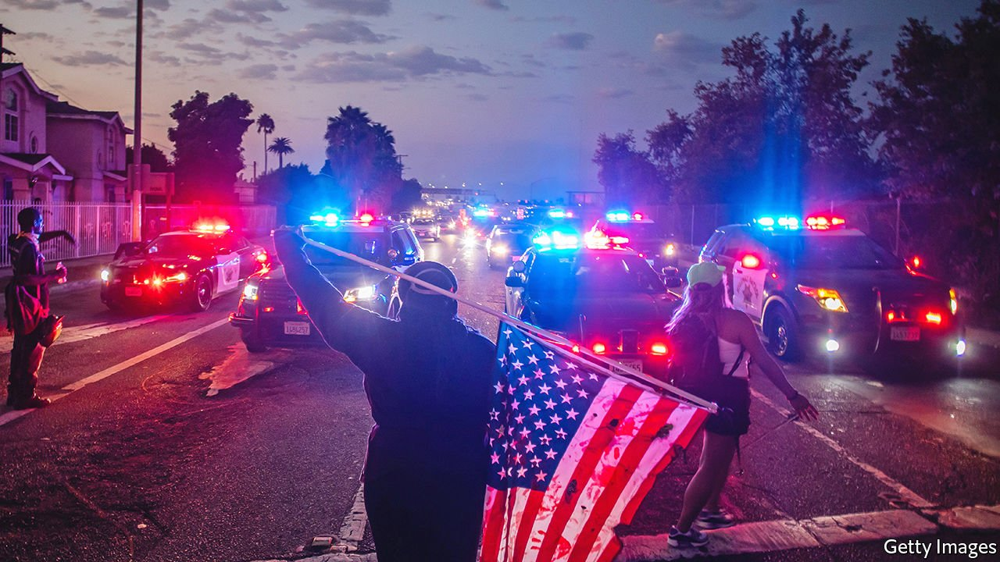
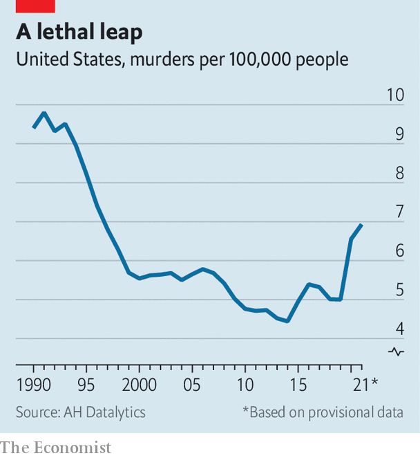

###### Refunding the police

# As violent crime leaps, liberal cities rethink cutting police budgets 

##### The tricky politics of criminal-justice reform at a time of rising fears 

 

> Jan 15th 2022 

IN THE DAYS after George Floyd was murdered by a Minneapolis police officer in May 2020, protesters took to the streets across America. They urged cities to “defund the police”, and politicians listened. Eric Garcetti, the mayor of Los Angeles, called for his department’s budget to be cut by up to $150m. London Breed, San Francisco’s mayor, announced that she would “redirect funding from the SFPD to support the African-American community”. City councils in Oakland and Portland, Oregon, among other cities across America, approved budgets that cut police funding.

That trend has reversed. Portland and Oakland increased police funding to hire more officers. The Los Angeles Police Department’s budget will get a 12% boost. Last month Ms Breed vowed to “take steps to be more aggressive with law enforcement” and “less tolerant of all the bullshit that has destroyed our city”. Why such a stark reversal, and what does it mean for the future of criminal-justice reform?


The first question is easy to answer. Though crime overall did not rise during the pandemic, the type people fear most—murders and shootings—did, and the surge has not abated. Over three decades from 1990, America’s homicide rate fell steeply (see chart). From 2019 to 2020, however, the rate had its highest-ever year-on-year rise, of nearly 30%, followed by a further rise in 2021. More than three-quarters of the murders were committed with guns. In Oakland, 133 people were murdered in 2021, more than in any year since 2006, and almost 600 more were shot but not killed. Portland was one of at least 16 American cities that set all-time homicide records last year.

 


The cause of this leap in violent crime is unclear. It probably stems from a combination of factors: soaring gun sales; financial stress; fewer bystanders and witnesses; pandemic-driven closure of schools, community centres and other institutions that gave young people things to do and a place to go; thinned police ranks caused by covid; and police being less proactive in the wake of widespread protests.

The murder spike has left reform-minded elected officials in an awkward position. But cities’ decision to back away from reducing police budgets is not purely political. No evidence suggests a relationship between the size of a police force and the number of people its officers kill; ample evidence suggests that bigger and better-funded forces tend to reduce violent crime. Murders can rise or fall for reasons outside police control, but if a city wants to drive down its murder rate, hiring more officers seems a reasonable place to start.

That does not mean any hope of criminal-justice reform is dead. David Muhammad, who heads the National Institute for Criminal Justice Reform, a research and advocacy group, says the current environment requires “more nuanced ways in which we explain the need for criminal-justice reform”. Many people in high-crime neighbourhoods reject defunding, and call for more but better-trained police who spend more time solving serious crimes. The slogan “defund the police” is also politically toxic. Joe Biden opposed it. Lots of Democrats blame it for nearly costing them their narrow congressional majorities in 2020.

Yet the policies that reformists advocate are often popular. Criminal-justice reform is one of the few policy areas in which the centre is actually holding in America. Some 45 states, conservative and liberal alike, have seen their prison populations decline in recent years. The First Step Act, intended to reduce the federal prison population and improve outcomes for inmates, was one of Donald Trump’s few legislative achievements.

In a Vox/Data for Progress poll taken last April, 63% of voters, including 43% of Republicans, supported redirecting some police funding to create a new agency of first-responders “to deal with issues related to addiction or mental illness”. Banning chokeholds, requiring body-worn cameras, ending qualified immunity (a judicial doctrine that impedes holding police accountable for misconduct) and banning no-knock warrants also received majority support. In the same poll, 63% of respondents also said they trusted the police. “The problem with the defund-the-police movement is that it felt punitive,” notes Aaron Chalfin, a criminologist at the University of Pennsylvania.

Plenty of officers will happily admit that they are not trained to respond to mental-health crises. They have simply become society’s default first responders to any problem not requiring an ambulance or fire truck. And, as Mr Muhammad says, “Police don’t sign up to get kittens out of trees. Officers say they want to focus on serious and violent crimes.” Around half the officers in every department are in patrol units, meaning they respond to calls for things such as home or car alarms, noise complaints and people in distress.

Not all of these require armed officers. Cities including Denver and Olympia, Washington have launched programmes that replace police with trained mental-health responders in some situations. But determining which ones those are in advance is all but impossible. When tragedy strikes, reform’s opponents will pounce. The greater the incidence, and the fear, of violent crime, the more plausible the anti-reform case becomes.

Still, reformers are digging in. New Yorkers elected Eric Adams as their mayor after he distinguished himself from his Democratic rivals by running a strong public-safety campaign, but they also elected Alvin Bragg, a staunch progressive, as Manhattan’s district attorney (Mr Adams’s police commissioner has already taken issue with Mr Bragg’s plans to seek prison time for only a few serious offences). Last November Larry Krasner, a pugnacious reformist district attorney in Philadelphia, thumped his police-union-backed rival in the Democratic primary and his Republican opponent in the election—even as his city set an all-time homicide record.

America’s five biggest cities by population all have progressive district attorneys, as do many smaller places. Mr Krasner estimates that more than one-fifth of America’s population lives in jurisdictions with chief prosecutors who think like him. But all five of those big cities increased police funding. Although voters there oppose an excessively punitive criminal-justice system and support better-trained and more accountable police forces, they also want fewer people shot and killed. ■

For exclusive insight and reading recommendations from our correspondents in America, , our weekly newsletter.

