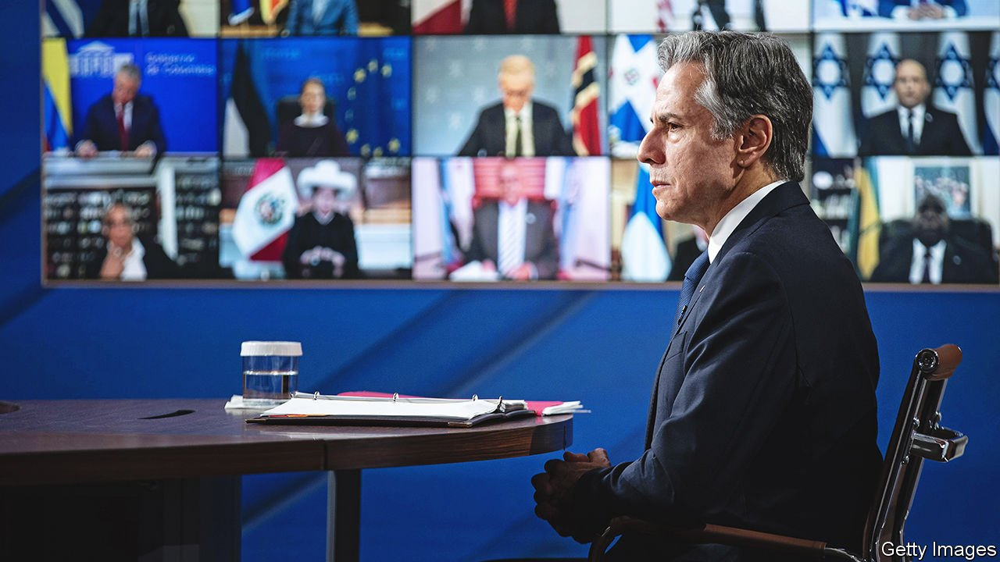

###### America’s missing diplomats

# Can Joe Biden’s relentless diplomacy work without diplomats? 

##### More than one-third of America’s ambassadors are missing from the action 

 

> Jan 15th 2022 

AMERICA’S CAMPAIGN to avert a Russian invasion of  intensified this week, as American and Russian officials met: first bilaterally, then collectively with NATO and at the Organisation for Security and Co-operation in Europe. For all his belief in the power of “relentless diplomacy”, however, President Joe Biden’s team is . He still has no ambassadors in important European capitals such as Berlin, London and Rome. Strikingly, there is no envoy in Ukraine—and has not been since 2019, when Donald Trump removed Marie Yovanovitch amid a scandal that led to his first impeachment (he was accused of illegally exerting pressure on Ukraine to find dirt on Mr Biden and his son, Hunter).

The dysfunction that hampers America’s dealings with the world comes just when Mr Biden wants to tighten alliances to counterbalance rivals. Trouble is brewing in the Middle East as nuclear talks with Iran falter. Yet America has  to any of its major Gulf allies: Saudi Arabia, the United Arab Emirates and Qatar. In Asia, where the contest with China looms largest, there are no envoys in India, the Philippines and Thailand. And though it deploys tens of thousands of troops in South Korea, America does not have an ambassador there either.


In Washington the State Department has no assistant secretaries for the Near East, for international security and non-proliferation, or for arms control. Nor is there a counter-terrorism co-ordinator or a legal adviser. The post of inspector-general, an internal watchdog, has been vacant since Mr Trump fired Steve Linick in 2020.

“This is a huge problem,” Antony Blinken, America’s secretary of state, warned on December 14th. “On virtually every challenge we face, including dealing with Russia, with China, with non-state actors, we’re hampered by the fact that we don’t have our full national-security and foreign-policy team on the field.” More than 30 nominees were confirmed in an end-of-year spurt last month, among them big hitters such as Nicholas Burns as ambassador to China, Rahm Emanuel to Japan and Mark Gitenstein to the European Union. Even so, Mr Biden still has 68 empty ambassadorial positions out of a total 190.

All presidents struggle to fill their administrations. They bring in their train some 4,000 political appointees, of whom about 1,200 must be confirmed by the Senate. On nominations overall, Mr Biden is roughly keeping up with predecessors such as George W. Bush and Barack Obama, according to data from the Partnership for Public Service (PPS), a non-profit group. Yet that is a slothful pace, with only about 460 people named to the 800 most important jobs. In terms of confirming officials in their jobs, though, he is scarcely doing better than the chaotic Mr Trump.

Having the largest number of posts requiring Senate confirmation, the State Department suffers disproportionately. Mr Biden has yet to submit names for about one-quarter of ambassadors. The bigger problem is obstructionism by Republican senators. Between them Josh Hawley of Missouri, Marco Rubio of Florida and, above all, Ted Cruz of Texas have delayed or blocked dozens of nominations, whether to posture or to extract concessions on various foreign-policy demands. Democrats can force confirmations by a full vote in the Senate, but that takes up scarce floor time when they have domestic priorities, such as appointing judges (see box).

It is hard to assess how much damage is being done by the diplomatic vacancies. Much business is conducted directly between foreign ministers or leaders. Other officials can take up the work. But however professional, a chargé d’affaires running an embassy often lacks the clout that comes with being the president’s chosen ambassador, endorsed by the Senate. It is possible that some foul-ups, such as the failure to tell France last summer about the US-British deal to provide nuclear-powered submarines to Australia, pushing out a French contractor, was thanks to poor co-ordination resulting from the absence of senior appointees.

A bipartisan investigation into the terrorist attacks of September 11th 2001 found that delays in appointing key personnel to national-security positions had contributed to America’s failure to prevent them. At the time just over half of the most important national-security personnel were in place. Two decades on, the PPS reckons, Mr Biden had just over a third of the equivalent staff in their jobs.

In many countries, the prolonged diplomatic vacancies are an irritant, or a slight. They feed the perception of America’s withdrawal, if not decline. Mr Biden’s failure even to name an envoy to Ukraine reinforces its worry of being kept at arm’s length. Perhaps Vladimir Putin has read matters similarly. The Biden team wants to signal that he has not forsaken Ukraine, or the security of Europe. But without ambassadors his reassurance is harder to convey—and may sound less convincing. ■

For more coverage of Joe Biden’s presidency, visit our dedicated  and follow along as we track shifts in his . For exclusive insight and reading recommendations from our correspondents in America, , our weekly newsletter.

