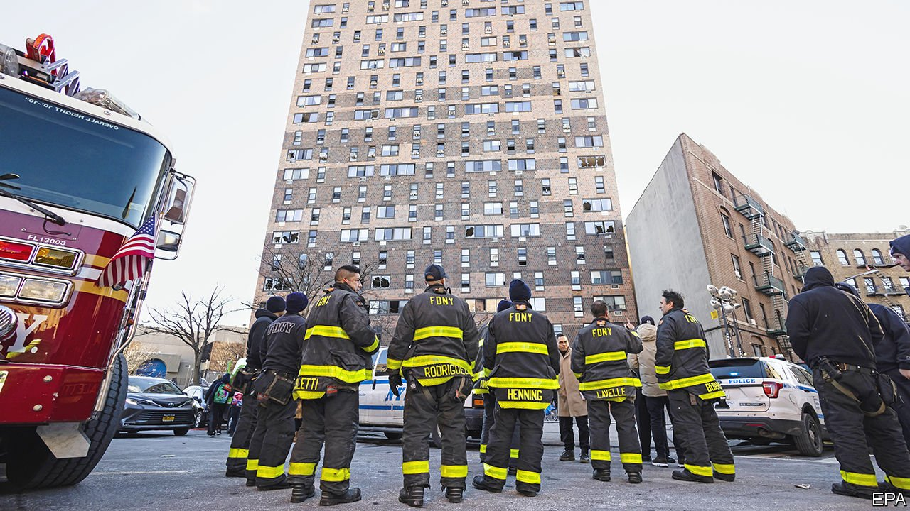

###### Fires

# Deadly blazes reflect America’s failure to adequately house its poor 

##### The real cause of recent deadly fires was poverty 

 

> Jan 13th 2022 

THE SMELL of smoke hung in the air for days after the fire on January 5th that killed 12 members of an extended family. Philadelphia’s mayor called it “one of the most tragic days in our city’s history”. The burnt row house belonged to the city’s public-housing authority. Four days later in the Bronx, a borough of New York City, 17 people were killed and dozens injured in a fire that whizzed through a 19-storey apartment building, home to scores of low-income families who rely on vouchers for federal rent subsidies. Though the circumstances differ—a Christmas tree was accidentally ignited in Philadelphia and a faulty space heater, along with open doors, may have been the culprits in the Bronx—each fire has sparked questions about the state of affordable housing.

In Philadelphia there is a shortage of housing for the 400,000 people living in poverty. Much of the available stock is old and shoddy. Philadelphia’s housing authority (PHA) serves 81,000 people; some 40,000 are on its waiting list, which has been closed for almost a decade.


In the 1950s the PHA began buying up empty row houses around the city. In theory such scattered housing, where people from different income brackets live in the same neighbourhood, is a sound idea, but could be hard for a cash-strapped agency to maintain. The fire was in Fairmount, a former working-class neighbourhood now gentrified by high-earners attracted by the quaint houses on narrow tree-lined streets. Jenna Collins of Philadelphia’s Community Legal Services, an advocacy group, says, “It’s easy to hide the underinvestment outside a really beautiful-looking row home in Fairmount.” The scope of the Philadelphia fire had a lot to do with overcrowding: 26 people were crammed into the house’s two small apartments.

Many of the apartments in the Bronx fire were also crowded and home to poor, multigenerational families, including immigrants from the Gambia. The building, Twin Parks Northwest, was part of an urban-revitalisation plan dreamed up by local clergy at the height of white flight in the 1970s. With help from the state, they built a dozen buildings for renters. When Twin Parks Northwest opened in 1973 it was considered a model of low-income-housing design, with spacious apartments, outdoor areas and nursery-school rooms. But within a few years drugs and crime took over. Fire alarms go off often, so are ignored.

After some lethal blazes, such as that at the Triangle Shirtwaist Factory in 1911, the horror of so many deaths prompted changes to building codes, fire regulations and labour laws. This time the lessons may be missed. The fire department is reminding New Yorkers to close doors behind them when they flee flames. Officials are talking about the need to use space heaters properly, not wondering why the family had to resort to one. In Philadelphia officials revealed that a five-year-old child, who has lost his family, accidentally started the fire. Better to have protected his privacy and wondered why his large family was not accommodated adequately. ■

