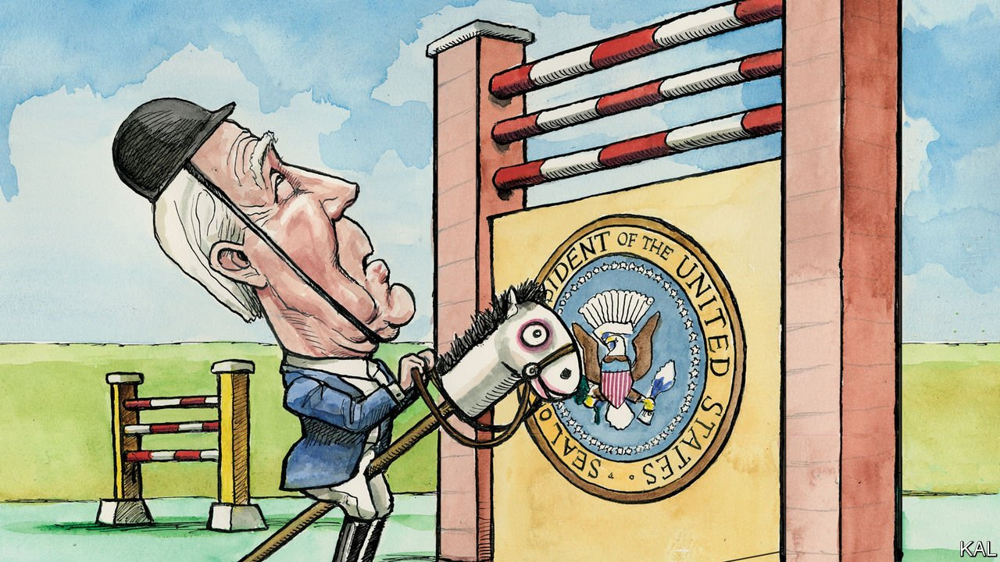

###### Lexington

# Joe Biden was set up to fail 

##### The Democratic president is a flawed politician in an impossible job 

 

> Jan 15th 2022 

HAVE ANY voters demanded more of their leaders than modern Americans? The thought occurred to your columnist while listening to a group of eight Georgians, Ohioans and Pennsylvanians, all aged under 30 and college-educated, opine on President Joe Biden this week. It was not pretty.

“Covid is the worst it’s been and the government is doing basically nothing about it,” said Lydia, speaking from Philadelphia. “We’re not even employing the good parts of Donald Trump, if there were any,” said Desiree, in Atlanta. “I don’t know what kind of powers Biden has,” offered Sara, another Georgian, “but I feel like he should be doing a lot more.” Asked to grade the president, the group, which had been convened remotely by Sarah Longwell, a conservative activist, gave him four Cs, three Ds and an F. And it was not a hostile crowd. All the group’s members were Biden voters, and none regretted their vote. Indeed, if asked to support the president again in 2024, all said glumly, they probably would do.


With friends like these, Mr Biden might ask, who needs a multitude of voters convinced that he is a senile election-stealing socialist? Anyway, he has them. After a year of being informed by conservative bigmouths that the president has dementia, most Republicans believe this to be the case. Together, these disenchanted Democrats and deluded Trump voters have made Mr Biden almost the most unpopular president since records began. A mere 42% of Americans approve of his efforts. Only Mr Trump, on 39% at the same point in his term, was rated worse.

To explain this debacle, most commentators have focused on Mr Biden’s weaknesses. Prolix and error-prone, at once too cautious and too changeable, the 79-year-old rarely set Democratic hearts racing even before he aged, as in recent years he noticeably has. The modesty of his talents was so obvious on the campaign trail that it seemed almost like a perverse selling-point—supporting evidence for his promise to restore low-key normalcy to the government. But with his predecessor out of the picture, for now, that promise appears less compelling. And Americans find themselves being led through tumultuous times by their least charismatic and politically able president since George H.W. Bush.

Tempting as it always is to bash the politician, however, Mr Biden’s shortcomings are only a marginal reason for his unpopularity. The main one is the dismal reality that half the electorate was against him from the get-go. This is a relatively new phenomenon. Mr Trump was the first modern president not to have been backed by a significant minority of his opponent’s supporters early in his term. By contrast, the fact that Mr Biden started out with an approval rate two percentage points higher than his share of the popular vote looked like an achievement. But relentless criticism and disinformation from the right soon reversed that. According to modelling by The Economist, which correlates historical presidential approval ratings with measures of partisanship, a generic president could be expected to have an approval rating of 46% at this point in his first term.

The resurgence of covid-19 and related economic glitches have made that slippage even more unavoidable. Notwithstanding the economy’s overall vigour, an alternative polling model, which correlates presidential approval with inflation and unemployment, also puts the generic president on 46%. That  are even lower than the models predict is probably largely due to the virus itself. Though most of the focus-group participants understood that he has limited power to crack down on the anti-mask, anti-vax mob that have exacerbated America’s covid struggles, most blamed him for not doing so anyway. “If you don’t have someone in charge, there isn’t any control,” said one participant.

This analysis is not to ignore Mr Biden’s mistakes. The debacle in Afghanistan, which helped propel his slide, was a howler. The administration underplayed its achievement in muscling through a trillion-dollar infrastructure upgrade and overestimated its ability to pass additional climate and social spending. It also allowed that package to become defined by its cost, not its contents, and ultimately made a hash of getting it past the mercurial Senator Joe Manchin. Yet the likelihood that a more inspiring president, who made none of those errors, would be almost as unpopular as Mr Biden is, suggests that their importance has been exaggerated.

It follows that Mr Biden’s ability to recover his footing looks limited, notwithstanding a modest improvement in his efforts of late. He has given a few good speeches, including a well-judged jab at his predecessor on the anniversary of the Capitol riot and some remarks on the economic recovery that dwelt sensibly on price rises. Nonetheless, the administration’s hopes of winning back disenchanted Biden voters—the only sort he probably has a fighting chance with—appear naive.

Such disaffected Democrats tend to be relatively young, disengaged and unlikely to consume mainstream media. Only one of the focus group’s members watched cable news; the rest got their facts from social media, where the president’s addresses make little splash. In addition, some in the group displayed such an exaggerated view of presidential power that Mr Biden’s modest expression of empathy and implied admission of failure on inflation seemed destined to leave them cold.

Failure is the only option

This is another new way in which presidents are set up to fail. In response to misleading media coverage and congressional gridlock, many voters, especially on the left, have come to imagine the office possessing “superman powers”—at once awesome and non-existent—says Jeremi Suri, a scholar of the presidency. Burdened by such expectations, it is becoming hard to imagine any mortal making a success of it, let alone the clay-footed Mr Biden. Even if inflation and the virus recede much faster than expected, a mid-terms shellacking for his party looks highly probable. ■

Read more from Lexington, our columnist on American politics: (Jan 8th) (Jan 1st) (Dec 18th)

For coverage of Joe Biden’s presidency, visit our dedicated  and follow along as we track shifts in his . For exclusive insight and reading recommendations from our correspondents in America, , our weekly newsletter.

