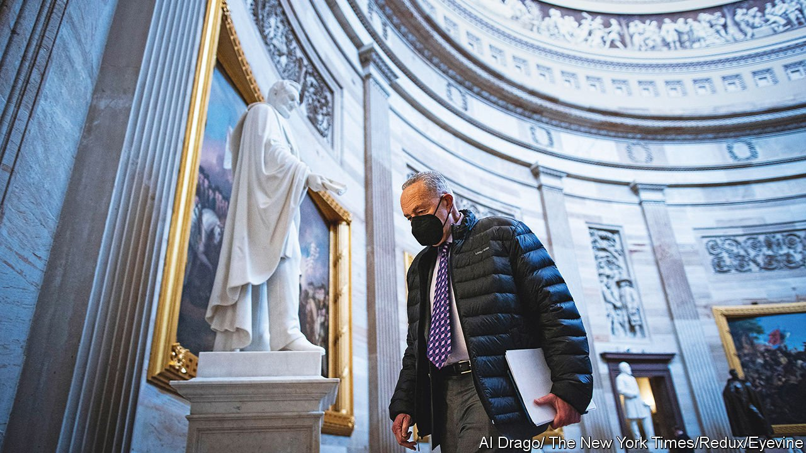

###### Biden’s judges

# More diverse appointments are set to reshape America’s judiciary 

##### Democrats race to fill the courts 

 

> Jan 15th 2022 

DEMOCRATS ARE accustomed to feelings of despair about the increasingly conservative Supreme Court. But in the lower courts President Joe Biden and Senate Democrats have wasted no time filling the federal bench. The 40 judges confirmed so far are the most at this point in a president’s first term since Ronald Reagan, and more than double the mark set by Donald Trump in his first year. Mr Trump filled the judiciary with young, conservative judges, confirming almost as many to the appeals courts in his one term as Barack Obama managed in two. Mr Biden is reshaping the judiciary in a more progressive direction.

This has depended on close co-operation with the party’s leader in the Senate, Chuck Schumer. Along with an ambitious legislative agenda, Mr Schumer has prioritised precious voting time on the Senate floor for judicial appointments—often at the expense of confirming executive-branch officials. A focus on court vacancies in states represented by Senate Democrats has ensured fewer objections from Republicans in committee.


Mr Biden has also elevated a far more diverse range of judges than his predecessors. He has already promoted more black women to the federal appellate courts than any other president—after Mr Trump did not appoint a single black judge for a federal appeals court, the first full-term president not to do so since Richard Nixon. Fully 80% of the appointed judges confirmed are women. Research suggests that such gender and racial diversity is likely to lead to different judgments on affirmative action, workplace discrimination and more.

The judges’ backgrounds also mark a break with the past. For decades, the surest path to becoming a federal judge was to first be a prosecutor or a partner at a major law firm. Mr Biden’s appointments have included more public defenders than those appointed in the first years of his four immediate predecessors combined. Just one confirmed circuit-court judge is a former prosecutor.

This reflects the turn among rank-and-file Democrats towards a more lenient stance on crime in recent years, and a belief that judges have been too friendly to prosecutors. Public defenders, they hope, will bring a different perspective. “Having somebody who has for years stood side-by-side with people who are oftentimes in the worst moments of their lives, that’s an experience not everyone can bring to the bench,” argues Geoff Burkhart of the National Association for Public Defence.

With elections looming in November, and a possible loss of control in the Senate, time is not in Democrats’ favour. John Collins of George Washington University suggests Mr Biden, himself a former chair of the Senate Judiciary Committee, is keenly aware that those appointed today will shape the law for years after he leaves office. A judge in her 30s can be expected to serve for over two decades before retiring. Unlike his recent predecessors, however, Mr Biden has yet to secure the ultimate prize: the appointment of a Supreme Court justice.

For exclusive insight and reading recommendations from our correspondents in America, , our weekly newsletter.

