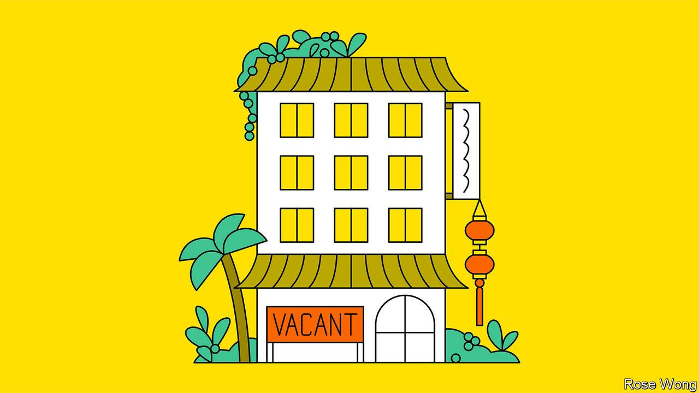

###### Banyan

# Asia’s holiday spots are missing Chinese visitors 

##### China’s strict quarantine rules are keeping them away 

 

> Jan 22nd 2022 

GIANT RED lanterns and long streamers adorn the foyers of Phuket’s resort hotels: the upcoming Chinese (lunar) new year is not to be marked by half-measures. Thailand’s paradise island on the edge of the Andaman Sea went out of its way to reopen to foreign holidaymakers—tour parties of mainland Chinese, above all. Last July it pioneered the use of the “sandbox”: tourists who were jabbed, tested and insured, and who had a bottomless appetite for form-filling and a readiness to submit to two further covid-19 tests, could enter Thailand without quarantine provided they had a resort hotel to stay at for a week. After that, they were free to travel to all other parts of the country.

In Phuket airport staff and health officials are models of polite efficiency. Guests are indeed showing up at the huge hotel at which Banyan is staying, albeit fewer than half as many as before the pandemic. There is no shortage of Europeans, Russians and South-East Asians. But for all the new-year decorations, not a single Chinese holidaymaker, says a manager, has booked to stay. Before the pandemic, in 2019, Chinese made up 12m of Thailand’s 39m international arrivals. The Thai authorities’ prediction in July that 2m foreigners would visit Phuket in the second half of 2021, generating $3.4bn, was predicated on a huge influx of Chinese tourists who never arrived.


Although Omicron has set back plans, much of South-East Asia remains committed to reopening to holidaymakers. Travel and tourism accounted for over 12% of the region’s GDP before the pandemic. Yet Chinese tourists will remain the rarest birds, for a simple reason. The government in Beijing has a zero-covid policy. When a few infections crop up, it locks down whole cities to contain them. It discourages travel abroad (mandating that international flights be cut to 2.2% of pre-covid levels for the winter season) and imposes strict and lengthy quarantines on those returning home. This approach is driven by politics as well as health. The government wants the (spectator-free) winter Olympics to go off smoothly next month. Later in the year the Communist Party holds a crucial five-yearly congress at which President Xi Jinping’s already considerable powers and personality cult will be elevated further. Not even a pesky germ may cross him.

It is the last straw for the region’s already troubled tourist industries. Before the pandemic, Chinese were the most numerous visitors in nearly every Asian country. Japan, Singapore, South Korea, Thailand and Vietnam were among their top ten destinations worldwide.

For richer economies, the impact is less severe. In Japan domestic travellers spent over four times the ¥22trn ($192bn) disbursed by foreigners in 2019. On South Korea’s balmy southern island of Jeju, Koreans holidaying close to home have replaced hordes of Chinese. Still, some businesses are in pain. Chinese visitors to Japan multiplied more than sixfold in the seven years to 2019. When they vanished, over a dozen shops closed in one newish mall alone in Ginza, Tokyo’s ritzy shopping district. Myeongdong, its equivalent in Seoul, is deserted.

Elsewhere, busloads of Chinese once could not get enough roast duck and fried rice in Singapore’s (overpriced) Chinatown food street. Now it has shut down. In Bangkok’s Or Tor Kor market, tables once groaned with durians for Chinese buyers; now stallholders have to borrow to stay afloat. In Cambodia the temples of Angkor Wat are eerily empty. Like tiny Laos next door, which saw nearly 900,000 Chinese visitors in 2019, Cambodia badly needs Chinese income, not least to help service its growing infrastructure debts to China.

The Chinese absence is not universally regretted. Chinese tour parties have appalled locals with their poor etiquette. In Thailand and Vietnam shoving matches have erupted as holidaymakers raid hotels’ seafood buffets. In Seoul Chinese tourists would stride unbidden into university libraries, photographing the students working there. In Kaohsiung airport in Taiwan one mother notoriously let her child defecate on the floor rather than take him to the nearby toilet. And the tourism authorities in Hokkaido in northern Japan, which is famous for its onsen (hot-spring baths), were so concerned about visitors belching, farting and talking loudly on their mobile phones that they published a guide in Chinese on good behaviour. These days some onsen operators are missing Chinese visitors so much they might even tolerate a few bubbles in the bath.

Read more from Banyan, our columnist on Asia: (Jan 15th) (Jan 8th) (Jan 1st)


