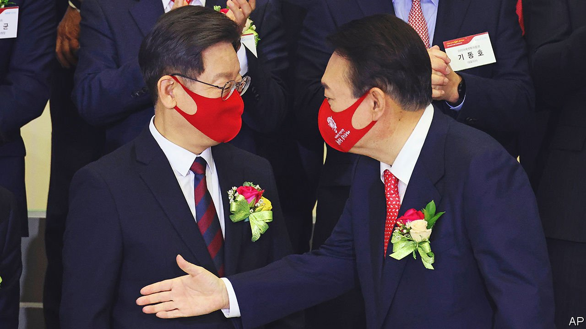

###### Mud on mud

# Both main candidates for the South Korean presidency are reviled 

##### Yoon Seok-youl and Lee Jae-myung are mired in scandal 

 

> Jan 20th 2022 

ALL OF SOUTH KOREA’S past presidents have been tainted by corruption investigations. Both of the surviving ones have served time in prison for corruption. Park Geun-hye was pardoned only last month, for health reasons; Lee Myung-bak remains in his cell. Even Moon Jae-in, the current president, who prides himself on his probity, has seen a close ally imprisoned for violating electoral law and has lost a justice minister to an influence-peddling investigation (the case is ongoing).

Politicians usually manage to get elected before becoming mired in scandals. That precedent may be overturned by the candidates vying for the presidency in an election slated for March 9th. (Mr Moon cannot run again, as South Korean presidents are limited to a single five-year term.) Both Lee Jae-myung of the ruling Minjoo Party and Yoon Seok-youl of the conservative opposition People Power Party (PPP) have been accused of serious wrongdoing since the campaign began. The pair deny any misdeeds. Yet each camp has tried to find advantage in the other’s adversity. With just six weeks to go, the campaign has been heavy on mudslinging and light on serious debate.


Mr Lee’s biggest potential headache is an investigation into allegedly corrupt land deals in Seongnam, a middle-class suburb of Seoul, while he was its mayor. He denies any involvement and has survived a parliamentary audit into the matter. So far the opposition’s calls for an independent probe into the scandal and his role in it have gone unheeded. Two officials who were indicted on corruption charges in the case committed suicide in December. That reduces the chances that the full tale will ever come to light.

Even so, the furore reflects poorly on Mr Lee, whose job it was to oversee the local development corporation at the centre of the case. He stresses his working-class origins and carefully cultivates an approachable image. The opposition portrays him as a gangster, playing up alleged links to organised crime and berating him for defending men who had killed their partners when he was a lawyer.

Banging on about Mr Lee’s shortcomings is a good way to distract voters from Mr Yoon’s. The PPP’s candidate—a former chief prosecutor who resigned last year after tangling with Mr Moon’s justice minister—has proved himself a loose cannon since entering politics last summer. His campaign has been marred by infighting. He lost his campaign manager and was embroiled in a weeks-long spat with Lee Jun-seok, his party’s chairman, over appointments and the campaign’s direction. The two men reached an uneasy truce earlier this month.

Meanwhile, prosecutors are investigating claims that, as chief prosecutor, Mr Yoon abetted an underling who allegedly helped the PPP file criminal complaints against Minjoo party lawmakers in the run-up to elections in 2020 (he denies the allegations). Mr Yoon’s numerous gaffes include claims that “poor or uneducated” people do not feel the need for freedom and that those fighting against South Korea’s military dictatorship in the 1980s did not really care about democracy.

Mr Yoon’s family is an additional liability. His mother-in-law has received a three-year prison sentence for medical fraud. His wife, Kim Keon-hee, has admitted that she forged most of her CV when applying for jobs as an art curator. This is particularly awkward given that Mr Yoon oversaw the investigation that led to the jailing of the wife of Cho Kuk, Mr Moon’s disgraced justice minister, for forging documents to help her daughter’s university application. Ms Kim also caused outrage among young women in particular after claiming that South Korean left-wingers had experienced more #MeToo cases than conservatives because conservatives “make sure they pay” the victims.

With the candidates’ campaigns focused on one another, their modest policy plans have faded into the background. Mr Lee made his name by advocating a universal basic income, but his most memorable current policy is a promise to include hair-loss treatment in health insurance. A video of Mr Lee claiming he was “the best candidate for your hair” in the style of a hair-product ad went viral earlier this month. Meanwhile, the closest Mr Yoon has come to a policy announcement in recent weeks was a remark in favour of a potential first strike against North Korea. Neither candidate has proposed compelling plans to dispel voters’ concerns about the pandemic and spiralling housing costs (The average price of a flat in Seoul has risen by nearly 50% since Mr Moon took office in 2017).

None of this has been lost on the electorate. Mr Yoon led polls for two months, probably thanks to his political novelty. Since December, however, neither candidate has managed to take a decisive lead. Both continue to be outshone by Mr Moon, whose approval rating remains above 40% in all polls, a share that neither of the two men who hope to succeed him has managed to sustain for any length of time. A majority of voters say they want to see a new party in power, but that is hardly out of enthusiasm for Mr Yoon. In one recent poll by Realmeter, a pollster on the right, conservatives said they would prefer an alliance between the PPP and the small People Party, with Ahn Cheol-soo, a colourless conservative, as president.

This suggests that Mr Yoon will have a hard time convincing even his own camp to vote for him, let alone sway moderates. Messrs Lee and Yoon still have a little time to get serious. But if they don’t, whoever manages to fill the headlines with the other side’s scandals just before election day probably has the best chance of success. ■

