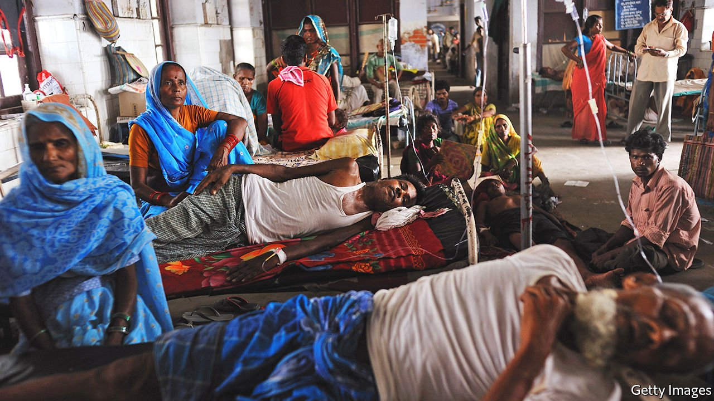
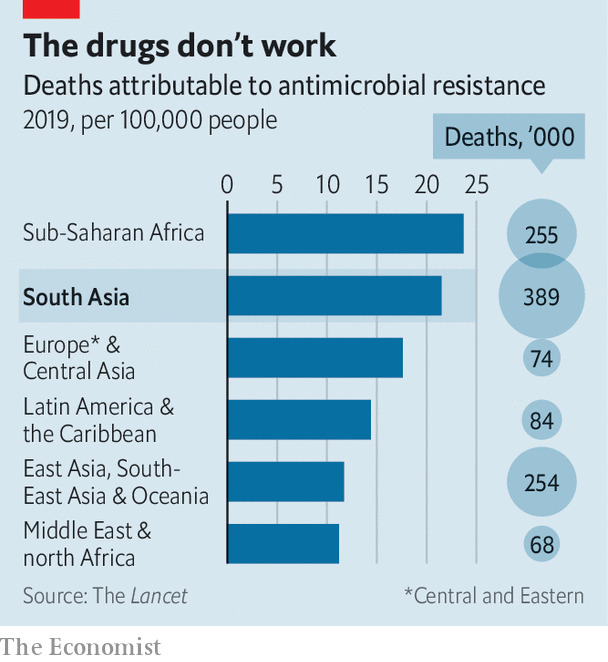

###### Battling the superbugs

# Drug-resistant infections kill almost 1.3m people a year 

##### To understand why, look at South Asia 

 

> Jan 22nd 2022 

RUMINA HASAN peers at a sample of bacteria taken from a three-day-old baby suffering from fever and fits. What she sees in her laboratory in Karachi, Pakistan’s largest city, is alarming. The bugs causing the illness–Serratia marcescens–are resistant to every antibiotic available. Meanwhile at a hospital in Dhaka, Bangladesh’s capital, Jobayer Chisti struggles to save a one-month-old from pneumonia caused by drug-resistant Klebsiella. This bug would be remarkable in Britain or America, where most cases of bacterial pneumonia are easily cured by antibiotics. But 77% of the infections treated by Dr Chisti’s team between 2014 and 2017 involved drug-resistant bacteria.

 


Antimicrobial-resistant infections are now a leading cause of death around the world, according to a report released by the Lancet, a medical journal, on January 20th. In 2019 almost 1.3m deaths directly resulted from illness caused by drug-resistant bugs. The highest tolls by far were in sub-Saharan Africa, where 24 deaths per 100,000 were the result of antimicrobial resistance, and South Asia, where it was 22 deaths per 100,000 (see chart).


When antibiotics, which kill bacteria, and other new antimicrobial drugs, including antifungals, became widely available in rich countries during the 1940s, they revolutionised medicine. Microbe-busting drugs also boosted industrial farming in the second half of the 20th century. Antibiotics not only guard against diseases, which are rife on factory farms; they also help to fatten livestock.

By 2018 South Asia’s 1.8bn people were taking a quarter of the world’s anti biotics, according to data published last year in the Lancet. (For comparison, sub-Saharan Africa, where around 1.1bn live, consumed just over 10%.) India is the world’s biggest guzzler of antibiotics for humans. Their greater availability has saved lives, says Direk Limmathurotsakul of Mahidol University in Thailand. But it has also created the perfect conditions for resistance to thrive. The more that microbes come under attack from antimicrobials, the more the former evolve to become resistant to the latter. The overuse of antimicrobials creates super bugs that these drugs cannot treat.

In most of South Asia antibiotics are easy to obtain. They can be bought in a pharmacy or even at a market—no need for a prescription. As the region grows more prosperous, more people can afford them. And the drugs themselves are getting cheaper. India’s thriving drug industry churns out truckloads of low-cost generics. A course of antibiotics may cost as little as 50 rupees ($0.67), says Kamini Walia of the Indian Council of Medical Research, a government agency. Many doctors overprescribe them, grumbles Dr Chisti. Some are sloppy because they lack training or oversight. Others give patients what they want because they are paying customers.

It is not only rising prosperity that leads to the overuse of antibiotics. Poverty can too. Antibiotics are sometimes used to compensate for poor sanitation and health care, says Ramanan Laxminarayan of the Centre for Disease Dynamics, Economics &amp; Policy, a research institute with an office in Delhi. People who drink dirty water get sick and reflexively pop a pill, which is cheaper than a visit to the doctor.

Lousy infrastructure also helps drug-resistant infections spread. For example, water sources around Hyderabad, a drug-making hub in southern India, are full of antibiotic and antifungal residue, says a recent study in Journal of Infection. As a result, microbes in the surrounding area have developed resistance.

Covid-19 has made things worse, because many people wrongly believe it can be treated with antibiotics. A recent study from a team led by Giorgia Sulis of McGill University in Canada looked at how sales of antibiotics for adults increased in India during the first wave of covid-19. They estimated that nervous Indians gobbled down 216m excess doses. An open letter from doctors on January 14th lambasted the country’s health authorities for the “wanton” and “unwarranted” use of antimicrobials in response to the Omicron variant. Antibiotics treat bacterial infections, not viruses like SARS-CoV-2.

The economic burden of superbugs is growing. In 2016 British government scientists predicted that, if no serious effort is made to check antimicrobial resistance, it could kill more than 10m people a year globally by 2050. They also estimated that it might reduce global output by a cumulative $100trn over that period. Such numbers are highly speculative. What is clear, however, is that treating a patient with a drug-resistant infection is costly—between three and four times more so than treating one with an infection that responds to antibiotics, estimates Dr Walia.

So far, efforts to avoid nurturing superbugs have been patchy. In 2020 India’s environment ministry proposed limiting antibiotic residue permitted in wastewater released by drug factories. Last year it quietly reneged on this promise. Several antibiotics have been barred for use in livestock in Pakistan, India and Bangladesh. In 2019 over-the-counter sales of antibiotics (for humans) were banned in Islamabad, Pakistan’s capital.

Rules are often not enforced, however, says Professor Hasan. Restricting sales is also tricky. While many South Asians take too many antibiotics, others suffer or even die because they have too few, says Dr Walia. More widely available cheap diagnostics would prevent doctors from prescribing the wrong drugs, says Dr Chisti. But this will only help so much. Hard-up labourers would rather go straight to a shop and buy cheap antibiotics than fork out first for a doctor’s appointment and tests.

Better sanitation and health care would reduce demand for antibiotics. Better medical training would curb overprescription. All this would slow the spread of antimicrobial resistance, making millions of South Asians healthier and more able to work. It would also cut medical bills. Fighting superbugs may be costly, but failing to do so is even costlier. ■

