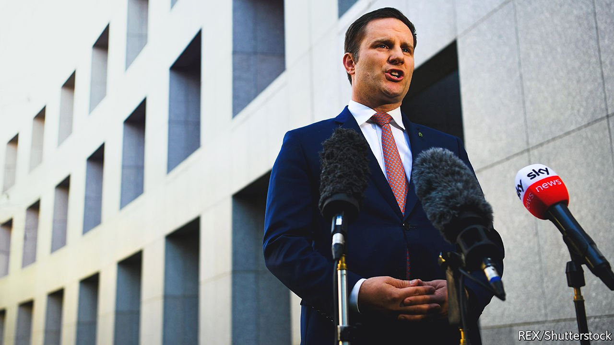

###### Because I say so

# Novak Djokovic’s deportation from Australia sets a troubling precedent 

##### The country’s powers to expel people who offend it are growing 

 

> Jan 22nd 2022 

IT DREW A bigger crowd than can sit in the centre court at the Australian Open. On January 16th more than 80,000 people tuned in to a live feed from the federal court to see whether, after a lengthy scuffle with Australia’s government, Novak Djokovic would be allowed to stay in the country. It was not the result that the world’s best tennis player wanted: the court’s three judges agreed unanimously to dismiss his challenge against the federal government.

Most Australians cheered as the unvaccinated Serb was sent to the airport. According to one poll, 71% of them agreed that he should be deported. But even those who were glad to see him go might have cause for concern about the way in which the case unfolded.


First, he was granted a visa. Then, on January 6th, the conservative coalition government cancelled it, saying that he did not have an exemption to bypass Australia’s travel rules. A court overturned that decision on January 10th, so the government changed tack. Mr Djokovic had not broken any rules by flying to Australia, it conceded, but his presence in the country might “foster sentiment against vaccination”. Alex Hawke (pictured), the immigration minister, then revoked his visa on “health and good order grounds”.

An Australian immigration minister has vast powers of discretion. So vast, in fact, that the incumbent in 2008 declared that he had “too much power”. Those powers have grown since then. Immigration ministers can personally grant or cancel visas if they think it is “in the public interest”, as Mr Hawke did in Mr Djokovic’s case. They can also deport foreigners on “character grounds”, overturn a person’s refugee status, or put asylum seekers into detention indefinitely—and they often do.

The Melbourne hotel in which the tennis star was detained holds 25 refugees and seven asylum-seekers. Because they tried to reach Australia by boat, they are not allowed to resettle there. One of the refugees, Mehdi Ali, an Iranian, has been locked up by Australia for nine years, since he was a boy of 15.

The strict regime is popular with many voters. But views on legal immigration are not one-sided. Polling conducted in 2019 by the Lowy Institute, a think-tank, found that 67% of Australians believe that immigration has a positive impact on the economy—down from 73% in 2016. Even so, 47% feel that immigrants are a burden on the welfare system.

Politicians “like to use their personal powers in cases where they get political mileage”, says Greg Barns, an Australian barrister. The government’s decisions can be extremely difficult to appeal against. “It is dangerous”, Mr Barns believes, “because it is designed to try to sidestep the courts.” Take Mr Djokovic’s case. The federal court could rule only on whether Mr Hawke was within his rights to cancel the Serb’s visa, not on whether his reasons for doing so had “merit”. The government did not need to show that Mr Djokovic’s views on vaccination were a threat to public safety, only that they “might” be so. “The bar does not get any lower than that,” says Mr Barns.

The case could set a worrying new standard. Recent Australian governments have locked out rabble-rousers and conspiracy theorists. (Katie Hopkins, a British right-wing pundit, was deported in 2020 after she attempted to “frighten the shit” out of hotel quarantine guards, by opening her door naked, and without a face mask.) Unlike them, Mr Djokovic has not “incited violence, flouted quarantine or engaged in hate speech”, says Michael Stanton of Liberty Victoria, a civil-rights group. The athlete has seldom discussed his views on vaccination publicly. The government claimed they were “widely understood”. His “perceived” opinions, not just his expressed ones, could fire up anti-vaxxers, it said. On those grounds, Australia could lock out anyone it says might stoke public discontent, says Mr Stanton. “That is a precedent which will be used to stifle legitimate political expression.”

Most Australians seem to have little interest in joining anti-vax groups; 82% of citizens have received at least one covid-19 jab. Yet certain members of the government still try to court anti-vax votes. Gerard Rennick, a Liberal senator, has posted accounts of alleged vaccine side-effects on Facebook. George Christensen, a renegade MP belonging to the coalition’s smaller National Party, has told parents not to jab their children. The difference, claims the prime minister, Scott Morrison, is that they are Australians. So they have a right to talk bull’s wool. ■

