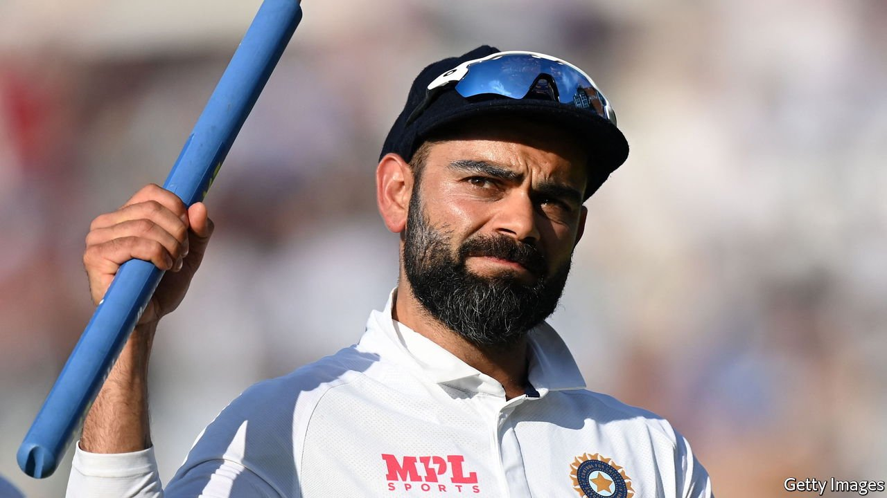
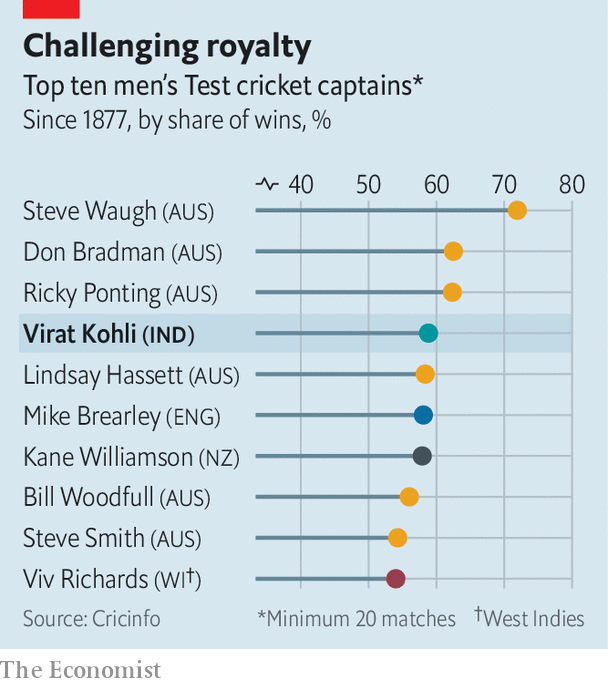

###### A captain walks

# Virat Kohli, India’s cricket captain, was more than a sporting hero 

##### In some ways the retiring skipper exemplified India’s new nationalism 

 

> Jan 22nd 2022 

FEW POSITIONS in India confer as much prestige as captain of the country’s Test cricket team—or as much weight. Carrying the hopes of a billion cricket-mad Indians requires a very broad back. For them it is not enough that the skipper be an exceptional sportsman and inspire a winning team. He must also project a sense of national self-confidence to a world which, some feel, is wont to belittle India.

 


That is exactly what Virat Kohli, who resigned from the post on January 15th, managed to do. Even though his team had just lost to South Africa, Mr Kohli was comfortably India’s most successful cricketing leader ever (see chart). Under his guidance India’s team jumped to the top of the Test rankings. For a while he was also considered the best batsman in the world.

On the pitch he was pugnacious, sometimes riling opponents who were more used to Indian teams with less bristle. He was obsessed with assembling a battery of snarling fast bowlers, something the team had lacked for decades. Mr Kohli, who hails from Delhi, a city known for its abrasiveness, believed this to represent the new India. His teammates absorbed his vision. Many now resemble him in everything from his brash demeanour to his tidy beard.

Mr Kohli’s brazen nationalism also aligned well with the country’s political mood. When an Indian fan on Twitter told him he preferred watching English and Australian batsmen, Mr Kohli told him to go “live somewhere else”, a retort straight from the ruling Hindu nationalist government’s handbook. The player made no secret of his admiration for Narendra Modi, India’s prime minister. When he was re-elected in 2019, Mr Kohli gushed that he would take the country to “greater heights”.


All of this has made him enormously popular. On Twitter he has around 46m followers, more than any other athlete in the world bar footballers Cristiano Ronaldo and Neymar, and basketball star LeBron James. But the adulation is hardly unconditional. When his form dips, he has to endure abuse online. His wife, Anushka Sharma, a Bollywood actress, sometimes cops it worse. And when he leapt to the defence of Mohammed Shami, a teammate who had received anti-Muslim insults, the response from Hindu chauvinist trolls was vitriolic. In their view, at least, he was not aggressive enough for the new India.

