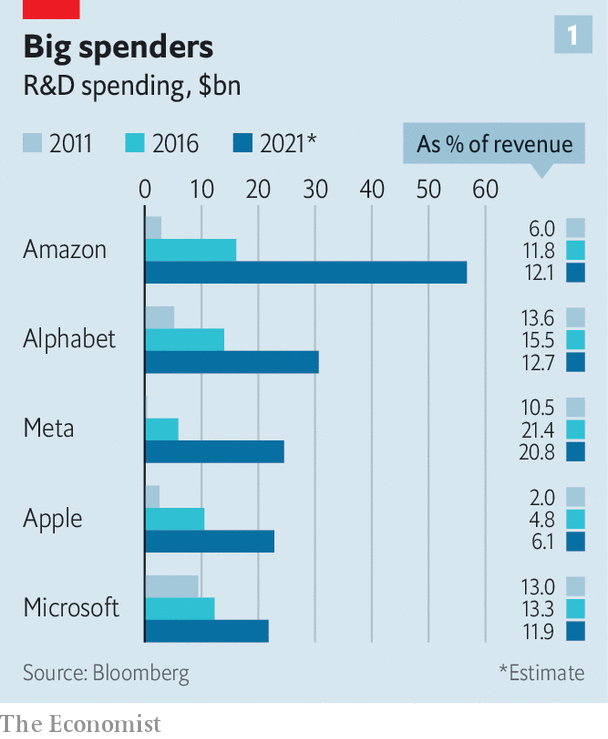
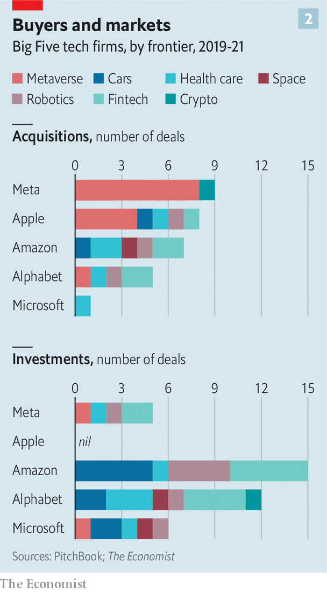
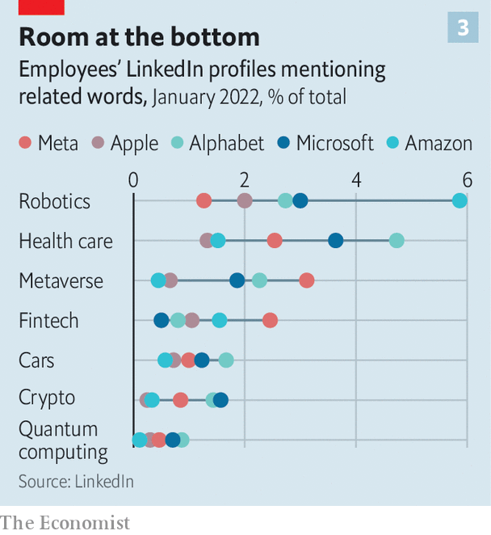

###### Moonshooters

# What America’s largest technology firms are investing in 

##### Their focus is on the metaverse, cars and health care 

 

> Jan 22nd 2022 

WHEN CORPORATE bosses want to impress investors they increasingly reach for the i-word. Mentions of “innovation” during the earnings calls of S&amp;P500 firms have almost doubled in the past decade. And no other sector talks about it as much as the technology companies do. For Hewlett-Packard, a printer and personal-computer maker, innovation has on occasion become what location is to estate agents and education to Tony Blair: so important it has to be said three times in quick succession.

Do they protest too much? Throughout that decade some critics held that the technology sector was not delivering as much innovation as it should. When Tim Cook, the boss of Apple, said that 2020 was the firm’s “top year of innovation, ever” thanks to the release of the new iPhone, Mac and other devices and services it was possible to feel he might be going some way towards making the critics’ case for them. The things the products could do and the ease with which they did them represented a remarkable achievement. Yes, computing power kept increasing, and software kept doing more. But where were the flying cars, robot footmen and headsets through which to meld minds?


In 2020 a report by an antitrust subcommittee in America’s Congress argued that the dominance of big tech had “materially weakened innovation”. The giants, it said, accrue big benefits from the network effects which make having the most users the best way to add new users; they add to the protection such moats provide by pre-emptively acquiring potential rivals. Stamping out such “killer acquisitions” was one of the aims of President Joe Biden’s executive order on increasing competition last year.

One counter-argument to this is that competition in tech is far from dead. It is hard to find a part of the industry where two or more of the “Big Five”—Alphabet, Amazon, Apple, Meta and Microsoft—are not facing off against each other. Another is that when it comes to technological innovation, competition is not necessarily the thing that matters most.

When the twin foundations of the computer age, the transistor and Claude Shannon’s theory of information, came out of Bell Labs in the mid-20th century, it was not because the labs’ owner, AT&amp;T, was facing lots of scrappy competitors. It was because it wanted to make and own the future. Rob Atkinson, head of the Information Technology and Innovation Foundation, a think-tank, argues something similar is true today: the Big Five are “oligopolists which use their market power to win the next big thing.”

Having gone through exponential growth themselves, they are all well aware that missing the next transformative change could see them thrown out of the future-making game. To get a sense of their strategies The Economist has analysed a range of data on the Big Five’s activities, including the technology focus of the companies they have recently acquired and of those they have taken minority stakes in, their employees’ profiles on LinkedIn and their publications and patents. The work provides a sense of where this phenomenal spurt of investment is headed.

That America’s big tech companies are spending a truly vast amount on R&amp;D is not in doubt. In 2020 America’s public and private spending on R&amp;D added up to $713bn. In 2021 the Big Five spent $149bn, equivalent to roughly a quarter of that total (though some of that money is not spent in America). That is significantly higher than the largest single government R&amp;D budget, that of the Pentagon.

A lot of that spending is in product development, and it is true that the tax regime encourages spending to be put down as R&amp;D if possible, which can distort things. But that can hardly explain the 34% increase since 2019: the tax regime has been unchanged throughout that time.

Capital expenditure—which mostly goes towards data centres, but also in Amazon’s case fulfilment centres—has also grown, to $131bn a year. In the past 12 months the Big Five’s share of cashflow from operations invested in R&amp;D and capital expenditure was 53%. That compares to a median of 32% for all S&amp;P500 firms.

 


One reason for truly vast spending is truly vast companies. The revenues of the Big Five, which have a combined market value of over $9trn, almost tripled between 2015 and 2020. But though when expressed as a proportion of sales increased investment looks more modest, it is still real (see chart 1). Spending on R&amp;D rose by a third over the same period, from about 9% of sales to 12%, and capital expenditure grew by more than a quarter, rising two percentage points to about 9% of sales.

But a crucial part of it is that there are specific goals the firms want to achieve that require a lot of R&amp;D. Apple is on the lookout for the piece of hardware that will become the new iPhone, be it a car or virtual-reality (VR) headset. Amazon is relentlessly trying to improve the efficiency of its warehouses and delivery system and expand the range of industries making use of Amazon Web Services. For Meta, which has seen its main offering, Facebook, eschewed by younger people, a new big thing may be the only way to secure survival: its recent name change will be for naught without the new tech to back it up.

Researchers at the Big Five published over 16,000 scientific papers in the five years to 2019, and their topics provide some insights into what is going on. Core businesses are being burnished—a recent paper from Amazon discusses ways of “avoiding duplicates in the search results”—and some esoteric possibilities explored—a paper from a team with members in Google Research provides insights into a “human surgical sample from the temporal lobe of the cerebral cortex”. But different publication policies at different companies make it hard to put the data to quantitative use.

Alphabet is generous when it comes to publication, seeking to attract researchers who wouldn’t join a company which required them to hide their light under a bushel. As a result Alphabet looks good in measures based on publications: it is the fourth-highest-ranked corporate institution in the current edition of the Nature Index, which measures the impact of academic research in the sciences (Roche, a Swiss health-care firm, tops the list). Apple is much stricter about publication. But that doesn’t mean it is less innovative.

Cars, the metaverse and everything

Analysts reckon that somewhere between 5% and 20% of the tech giants’ massive R&amp;D spending goes towards what, for the purposes of this article, we are calling “frontier technologies”: the metaverse, autonomous vehicles, health care, space, robotics, fintech, crypto and quantum computing. (Artificial intelligence, AI, is now so ubiquitous that we are not counting it as a frontier in itself.) We looked at acquisitions, investments and employment data to see which of the companies seemed most interested in what.

Over the past three years the Big Five have acquired 110-odd companies, according to data from PitchBook, a research outfit (these data do not include the $69bn acquisition of Activision Blizzard by Microsoft announced this week, which is reported on in the Business section). There is a limit to how much these data can reveal. In most cases the deal size was not made public and many smaller acquisitions are treated as recruitment and so not in the data. Believers in “killer acquisitions” may see some of these deals as attempts to hinder innovation rather than accelerate it. But even if that is the case, they show where the companies are focused.

 


Of the 40-odd deals that came with figures attached, the total valuation was roughly $50bn. Over a quarter of the firms acquired specialised in AI or in crunching vast data sets. Perhaps a quarter of them were developing frontier technologies (see chart 2 for a breakdown).

Microsoft is the big spender. In April it agreed to buy Nuance Communications, a health-care-focused cloud and software provider, for $19.7bn, in the largest acquisition for which we have data in the past three years. It has also bought startups which facilitate cloud services, such as Mover.io, which helps businesses shift data to the cloud, and CloudKnox, a cyber-security firm. Google, which lags behind Microsoft and Amazon in its cloud offering, snapped up three cloud-based startups, including Actifio. It also bought three wearables firms, including Fitbit, on which it spent $2.1bn, reflecting its growing interest in health care.

In terms of single-mindedness, the clearest signal is Meta’s pursuit of all things metaverse. Of the 13 firms that work in augmented reality (AR) or VR which were bought for a public price, Meta bought eight, including BigBox VR and Downpour Interactive. Apple bought another four, including Next VR and IKinema. But its highest priority by this measure was AI. Of its 22 purchases since 2019 more than half have been AI-related startups.

Another window into the priorities of four of the five companies is where they choose to take minority stakes. Of the 101 companies in which PitchBook data show the firms investing over the past three years more than a third are active in frontier technology. The exception here is Apple, which makes very few such investments, none of which have been in the frontier areas.

Here, too, the choices are revealing. Take the five investees that make cars. Amazon invested in two, Aurora and Rivian. The latter, in which it has a 20% stake, went public in November and is valued at $67bn. On top of this, last year Amazon bought Zoox, which like Aurora focuses on autonomous vehicles, for $1.3bn.

Analysts suspect Amazon’s immediate interest in the sector lies in the possibility of making its delivery service cheaper and more efficient—it has already ordered 100,000 delivery vans from Rivian. The investment may be comparable to the company’s purchase of Kiva Systems, a robotics firm, in 2012. Kiva’s technology now helps Amazon’s warehouses run smoothly.

Google also invested in two self-driving-car companies: Waymo, a firm originally spun out of X, the tech giant’s in-house “moonshot” unit; and Nuro, an autonomous-delivery company. Apple, which in 2019 acquired Drive. AI, a self-driving-car startup, is mostly working on its self-driving cars in-house. Its Project Titan aims to launch a vehicle in 2025. This week Microsoft joined the race, with an investment in Wayve, a London-based self-driving-car firm.

Overall, 9% of the investments made by the big tech companies are in cars and mobility, compared with just 2.4% for the venture-capital industry. Indeed, all of the frontier technologies except for crypto boast a share of Big Five investment higher than that for VCs in general. Overall 37% of big tech investments, by number, were on the frontiers, as opposed to around a quarter for venture investors in general.

Alphabet, Amazon and Microsoft also all have separate investment subsidiaries. Since 2019 Alphabet’s venture-capital arms (Gradient Ventures and GV) and its private-equity unit (CapitalG) have cut about 400 deals. Around 100 of those have been for firms that work in life sciences or health care—an area tech firms see as appealing in part because of AI’s increasing applicability to biology. You can now “write RNA structure on a computer like it’s a piece of software,” says Tom Slater of Baillie Gifford, a large asset manager that invests in tech firms. Google’s venture-capital investments include Editas Medicine, a genome-editing company, and Adagio Therapeutics, a drug-discovery firm.

Another 45 investments from Google’s financing arms have been in fintech firms such as Botkeeper, an automated book-keeping service. Other tech firms are making similar moves. Apple acquired Mobeewave, a payments startup, in 2020 to turn iPhones into mobile contactless payment terminals. Last year Amazon bought Perpule, an Indian fintech firm, and is working with Goldman Sachs to expand the company’s loan offering.

Perpule and a number of other fintech firms are part of another trend: of the 101 firms the tech titans have taken a stake in since 2019, 24 hail from India, more than any other country except America. Amazon has built up a stake in BankBazaar, a Chennai-based online financial marketplace. In 2020 Google said it planned to invest $10bn in Indian tech firms over the next five-to-seven years. Overall big tech looks far more willing to invest in India than American VC firms are.

 


Another way to gauge where technology firms are placing their bets is to look at the people they employ and those whom they want to employ. The Economist examined the LinkedIn profiles of employees at the Big Five for the most-used keywords (see chart 3). Again, the data from Meta are very metaversal. We found some experience of working with AR or VR in 2-4% of the profiles associated with Meta’s employees, more than with any other firm.

Quantum of employment

According to Thinknum Alternative Data, a research firm, the tech giants are looking to hire in these areas too. Among the Big Five job listings mentioning AR or VR jumped from about 75 in August 2020 to 567 today. Meta and Amazon are posting about 200 such jobs each at the moment—a striking fact given that Amazon employs 20 times as many people as Meta does. A similar uptick can be seen in car-related listings. Some hires are high-profile. In June Apple hired Ulrich Kranz, formerly a senior executive at BMW’s electric-vehicle unit, to beef up Project Titan. It has also snapped up two executives from Tesla.

There is growing interest in quantum computing, if from a low base. On average around 0.5% of staff at Big Tech firms refer to quantum on their LinkedIn pages. Amazon and Alphabet are mentioning it more when advertising vacancies. In July Google announced a big step in quantum error suppression, vital if the technology is to be commercialised. Kevin Scott, chief technology officer at Microsoft, sees investment in quantum computing as a necessity for the company. “If such a [quantum-computing] machine were to exist in the future it would be important that Microsoft has one,” he says. Such fears of missing out can drive huge research projects.

 


Other forms of data support much of what our research suggests. Take patents. Microsoft, Amazon and Google have all recently applied for quantum-computing-related patents. More than half of Meta’s patent applications since 2019 mention AR or VR. On earnings calls Meta, unsurprisingly, bangs on about the metaverse; Microsoft and Google are much more likely to talk about the AI which will underpin most of the new tech frontiers.

None of this is to say that Mr Atkinson’s oligopolists are investing in a way likely to maximise innovation itself, let alone the economic and social benefits it can bring. It is hard not to believe that the sheer size of these incumbents constitutes some sort of block on radical attempts to reinvent the world. But though each company has its particular interests, our picture of their priorities shows that in many sectors there really is significant competition.

And for all that innovation is an easy word to throw about, throwing huge amounts of money and resources at it is much harder. Far better that big tech should do that hard work than just sit on its backside maximising its rents. ■

