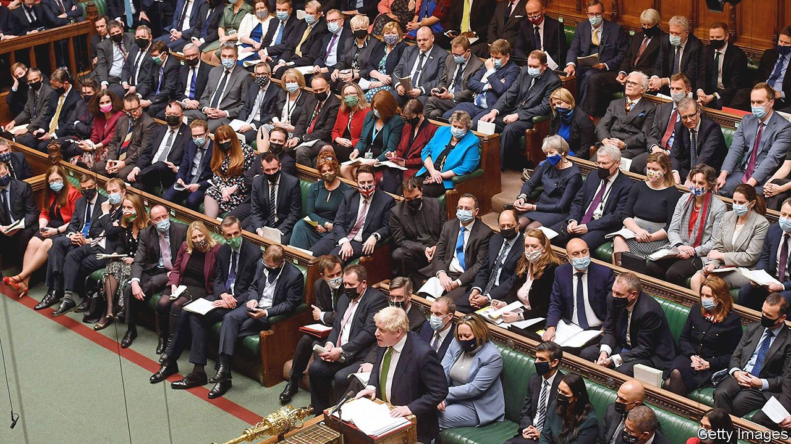
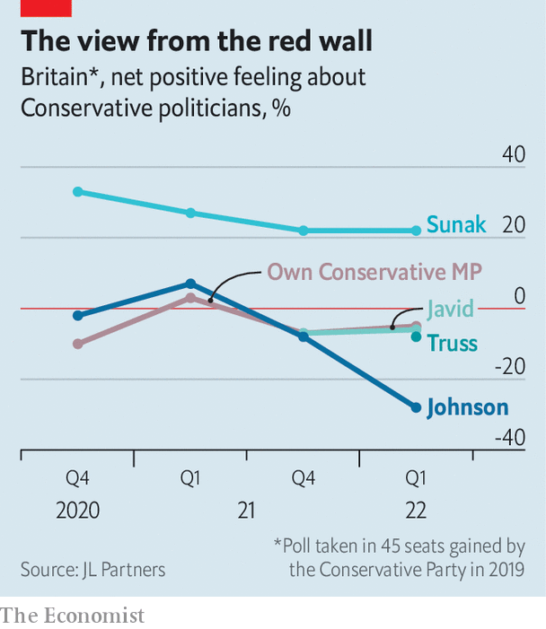
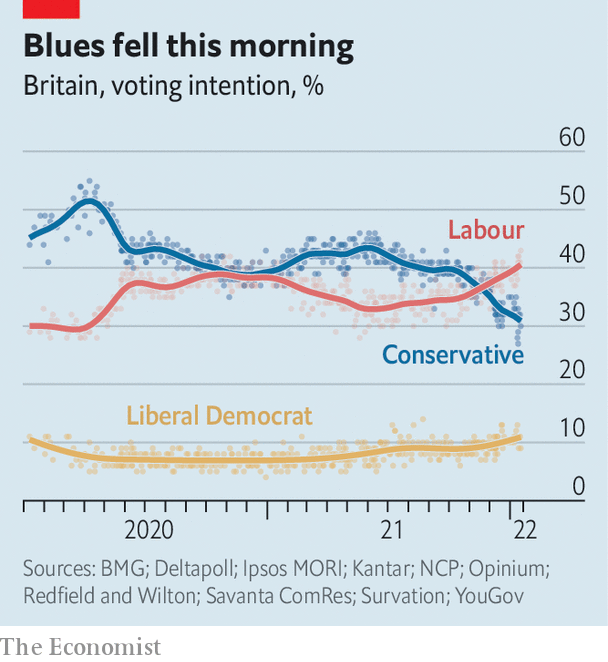

###### The price of survival

# Boris Johnson’s broken premiership 

##### He may cling on to office, but his hold on his party has gone 

 

> Jan 22nd 2022 

BORIS JOHNSON wagged his head in a show of boredom and looked at his watch. He jabbed his finger and slapped the despatch box. Gone was the man who had sighed, shuffled and looked at his shoes in a television interview the day before. He did not give the appearance of a prime minister about to be deposed at all, but one game for an election.

Fifteen minutes before the weekly prime minister’s questions on January 19th, a coup had begun. Christian Wakeford, the Conservative MP for the marginal English seat of Bury South, had defected to the Labour Party, declaring the prime minister incapable of leadership. Little matter, Mr Johnson boomed: the Tories would win the seat back at the next election, “under this prime minister”. A few minutes later David Davis, a backbencher first elected to Parliament when Mr Wakeford was just two years old, read to Mr Johnson the words of Leo Amery to Neville Chamberlain, the prime minister in 1940. “You have sat too long here for any good you have been doing…In the name of God, go.” A smile flickered across Mr Johnson’s lips.


Over the past six weeks revelations about  during England’s covid-19 lockdowns have pushed Mr Johnson’s administration to the . The details seem designed to offend: one raucous gathering was held during a period of national mourning for the Duke of Edinburgh, prompting an apology to Buckingham Palace. Tory MPs decided to act. Some have submitted letters of no confidence in Mr Johnson, seeking to trigger a .

As The Economist went to press, Mr Johnson was hanging on. No other MPs had followed Mr Wakeford across the floor, nor had the threshold of 54 letters required to trigger a contest been reached. (Letters are sent anonymously and the running tally is a secret, encouraging bluff and rumour-mongering.) Mr Johnson’s staff said he would fight any leadership ballot, in which he would need the support of half the party to win. Judging by the roars on the benches behind him, he has a good chance. The plotters disagree over when to oust Mr Johnson and have no obvious candidate or policy agenda to rally around.

But if Mr Johnson survives, he will have paid a high price. From the beginning, his government sought to banish memories of Theresa May’s enfeebled premiership. The cabinet was packed with loyalists who barked slogans written by his office. Parliament, filled after the election of 2019 with young MPs like Mr Wakeford who owed their jobs to Mr Johnson, would be akin to a printer for the executive. When the Conservatives won the constituency of Hartlepool, a poor town in north-east England, in a by-election in May 2021 Mr Johnson’s allies boasted he would govern for a decade.

All that has crumbled. “The imperial premiership is over,” declares a former cabinet minister. Like Mrs May, Mr Johnson will be a caretaker prime minister, diminished in a cabinet preoccupied with the race to succeed him. His MPs have the upper hand. The Conservative Party, which was already fractious and disparate, will become even harder to lead.

Many MPs have heeded Mr Johnson’s pleas to wait for a report by Sue Gray, a civil servant, into the parties before deciding whether to submit their letters. Mr Johnson and Dominic Cummings, his former aide turned tormentor, will be interviewed. The critical question is whether Ms Gray accepts Mr Johnson’s defence that he was unaware that a drinks gathering in the Downing Street garden in May 2020 breached the rules. The ministerial code, of which Mr Johnson is the ultimate adjudicator, states that ministers who knowingly mislead Parliament should resign.

 


The public appears to have made up its mind about that. Mr Johnson’s electoral performance has been flagging for some months: his party lost by-elections in the formerly safe seats of Chesham and Amersham in June 2021 and North Shropshire in December. Now it has collapsed. The Labour Party enjoys a ten-point lead, while Mr Johnson has a net favourability rating of -52, below Mrs May at her lowest. He is a drag on MPs in seats the Tories gained in 2019 (see charts).

 


Should they refrain from toppling Mr Johnson, MPs will extract a price. Once Ms Gray’s report is published he will be forced to gut his Downing Street operation. Dan Rosenfield, his chief of staff, and Martin Reynolds, his principal private secretary who sent the email inviting staff to the “bring your own booze” garden party, are likely to go. Some MPs want far deeper cuts, to remove the knot of 20-something special advisers, many of whom went straight from university to the Brexit referendum campaign and who turned the prime minister’s office into a junior common room.

Power will shift to the cabinet. That could produce more deliberative government, or it could herald a return to the divided, leaky days of Mrs May, says a senior Tory. Liz Truss, the foreign secretary, and Rishi Sunak, the chancellor, are vying to replace Mr Johnson, and were slow to offer support. The prime minister now relies on the support of unimpressive ministers such as Nadine Dorries, the culture secretary, and Priti Patel, the home secretary.

Parliament has been proving difficult to manage for months, and it will become harder. Tory MPs are weary and squabbling after 12 years in power. In an age when rebellions can be organised by WhatsApp, a large majority can behave like a hung parliament. Last year Mr Johnson faced bruising rebellions from every quarter of the party on covid policy, free school meals and foreign aid. For as long as he clings on, they will exploit his vulnerability to advance their pet causes.

“It will be much easier for him to survive if he starts greasing the wheels of parliamentary politics a bit better,” says one serial rebel, cheerily. On January 19th Mr Johnson tried to mollify his MPs by announcing the restoration of “our ancient liberties” and an end to mask mandates and covid passports. Tory backbenchers clustered around the Covid Research Group want him to go further, by scrapping mandatory vaccinations for NHS workers and dismantling the government’s testing infrastructure. Others want planned tax increases to be postponed to help constituents hit by inflation, which rose to 5.4% in the year to December.

Placating backbenchers will not be easy, however. That was demonstrated by the reception of Operation Red Meat, as Downing Street staff dubbed a series of populist announcements earlier in the week. The Royal Navy was given control of anti-migrant boat operations in the English Channel, and asylum-seekers would be sent to Ghana, or perhaps Rwanda, for processing, ministers told newspapers. The BBC’s licence fee would be frozen for two years and eventually scrapped. Yet the plans quickly disintegrated. The navy has the wrong boats for “pushback” operations, ministers admitted; the government of Ghana crossly repudiated the briefing. Ms Dorries admitted she had no idea for a rival BBC funding model. The bigger problem is that the Conservative Party is badly fragmented. Plenty of MPs find red meat rancid, treasure the BBC and resent the use of the armed forces as political props.

It is an unforgiving landscape through which to pilot new legislation, which Mr Johnson hopes will help him win the next general election. He proposes new criminal-justice measures and changes to electoral rules and the planning regime. But Nikki Da Costa, Downing Street’s former director of legislative affairs, now at Flint Global, a consultancy, reckons that a third of legislation was already behind schedule before this week’s rebellion. Important bills such as a new anti-espionage regime are yet to be published. As bills run into the end of the parliamentary session in summer, MPs’ leverage to extract concessions will grow, says Ms Da Costa. Mr Johnson’s weakness will mean more giveaways.

A weak prime minister also makes for an emboldened House of Lords. On January 17th peers gutted a series of measures in the Police, Crime, Sentencing and Courts Bill, a draconian law that would make it easier to break up protests. Among those voting against the measures were a handful of Tory grandees, together with Labour and Liberal Democrat peers. In Mr Johnson’s prime, when he threatened to relocate the Lords to York and railed against out-of-touch elites, they might have thought twice about defying him. But these days he is a diminished figure, whose threats and cajoling carry little weight. ■

Dig deeper

 (Jan 22nd) (Jan 22nd) (Jan 19th) (Jan 15th)

