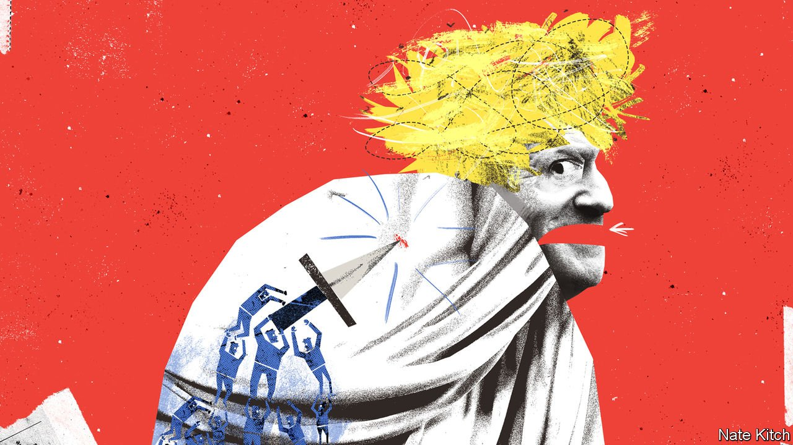

###### Bagehot

# Boris Johnson’s would-be assassins are very like him 

##### The sons want to kill the father 

 

> Jan 22nd 2022 

SIGMUND FREUD would have loved to put the modern Conservative Party on the couch. When Theresa May emerged as the runaway leadership contender in 2016, MPs of a certain age developed the unnerving habit of calling her “mummy”. Margaret Thatcher opened a speech at a Conservative conference in 2001 with a joke about that summer’s blockbuster: “The Mummy returns”.

Under Boris Johnson, the party has developed daddy issues. In happier days aides briefed that Mr Johnson wanted to be a “father of the nation” figure. Friendly newspapers went through a stage of portraying the portly prime minister as a fecund strongman. Unfortunately for Mr Johnson, Conservative MPs have developed another Freudian urge towards their father: they want to kill him.


It is precisely those MPs built in Mr Johnson’s image who are most enthusiastically trying to do him in. In a “Pork Pie Plot”, so-called because one member’s constituency includes the snack’s home, around 20 new MPs representing everywhere from “red wall” seats in County Durham to coastal Dorset pledged to bring down the prime minister. They do so not because they are radically different from the prime minister but because they are so similar. They are unashamedly populist, transactional, disloyal and unconstrained by the usual rules of politics. And they want to ditch Mr Johnson, a man who fulfils all these traits and brought them into the world.

Those leading the charge against Mr Johnson are not Remainers out for revenge over Brexit. Only true Brexiteers, or the fully converted, had a chance of being selected for the Conservative Party at the last election. Mr Johnson’s promise of post-Brexit big-state Conservatism goes down well with MPs for areas of the country that felt overlooked by central government.

Under Mr Johnson, the Conservatives stood on a populist platform of smashing a Parliament determined to thwart the will of the people over Brexit. The MPs first elected in 2019 still adhere to this code. Rather than Burkean representatives, deciding issues how they see fit, they are tribunes directly channelling their voters’ wishes. When their constituents raged at the thought of a prime minister hosting lockdown-busting parties, their MPs raged with them. Once atop the system, Mr Johnson lost some of his revolutionary verve. But the MPs he brought with him still want to smash it. If that means smashing Mr Johnson too, so be it.

Relationships for Mr Johnson are transactional, as they are for the MPs who arrived in 2019. Majorities across the red wall are slim: if Mr Johnson’s popularity dips, many of that intake are doomed. Even now, only three of a sample of 45 seats won by the Tories in 2019 would stay blue at the next election, suggests JL Partners, a pollster. Mr Johnson’s camp thought the new MPs were beholden to the prime minister. This was the case when he had a unique popularity, whereas now the prime minister conjures only contempt. Loyalty has a price and Mr Johnson no longer pays it.

A streak of ruthlessness pervades younger MPs that Mr Johnson, possibly the biggest cynic ever to become prime minister, would admire. Christian Wakeford, the MP for Bury South, personified this more than most when he defected to Labour on January 19th. Until his defection, Mr Wakeford’s main contribution as a Conservative MP was his frank abuse of a fellow Tory in the division lobby. (He later blamed the outburst on “anger and codeine”.) But it is the message that matters, not the messenger. Some MPs think the game is up.

Mr Johnson and his political offspring also share a contempt for the usual way of doing things in Parliament. The prime minister took an unorthodox path to the top of politics, hurling himself into Downing Street via the London mayoralty and the Brexit referendum, with only a brief, botched stint as foreign secretary. Likewise, most young MPs spend their first years in Parliament sucking up. This crop are different. In the patronising discourse of Westminster, the new MPs have not been “housebroken”. Until they are, expect them to keep weeing on the carpet.

Indeed, Mr Johnson and his newest MPs are bound by a stunned disbelief that they have ended up where they are. At the start of 2019 Mr Johnson was written off as a failed foreign secretary. Now he is prime minister with a big majority. It is much the same for the rebellious newbies. The sweeping Conservative victory at the last election resulted in a heap of 30-something councillors and oddballs winning seats no one expected. It is hard to be a Westminster careerist if you never planned on that career.

Those leading the charge against Mr Johnson have little to lose. Launching a coup only a few years after winning seats has a certain chutzpah. If Mr Johnson stays in his job, many of those plotting will lose their seats; if he goes, they may survive. Knowing when to gamble has also been the hallmark of Mr Johnson’s career. If they were not trying to murder him, Mr Johnson would approve.

Wars of succession

Should the coup fail, the Conservatives will not become a happy family. Its MPs want different things. Those in recently conquered territory desire “levelling up”, which boils down to redistribution, with heavy investment in small towns that have seen better days. But if rich Tories in south-east England truly wanted to see their taxes spent in the north and Midlands, they could just vote Labour. Keeping southern and northern MPs satisfied is a tricky task for any Conservative prime minister.

Instead, the Conservative Party will start to resemble an episode of “Succession”, an HBO drama about a family of unhappy billionaires. In the show, Logan Roy, the patriarch, faces repeated attempts by his own children—a damaged bunch—to force him out. They do so partly because they think he is not up to the job. But also because he raised them that way: all they know is how to kill. Mr Johnson has shaped the Conservative family in his own image. It will take a lot of therapy to fix. ■

Dig deeper

 (Jan 22nd) (Jan 22nd) (Jan 19th) (Jan 15th)

