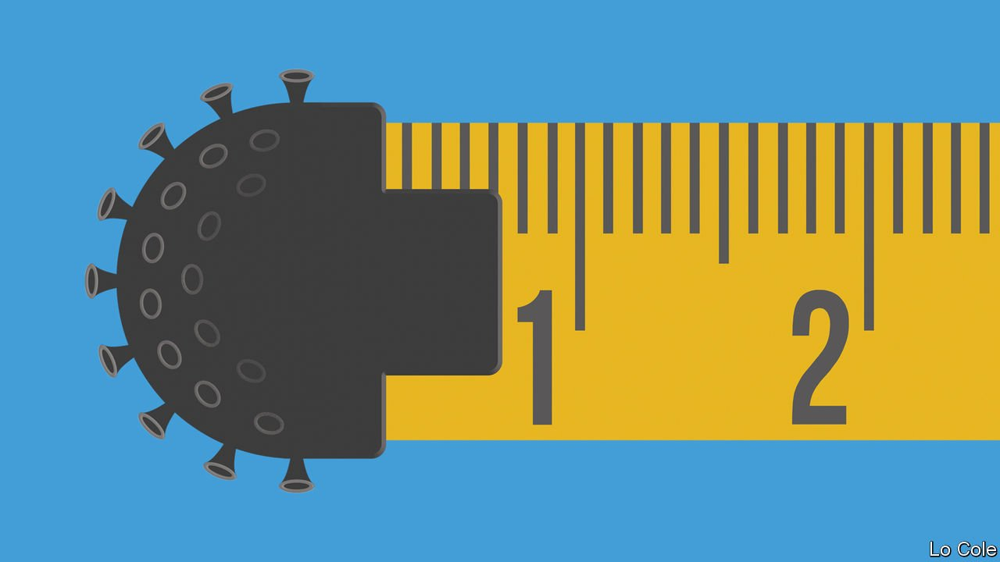

###### Data

# Britain’s Office for National Statistics did well during the pandemic 

##### It did more as its job became harder 

 

> Jan 22nd 2022 

SCIENTISTS AND health-care workers have been justly lauded for their work battling covid-19. But what of those whose job is to measure that work? Just as the pandemic raised demand for fast, reliable statistics, it made them harder to collect. Handily, number-crunchers at the Office for National Statistics (ONS) rose to the challenge. The ONS did “a lot more innovation than you’d normally expect a statistical office to do”, says Jacob Nell of Morgan Stanley, a bank.

The pandemic came on the heels of a challenging period for statisticians. People were growing reluctant to reply to the surveys that underpin much economic measurement. Supplementing those with administrative data was tricky because governments feared to share it, lest a privacy scandal result. A review of economic statistics in 2016 told the ONS to buck up and respond better to economic changes and the needs of its users.


That pressure prompted a trend towards faster-paced publication using non-traditional data sources. In 2017 a new Data Science Campus was established at the ONS’s offices in Newport, Wales, and a Digital Economy Act made it easier for government departments to share data. In 2018 the ONS became one of the few statistical agencies worldwide to publish monthly estimates of GDP. The following year it joined forces with the tax office to publish timely earnings and employment figures based on income-tax receipts.

When covid-19 struck, the march towards faster, better information became a dash. Civil servants bombarded statisticians with questions they could not answer: whether people were staying at home; how consumer spending was changing; how many were wearing masks. Meanwhile, collecting and disseminating data in person became unsafe. Price-collectors could no longer visit supermarkets; interviewers could no longer knock on doors. Between the first and second quarters of 2020 the number of households interviewed for the labour-force survey fell by around 10%. Some surveys stopped, including those covering travel and tourism. “Lock-ins”—corralling journalists in a room and giving them advance sight of market-sensitive data—were halted.

Then came the fightback. Price-collectors were sent laptops so they could collect online prices; interviewers hit the phones. The labour-force survey pivoted to phone interviews, while wonks at the Data Science Campus used anonymised mobile-phone data to see how people were responding to lockdowns. In 2019 the ONS produced 600 publications. That rose to 1,000 in 2020, with the same again in 2021.

Bugs in the system

Two of the ONS’s biggest achievements during the pandemic came in the form of surveys. Indeed, the Coronavirus Infection Survey was motivated by data gathered another way. Because people without symptoms of covid-19 were less likely to be tested, government records were likely to understate prevalence. Britain now sends tests to a representative sample of individuals, making it one of just a few countries with good prevalence estimates for asymptomatic infection. That is how it knows that, in the week ending January 15th, around one person in 20 in England had covid-19. Official test records suggested a rate of one in 90.

The other is the Business Insights and Conditions Survey (BICS), whose evolving set of questions has covered topics including the impact of the pandemic on business turnover, use of the furlough scheme and even the effect of Brexit on businesses’ costs. The latest results, published on January 13th, suggest that almost half of accommodation and food-service businesses in operation saw customer cancellations rise during the previous month.

The full potential of some pandemic-inspired developments will only become apparent over time. Mobile-phone data, for example, could be used to improve travel and tourism statistics. New indicators need a while to demonstrate their predictive power. After lock-ins were suspended, market-sensitive releases were moved to 7am. That shift put a stop to tedious speculation during morning news bulletins, and seems likely to stick.

Amid all the change, there have been grumbles, and not just from journalists complaining about early starts. Will Moy of Full Fact, an independent fact-checking charity, says that the ONS is still sometimes naive about the potential for data to be misunderstood or deliberately misinterpreted. Last November the Office for Statistics Regulation ticked off the ONS for publishing data comparing mortality between the vaccinated and the unvaccinated among 10- to 59-year-olds. In some cases mortality among the former was higher, but probably only because older and sicker people were more likely to be in the vaccinated group. (The ONS said that in future it would use smaller age bands.)

But most of the criticisms add up to the perennial demand on official number-crunchers: to provide greater insights more quickly. Satisfying them is unlikely to get easier. After the pandemic ebbs, the BICS survey will continue. Grant Fitzner, chief economist of the ONS, is sceptical that demands on the ONS are going to ease, adding that “we’re not very good at stopping things.” The ONS did extraordinary work during the pandemic. There will be little time to relax afterwards. ■

Dig deeper

All our stories relating to the pandemic can be found on our . You can also find trackers showing ,  and the virus’s spread across .

