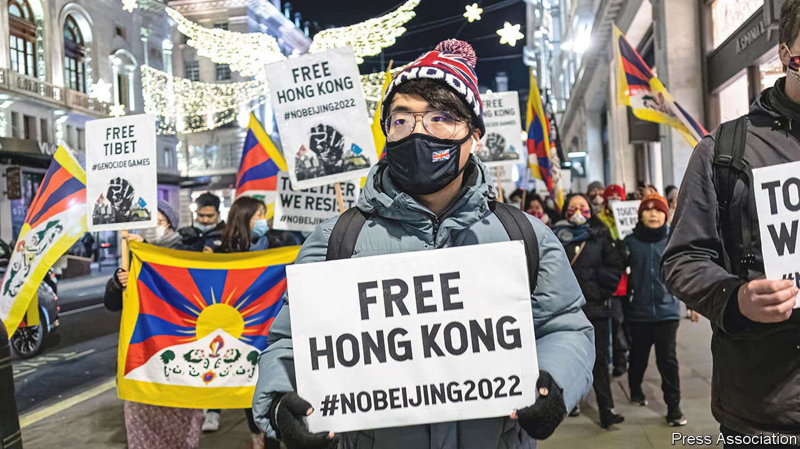

###### Hong Kongers

# Britain’s newest immigrants are showing a flair for protest 

##### Keeping up the old traditions 

 

> Jan 22nd 2022 

ON JANUARY 16th around 250 Hong Kongers gathered on Princes Street in Edinburgh to protest against attacks on press freedom in their former home. Volunteers marshalled the crowd to avoid blocking the pavement for locals. After speeches and a rendition of “Glory to Hong Kong”, the anthem of the pro-democracy movement, the protesters arranged themselves into an orderly line, snaking 150 metres around the grand National Records building. They left a gap so that two buskers could continue their performances.

Between January and September last year 88,000 Hong Kongers applied to move to Britain under the British National (Overseas) visa route, which was created by the government in response to the crackdown on democracy in Hong Kong. Many of them have been quick to stage in their adopted home the traditions of their old one. The protest in Edinburgh was one of at least ten held across Britain in January alone. Some demonstrations in London have attracted almost 1,000 people. For a modest-sized group of new immigrants, the speed and scale with which the Hong Kongers have taken to the streets is striking.


Hong Kongers have a long tradition of protest. Between 1990 and 2019, activists in the territory organised a large annual vigil for the victims of the 1989 massacre around Tiananmen Square in Beijing. In June 2019 around 1m people marched through the Chinese-ruled city in the first of many rallies against a proposed new extradition law. Hong Kongers already have the “skills and initiative to initiate protests,” says Man-yee Kan of Oxford University. “They don’t feel that it takes a lot of effort”. Protests in Britain are organised mostly through Facebook and Telegram, a messaging app. Attending protests is a way for Hong Kongers to meet like-minded immigrants and build a sense of community in the cities where they live.

Hong Kongers say that the main reason they keep protesting is because objectionable things keep happening. January’s protests have been focused on the issue of press freedom: in December and January two of Hong Kong’s last remaining independent news outlets closed after their offices were raided by police and journalists were arrested. Further protests will probably be held in February to call for a boycott of the Beijing Winter Olympics, which start on February 4th.

Hong Kongers have less fear than previous generations of Hong Kong immigrants of drawing attention to themselves. When Jabez Lam, a London-based community activist, first arrived in Britain in 1973, it was “a very racist society”. Earlier waves of migrants “were more concerned about survival” than about protesting, he says. And they left Hong Kong for different reasons: “they haven’t experienced the kind of sudden change in circumstances that led them to leaving the place they love”.

Many of the newly arrived Hong Kongers are wary of more established immigrants. “I wouldn’t waste my time by talking to them because they’re heavily influenced by the Chinese,” says Ken, who arrived in Edinburgh in October with his wife and young daughters. But the biggest fault line is between immigrants from Hong Kong and those from mainland China. At a protest in Manchester on January 9th a scuffle broke out between protesters and two women who accused them of trying to “split” China. The ruckus ended with one man being arrested for suspected common assault (he was later released without charge). The Chinese embassy issued a statement condemning the “‘Hong Kong independence’ rioters”.

Many migrants to Britain come from countries beleaguered by war, poverty or authoritarianism. But Hong Kongers who have fled the Chinese Communist Party’s crackdown on the city were specifically driven to leave by sudden restrictions on their rights of free speech and free assembly. The point of moving was to regain those freedoms for themselves and their children. Although many Hong Kongers in Britain still fear the Communist Party, failing to protest in Britain would be cowardly, argues Ken: “If I am silent here I am just helping them.” ■

