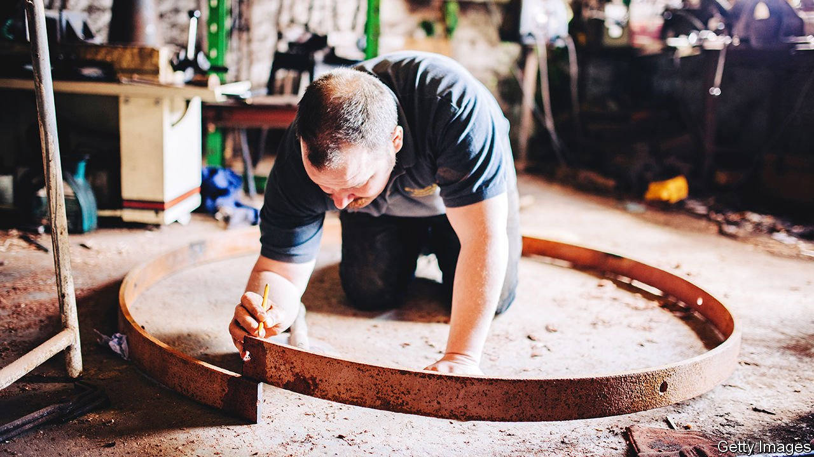

###### Still got skin in the game

# Britain’s vellum industry is booming (quietly) 

##### But the nation’s crafts are still endangered 

 

> Jan 22nd 2022 

IT IS LIKE shaving a leg, but a hairy one. In a workshop, a blade moves across a calf skin; thick chunks of hair fall to the floor. It moves again; more hair falls. A white expanse appears beneath: this is vellum, the material on which history was written and made. The Act of Union was written on vellum; the Magna Carta copied onto it; the Lindisfarne Gospels gleam on it. Centuries after its heyday, it is still in production.

Vellum is still a healthy industry, says Paul Wright of William Cowley Parchment Makers in a small workshop just outside Milton Keynes. The market has shifted from monks to megayachts (vellum makes a lovely sofa). But his company is the last vellum maker left in Britain. The lack of competition is good for Mr Wright but bad for the craft in general.


A lack of glass eyes

In the past two years Britain has endured well-publicised shortages of toilet paper and carbon dioxide. But the nation is also suffering from a shortage of vellum makers and tinsmiths; of sporran makers and Highland thatchers; and from a particularly acute shortage of glass-eye makers. Heritage Crafts, an industry body, produces lists of the most endangered skills. A red list contains 56 “critically endangered” ones, while 74 more are “endangered”. Covid made things worse.

That might not seem alarming. As even the Heritage Craft manual itself muses, “If glass eye making is lost to us” then “So what?” Britain is a nation of heritage lovers—the National Trust, a heritage charity, proudly notes that it has more members than Costa Rica has people. Britons tend to think of heritage in the country-house-and-gardens sense: history, served with a helping of high tea. Britain does not subscribe to UNESCO’s convention on safeguarding intangible heritage. But Daniel Carpenter, the head of Heritage Crafts, argues that people as well as posh houses are an important “part of our culture”.

Read the lists of endangered crafts and the truth of this becomes clear, for the reader finds herself in a world of work that is at once alien and oddly familiar. Here you find smiths, weavers, wainwrights, coopers, thatchers and tanners. The lists read like the names on an old school register. Weaving might be endangered, but the warp and weft of English is shot through with the language of the weavers still. British culture was shaped by such crafts, says Mr Carpenter, whose surname supports his argument.

Words alone cannot keep such crafts alive. Greg Rowland is a wheelwright and a wainwright: he makes and repairs wooden wheels for carts, wagons and (another former boom industry) cannons. His family have been wheelwrights, on and off, since 1331. Much of his knowledge cannot be reduced to words. “When you are driving a spoke in”, he says, “you know when it’s home because the sound changes slightly.” This can only be learnt by doing. “You can’t learn a sound from a book.”

Even those deaf to the importance of intangible heritage might be alert to its consequences. Country houses cannot be repaired if the crafts used to build them have died out; restaurants in cathedral crypts are less appealing if the buildings above them crumble because stonemasons cannot be found. For many buildings, particularly churches, shortages are pressing. When Notre Dame burnt down, Paris struggled to find craftspeople to repair it.

The loss of craftspeople can change the look of a nation. Modernist styles thrived after the first world war not only because the nation longed for a fresh start but also because so many craftsmen were dead, says James Campbell, an architectural historian at Cambridge University. “There was a critical shortage—a practical reason for reducing decoration on buildings.”

If Britain is not to lose other skills, its politicians will have to take action. So far, Mr Carpenter says, they have shown “very little impetus”. But their interest has been piqued recently. The Palace of Westminster is being refurbished and they have struggled to find the skilled workers to restore it. This, says Mr Carpenter, is drawing their attention to the problem nicely. ■

