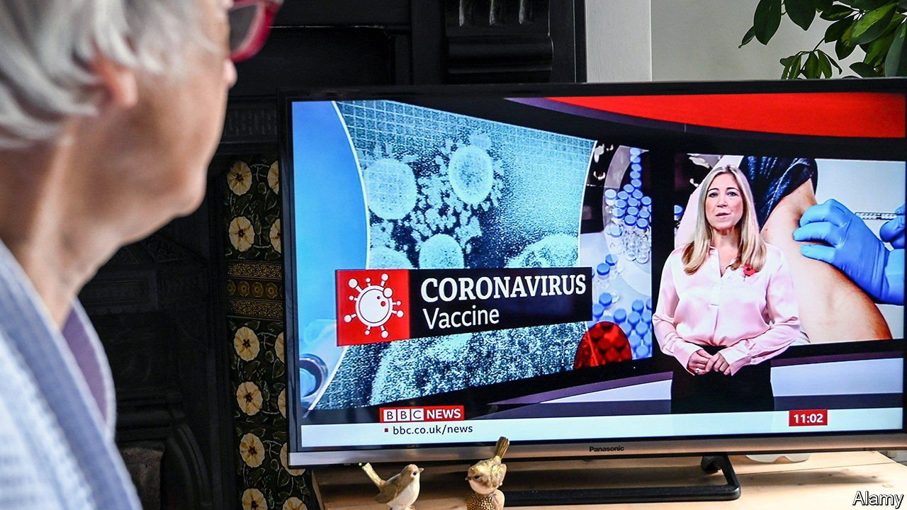
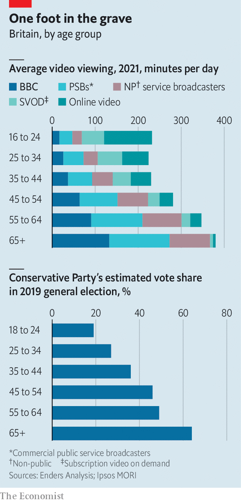

###### Telly addicts

# Tory MPs love to hate the BBC, but Tory voters love to watch it 

##### The latest piece of “red meat” may stick in the throat 

 

> Jan 22nd 2022 

THE “BRITISH Bastard Corporation”, as Margaret Thatcher’s husband Denis called it, has always irritated governments, particularly Conservative ones. Winston Churchill suspected that the broadcaster was “run by reds”. Lord Tebbit, the Tory party chairman under Thatcher, characterised its outlook as “insufferable, smug, sanctimonious, naive, guilt-ridden, wet, pink”.

On January 17th the culture secretary, Nadine Dorries, continued the tradition of BBC-baiting by announcing cuts to the broadcaster’s funding. The licence fee, an annual charge on households which provides most of the corporation’s income, will be frozen at £159 ($217) for the next two years. That was expected; more surprising was her declaration on Twitter that the current licence-fee agreement, which runs until 2027, would be the last. Ominously for the BBC, the government has no plan yet for what might replace it.


The announcement was billed as “red meat” for Tory MPs, who are alarmed at the party’s recent dive in the polls. They cheered as Ms Dorries demanded that the BBC shun “groupthink”. But bashing the BBC has become politically trickier for the Conservatives. The main losers from cuts to its output are its increasingly elderly viewers, who also make up a growing share of the Tory vote.

Older people have long been somewhat more likely than youngsters to vote Conservative, but in the past decade they have become hugely so. Whereas in 2010 the Tories’ vote share among over-65s was 14 percentage points higher than among under-25s, in 2019 the party won 64% of the pensioners’ vote, versus just 19% among the younger group.

 


As the Tory coalition has gone grey, so has the BBC’s audience (see chart). Young people are moving away from television in general and the BBC in particular, while the elderly remain super-consumers of both. Over-65s watch more than six hours of video a day, about a third of it from the BBC, according to Enders Analysis, a research firm. The typical 16- to 24-year-old watches a little under four hours, of which the BBC provides only around 15 minutes. Factoring in the BBC’s full range of services—radio, online and more—the under-35s consume about an hour of BBC content a day. That is less than half as much time as pensioners spend watching BBC TV alone.

Since every household pays the same licence fee, the elderly get the best deal out of the BBC. Indeed, 1.5m poorer households with a resident over 75 are exempt from the fee altogether, courtesy of a waiver funded by younger licence-fee payers.

What deal could be better for the corporation’s elderly, Tory-voting viewers? It is hard to think of one. Some Conservatives back a subscription model, along Netflix lines. Yet younger households would probably opt out, meaning the BBC’s remaining subscribers would lose the subsidy they currently get from those who are forced to contribute despite seldom tuning in.

Another idea is to make the BBC rely on advertising. Thatcher planned to do this until her advisers concluded that it would devastate commercial media. Today, even the BBC’s fiercest critics in the press shudder at the thought of competing with it for ads. Perhaps simplest would be to fund the public broadcaster directly from the public purse. Yet Tory backbenchers might find a new BBC tax hard to swallow.

As more households switch to streaming and the BBC’s share of screen time declines, the licence fee will become harder to justify. And the Tories are not the only ones with axes to grind. Many in Labour consider the BBC incorrigibly conservative; Remainers and Leavers alike were annoyed by aspects of its Brexit coverage; nationalist parties in Scotland, Wales and Northern Ireland have an in-built scepticism towards the London-based broadcaster. But for now the Tories may find it most convenient to leave the licence fee alone. That way their voters can continue to enjoy the twin pleasures of complaining about the BBC’s iniquities while settling down for a long, subsidised night in front of the box. ■

Dig deeper

 (Jan 22nd) (Jan 22nd) (Jan 22nd) (Jan 19th) (Jan 15th)

