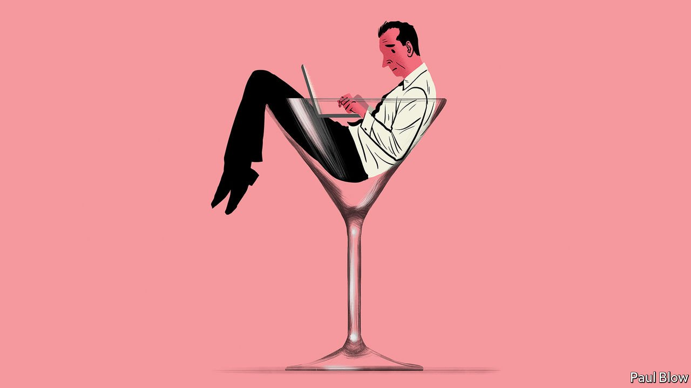

###### Bartleby

# Drinking in the office 

##### Don’t ban, don’t binge and don’t badger 

 

> Jan 22nd 2022 

A RATHER GOOD black comedy called “Another Round” depicts what happens when a bunch of disenchanted Danish school teachers constantly top up the levels of alcohol in their blood. At first the experiment goes well: the students respond enthusiastically to their newly inspiring teachers. But unconsciousness, bed-wetting and worse soon ensue. By the end of the film, it is almost like a normal day in Downing Street.

A series of revelations about parties held in the home of the British prime minister during the pandemic, while the rest of the country was subject to covid-19 restrictions that banned such jollity, has put  job on the line (see Britain section). The story has brought with it allegations of a culture of drinking among staff in Number 10: whip-rounds among colleagues to buy a wine-cooler; “prosecco Tuesdays” and “wine-time Fridays”; a suitcase used to ferry booze into the office.


Downing Street is a specific place: most people can socialise outside work without worrying about journalists eavesdropping. “Partygate” nonetheless raises the wider question of whether alcohol belongs in any office.

The pitfalls of combining drink and work are obvious. One is safety: a study from 2005 found that one in four industrial accidents worldwide could be attributed to drugs or alcohol. A second is that it encourages addiction. Alcohol use is the biggest risk factor for premature death and disability among 15-to-49-year-olds globally, according to the World Health Organisation. Research carried out in Canada found that norms encouraging workplace drinking, whether getting a round in after work or making booze available in the office, were predictive of alcohol problems.

A third consideration is the effect of sloshed colleagues on their co-workers. Roughly one-sixth of Norwegian employees say they experience harm from their colleagues’ drinking, whether through unwanted sexual attention or simply feeling excluded. A recent 12-country survey found that 9% of employees are subject to some negative spillover effect, principally through having to cover for their co-workers in some way.

No wonder many organisations ban drinking on the premises or in working hours. Lloyd’s of London, an insurance marketplace long associated with boozing, stopped its own employees from imbibing between 9am and 5pm in 2017; two years later it extended the prohibition to the much larger group of people with access to its building. But boundaries are hard to police. Lots of work-related drinking happens after hours and out of the office. That is especially true in the wake of the pandemic, when the lines between office and home have become so blurred. Is someone working at home with a glass of wine drinking on the job?

Bans can also be counterproductive. Lunches may not be as liquid as they once were, but salespeople will still sometimes want to wine and dine a client. A paper from 2012 found that a certain level of intoxication improved people’s problem-solving ability; writers at The Economist have been known to combine claret and keyboard. Work drinks are a simple way to show appreciation for employees. Plenty of people enjoy alcohol and are capable of doing so in moderation. Leaving dos and office parties would be a lot less fun for many without a glass in hand.

The liberal argument—that, within reason, people should be able to make their own choices—is a good way to frame policies on work-related drinking. Let people have a tipple, so long as it does not impair their productivity. Make sure that choice genuinely goes both ways: stigmatising non-drinkers is a problem, particularly in boozy cultures like South Korea’s. Normalise restraint, by restricting the frequency of work events and the amount of drink on offer.

And if you do worry about your drinking culture, the Downing Street shambles can help. Here are ten signs that things may be getting out of hand:

• You think a suitcase is a unit of measurement.

• You try to expense your fridge as a piece of office equipment.

• You bring booze to work events and laptops to parties.

• Your behaviour requires you to apologise to the queen.

• You cannot count to ten.

Alcohol and work can go together, but in moderation. That may not be the most original advice in the world, but following it would have left Mr Johnson with less of a headache.


 (Jan 15th 2022) (Jan 8th 2022) (Jan 1st 2022)

