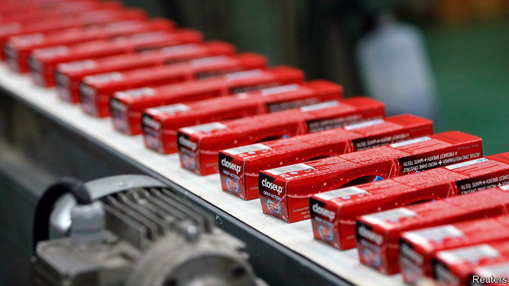
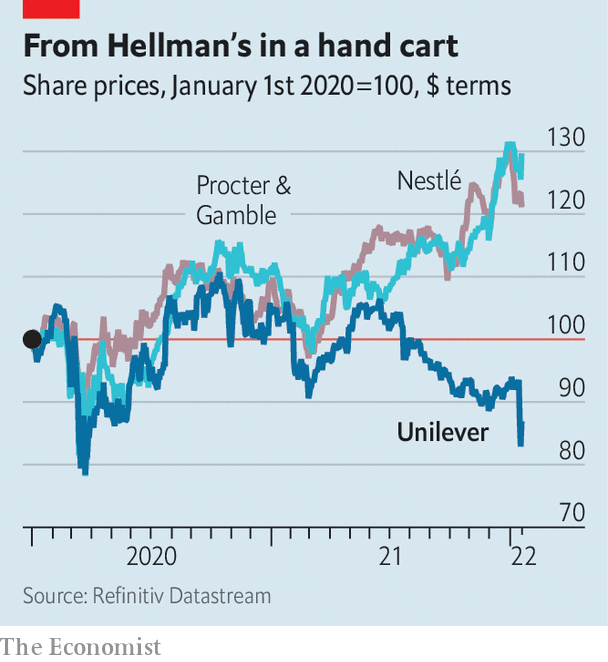

###### Less tea, more toothpaste

# Unilever’s £50bn health cheque 

##### Purchasing GSK’s consumer-health division may be hard to swallow 

 

> Jan 22nd 2022 

WHEN UNILEVER bought Bestfoods for $20.3bn at the turn of the millennium, it was one of the largest cash acquisitions ever. After two failed bids, the British consumer-goods giant dug up an extra $2bn to sweeten the deal. It divested 700 of its brands in the year that followed but replenished its larder with Bestfoods’ Knorr soup and Hellman’s mayonnaise. Now, in pursuit of another mega merger that could be four times as big, Unilever has been prepared to dispose of the larder entirely.

Unilever’s new target has been the consumer-health unit of GlaxoSmithKline (GSK), a British drugmaker. On January 15th it emerged that the soup-to-soap group was offering to pay £50bn ($68bn) for the business. GSK, which has been keen to ditch the division in order to focus on more lucrative prescription medicines, refused to bite. The markets choked: Unilever’s share price fell by 7% the next trading day. Analysts are almost uniform in their view that the deal is a bad idea, arguing that it presents more risk than Unilever, with a market capitalisation of £94bn, can stomach. Selling lagging categories like food may not be enough to fund the transaction, of which nearly £42bn would be in cash. Fitch, a ratings agency, warned that Unilever could lose its A credit rating if it took on too much debt.


Alan Jope, who took over as chief executive three years ago, sees the future of consumer goods in health and hygiene products rather than food. Hand sanitiser and paracetamol have certainly sold well during the pandemic. Moreover, Unilever has a big presence in developing countries, which could create new markets for GSK’s brands such as Sensodyne toothpaste and Advil painkillers. Still, on January 19th the company, possibly having read all the warning labels about the deal, said it would not raise its offer above £50bn, which GSK’s bosses said undervalued their division. This may end the pursuit.

 


It won’t end Mr Jope’s troubles. He is under immense pressure to improve the group’s performance. The affable Scotsman has so far been unable to reignite growth in his three years in charge. Unilever’s share price has declined in the pandemic even as those of rivals such as Nestlé, a Swiss giant, or Procter &amp; Gamble (P&amp;G), an American one, have gone up by more than 20% (see chart). A career-defining deal might have set him apart from his predecessor, Paul Polman, who was known for eschewing financial engineering. If the £50bn transaction came to pass, it would be one of Britain’s biggest-ever.

There is also a growing sentiment that Unilever’s zeal for purpose-driven brands, first instilled by Mr Polman, has run out of steam. From ethically sourced tea and fighting deforestation with sustainably-sourced palm oil to marketing Dove soap as a women’s-self-esteem project, the firm has sought to connect with shoppers on their values and draw investors interested in environmental, social and governance (ESG) factors as well as profits. Although ESG remains popular, hints of a backlash against it are appearing. This month Terry Smith, an asset manager who is among Uni lever’s top ten shareholders, groused that the firm has “lost the plot” by pursuing sustainability medals at the expense of financial performance. A hard-headed pivot to a more profitable health business could, if successful, allay such worries.

The deal would have been problematic, and not just because it looked like a heavy lift for Unilever. Megamergers seldom work out as advertised, and Mr Jope’s firm is not renowned for stellar execution. Moreover, the consumer-health market is expanding but incumbents’ share of it is not. Established brands have a place—people need to brush their teeth—but growth in the sector increasingly comes from a new pharmacopoeia of clever products and services, many of them with digital features. Even in good years GSK’s consumer-health division has grown at best in single digits. The long-term growth prospects for its brands look pale. Antacids and nicotine patches have only limited potential, even in emerging markets.

Unilever’s rivals have been more discerning with their acquisitions. In 2020 Nestlé acquired Aimmune, a novel peanut-allergy medication, and a year later it bought Nuun, a challenger in the sports-beverage market. Both deals gave the Swiss firm a foothold in profitable, underdeveloped niches. P&amp;G is dabbling in premium skincare, one of the industry’s fastest-growing categories, with its latest acquisitions Tula Skincare and Farmacy Beauty. If Unilever does end up disposing of its food business, it may also miss out on the boom in alternative proteins, notes Bruno Monteyne of Bernstein, a broker. Meat substitutes appear certain to become more popular with time and companies like Unilever stand to benefit, given their mix of solid research-and-development base and brands beloved by consumers.

Unilever says it has another, undisclosed initiative up its sleeve to improve performance. It had better. The pandemic boost notwithstanding, the entire consumer-goods industry has experienced slower growth over the past decade. With the exception of Nestlé, European companies have done poorly. Unilever needs some refreshing, but more toothpaste won’t do the trick. ■

For more expert analysis of the biggest stories in economics, business and markets, , our weekly newsletter.

