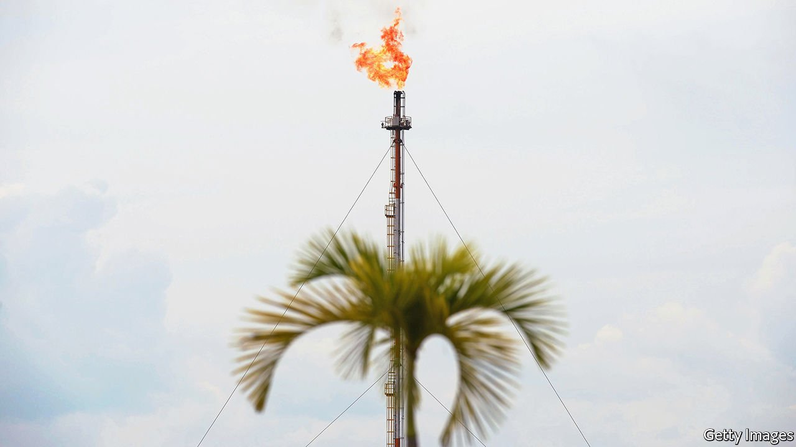

###### Going green-ish

# What is ExxonMobil’s new climate strategy worth? 

##### Big oil’s most reluctant decarboniser lays out its green plan 

 

> Jan 22nd 2022 

DARREN WOODS made some revealing remarks this week about global warming. His ruminations matter in  for he is the boss of Exxon Mobil, the largest Western oil major. His firm has historically been less enthusiastic than rivals about taking climate change seriously. But a  last May placed three green-tinted directors on its board. That has put pressure on the Texan company’s management to curb emissions with more ambition.

On January 18th Mr Woods unveiled the firm’s long-awaited update to its climate strategy. “Is society sincere in its desire for a lower-emissions future?” asked the veteran oilman when pressed on the thinking behind the plan. It is, he says. “And so are we.” Evidence for this lies in a newfound willingness to commit to hard targets for cutting greenhouse-gas emissions.


The first, long-term target is for the company to achieve carbon neutrality in its operations by 2050. It has been quite fashionable of late for big energy firms to claim that they will achieve  by some distant date. Not all of them lay out specific plans for how they will actually do this. Often, they plan to rely heavily on carbon offsets, which could let them buy emissions credits of dubious quality cheaply rather than making painful emissions cuts and costly changes to their business. Mr Woods has previously dismissed such proclamations as nothing more than a “beauty competition”.

In contrast to such pageants, Exxon Mobil’s new long-term goal is accompanied by concrete plans for this decade. In a big U-turn, the firm will commit to absolute cuts in its carbon emissions—a step it has long resisted in favour of squishier reductions in “emissions intensity”. It pledged to emit about 20% less greenhouse gases by 2030 relative to 2016, with emissions from exploration and production set to decline by approximately 30% over that period. Thirty-plus operating divisions will each get a binding target, which will add up to the company-wide total. Managers at each division will then be held accountable for achieving those cuts, with no wriggle room or trading among divisions permitted.


The firm’s plans for its shale business in America’s Permian region are illustrative. ExxonMobil says it will achieve net-zero operating emissions in the patch, responsible for over 40% of its American hydrocarbon output, within the decade. It plans to achieve most of that through the use of novel low-carbon technologies and improvements in its practices, from replacing leaky compressors and powering operations with green energy to carbon capture and storage (CCS). It is flaring less methane, a potent greenhouse gas, and working with third parties to monitor fugitive emissions using satellites, aerial reconnaissance and sensors. The firm insists it will rely on carbon offsets for at most “a few percentage points” of emissions cuts.

ExxonMobil’s new plan is, then, an improvement on its earlier climate recalcitrance. How much it actually does for the planet is another matter. Unlike many rivals, ExxonMobil does not count emissions from fields operated by joint-venture partners, which gives a fuller picture. Most important, its road map covers only emissions emanating from the company’s own operations and energy use (scope 1 and scope 2 emissions, respectively, in the jargon). European rivals such as BP, Shell and TotalEnergies have additional targets to reduce the emissions intensity of their products by 2050. That is why they have piled into renewables.

Some oilmen argue that the makers of petrol-burning cars or their drivers should share more of the responsibility for limiting these “scope 3” emissions. Such arguments, though not wholly without merit, are also self-serving: end users can account for 80-90% of the total climate-warming gases associated with fossil fuels. Ignoring them in your carbon accounting seems mighty convenient.

ExxonMobil’s plan does open the door to a pursuit of fuller net-zero goals beyond scopes 1 and 2. But the firm has no interest in renewables, which is a less profitable business than oil (as reflected in the European firms’ weaker valuations). Instead, it is investing $15bn over the next five years in areas such as hydrogen, CCS and biofuels. The snag is that these climate-friendly technologies have not yet found profitable business models.

They may never do, at least without government inducements. ExxonMobil believes that decarbonisation carrots in the form of tax credits and subsidies will offset some of the higher costs of its low-carbon bets and help keep the firm’s overall margins high. Ultimately, Mr Woods says, low-carbon strategies will require some state support in order to generate good profits. If big oil is to make big profits from the energy transition, in other words, it needs big government. ■

For more analysis of the biggest stories in economics, business and markets, , our weekly newsletter. For coverage of climate change, register for , our fortnightly newsletter, or visit our 

