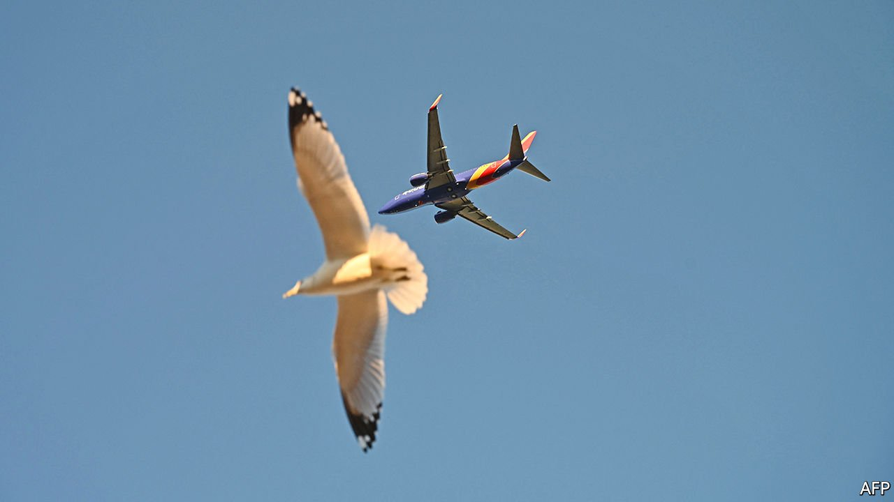

###### Flight tracker

# Where next for air travel? 

##### New covid variants stall aviation’s upward flight path 

 

> Jan 22nd 2022 

WORK AND shopping have, for better or worse, been permanently altered by the pandemic. The airline industry hopes that its own covid-19 disruption proves temporary. Luckily for those deprived of holidays, visits to family and friends, or even the odd business trip, flying in 2022 will look a bit more like the pre-pandemic jet age—with differences between domestic and international routes, short-haul and long-haul ones, and east and west.

The numbers taking to the skies have risen steadily since March 2020, when the pandemic first grounded flights. Most forecasters expect that by 2024 as many passengers will fly as did in 2019. IATA, a trade body, reckons that 3.4bn people will buckle up in 2022. That is nearly double the number in 2020, though still some way shy of 2019, when 4.5bn took to the air.


Uncertainties remain, however, not least the pandemic. Consider the Omicron variant. Ed Bastian, boss of America’s Delta Air Lines, has described navigating the past few weeks as “hellacious”, after some 8,000 of his staff, about 10% of the total, contracted the virus. Crew shortages, tighter travel restrictions and bad weather conspired to force the cancellation of 60,000 flights worldwide between December 24th and January 3rd, calculates Cirium, an aviation-data firm. That corresponds to roughly one in every 40 flights. The fact that the worst Christmas period for a decade still made December the busiest month of 2021 illustrates just how far the industry has to go.

Covid-19’s unpredictable course shows that even bright spots can cloud over. Large domestic markets, unaffected by international travel bans and other unco-ordinated border restrictions over vaccinations and testing, have led the recovery. Within America, the world’s biggest internal market, demand for seats has nudged above 80% of pre-covid levels. In China it has exceeded pre-covid times on occasions over the past year, thanks in part to the country’s strict “zero-covid” strategy. Although lockdowns to snuff out recent outbreaks in the run-up to the Winter Olympics in Beijing next month have slapped the chock blocks back on, China’s aviation regulator still expects domestic traffic at around 85% of pre-pandemic levels in 2022.

The plans for restoring capacity among the world’s airlines give a sense of the likely shape of improvement on international routes, which IATA predicts will reach only 44% of pre-crisis demand this year. Some low-cost airlines serving short-haul connections in America and Europe, where travel restrictions may soon be relaxed, could surpass pre-covid capacity, reckons IBA, another aviation-research firm. America’s big three network carriers will also benefit from the reopening of the lucrative transatlantic market, which this year is expected to bounce back to where it was in 2019. Delta will approach pre-covid capacity in 2022, and United may exceed it. Some of Europe’s legacy airlines may benefit, too. IAG, owner of British Airways, is expected to restore all of its flights across the Atlantic by summer 2022.

Airlines in the Asia-Pacific region are likeliest to remain stuck. Many governments, relying on isolation to control the virus, have toughened already strict travel rules to contain Omicron. Capacity is still around 60% below previous highs. Singapore Airlines will run at half of its pre-covid capacity for at least the first couple of months of 2022; Australia’s Qantas may operate at just 45% this year.

Even if Omicron were the last of covid, airlines have other things weighing them down. As Andrew Charlton of Aviation Advocacy, a consultancy, notes, governments have doused beleaguered airlines with cash to keep them aloft. Much of that—around $110bn, says IATA—needs to be paid back. And that is on top of new debts owed to private-sector creditors. Moreover, so long as demand remains weak airlines will find it hard to pass the rising cost of fuel on to passengers. The industry’s net losses will narrow from the staggering $138bn in 2020 and $52bn in 2021. Collectively, airlines are expected to lose another $12bn this year. Better—but hardly stellar. ■

For more expert analysis of the biggest stories in economics, business and markets, , our weekly newsletter.

