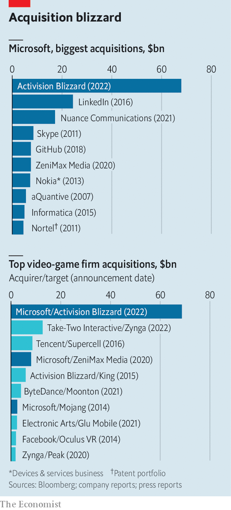

###### High score

# Why Microsoft is splashing $69bn on video games 

##### The tech giant’s acquisition of Activision Blizzard is its biggest-ever deal 

 

> Jan 22nd 2022 

EVEN FOR Microsoft, which boasts a market value of $2.3trn, $69bn is a lot of money. On January 18th the firm said it would pay that sum—in cash—for Activision Blizzard, a video-game developer. It is by far the biggest acquisition in the video-game industry’s history, and the , more than twice the size of its purchase in 2016 of LinkedIn, a social network (see chart). The move, which caught industry-watchers by surprise and propelled Activision Blizzard’s share price up by 25%, represents a huge bet on the future of fun. But not, perhaps, a crazy one.

Gaming was a big, fast-growing business even before the pandemic. Lockdowns —to hardened gamers with more time on their hands and bored neophytes alike. Newzoo, an analysis firm, reckons revenues grew by 23% in 2020, to nearly $180bn. That growth has attracted the attention of other tech titans, including Apple, Netflix and Amazon, all of whom have dipped their toes into the market in recent years.


Microsoft has been in the business for two decades. It earns $15bn a year from games, mostly thanks to its Xbox console. It has made a string of gaming acquisitions since 2014, when Satya Nadella, its chief executive, took the reins. Assuming it is not blocked by regulators, who are watching big tech with a beady eye, this deal would cement its position. Once completed in 2023, it will make Microsoft the third-largest video-gaming firm by revenue, behind only Tencent, a Chinese giant, and Sony, Microsoft’s perennial rival in consoles.

 


Big acquisitions are always risky. Like most companies, Microsoft has a spotty record. Activision Blizzard’s share price slid by around 40% between a peak last February and the deal’s announcement, as it was embroiled in a sexual-harassment scandal. Player numbers have slipped from 530m a month in 2015 to 390m, and some recent games have had mixed reviews. Pessimists could argue that the company is overvalued. Optimists, who see annual revenues of $8bn and net profit margins of around 30%, might counter that it is cheap.

Most important, Activision Blizzard has lots of content—and in video games, as in all of media, content is king, says Piers Harding-Rolls of Ampere Analysis, another research firm. Like the movie business, where “Star Wars” films, even bad ones, are reliable money-spinners, video games rely increasingly on “franchises”—popular settings or brands that can be squeezed for regular instalments. Activision Blizzard offers, among others, “Call of Duty”, a best-selling series of military-themed shoot-’em-ups, “Candy Crush”, a popular pattern-matching mobile game, and “Warcraft”, a light-hearted fantasy setting.

The deal may help Microsoft broaden its reach beyond consoles, says Julianne Harty of Newzoo. King, a mobile-focused unit of Activision Blizzard, boasts around 245m monthly players of its games, most of whom tap away at “Candy Crush”. It is also a strike against Sony, whose share price fell by 10% on news of the deal. If Microsoft controls the rights to “Call of Duty”, it can decide whether or not to allow the games to appear on Sony’s rival Play Station machine. When Microsoft bought ZeniMax Media, another gaming firm, for $7.5bn in 2020, it said it would honour the terms of ZeniMax’s existing publishing agreements with Sony, but that Sony’s access to ZeniMax’s new games would be considered “on a case-by-case basis”.

It also fits Microsoft’s long-term ambition to become the dominant player in a gaming market that it hopes still has plenty of room to grow. (Mr Nadella, inevitably, gushed about the .) The firm is bundling content and pushing the “Game Pass” subscription service, which offers console and PC gamers access to a rotating library of titles—which usually cost $40-60 each—for $10 a month. Adding Activision Blizzard’s catalogue to the service could boost its appeal.

In the longer term, Microsoft  to use its Azure cloud-computing arm to do for video games what Netflix did for films and TV. In 2020 it launched a game-streaming add-on to Game Pass that beams high-end games across the internet to a phone, TV or desktop. Running a game’s code in the cloud removes the need to own a powerful, pricey console or PC. The technology is tricky. Still, Microsoft hopes that as it matures, it will draw in more players, especially in middle-income countries where smartphones are common but consoles rare. Although other firms, including Sony, Amazon and Nvidia, offer similar services, none looks as well-placed as Microsoft. The software giant combines a strong content library and decades of experience in gaming with the world’s second-largest cloud operation behind Amazon.

Microsoft’s big bet may persuade rivals they, too, need to snap up content while they can. The gaming industry was already seeing plenty of merger activity. Last year five deals worth $1bn or more were inked. On January 10th Take-Two Interactive, a game developer and publisher, spent $13bn on Zynga, a maker of mobile games. Sony will be feeling vulnerable after Microsoft’s deal. Amazon, Apple or Netflix may decide that now is the time to show that they are serious about the business. Consolidation looks like the name of the game. ■


