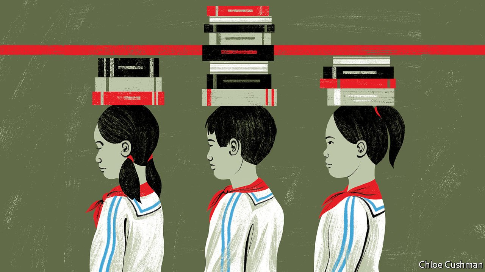

###### Chaguan

# The Communist Party revisits its egalitarian roots 

##### Xi Jinping offers the stressed-out middle classes a dose of populism 

 

> Jan 22nd 2022 

CHINESE NATIONALISTS and fans of liberal democracy do not often agree. Still, early this century, both groups sounded convinced of the subversive power of affluent Chinese buying American coffee. In 2007 a state television anchor growled that a Starbucks branch in the Forbidden City “trampled Chinese culture” (the branch closed the same year). In 2004 a New York Times columnist declared the Communist Party revolution “finished” once Starbucks entered China, because: “No middle class is content with more choices of coffees than of candidates on a ballot.”

Both groups were mistaken. Nationalists should have been more confident about China’s cultural power. With 5,400 outlets in China today, Starbucks thrives by adapting to local tastes, offering such items as the Lychee Ruby Chocolate Tea Latte. For their part, Western liberals have to date been proved wrong when they drew neat links between expanding consumer choice, individual spending power and, they assumed, a clamour for political freedoms and democracy. Four decades after the Communist Party embraced market reforms and opened to foreign investors, China’s middle class has never been larger. Its members can choose where to live, work and how to spend their days in ways that would have been unthinkable 40 years ago. Yet under President Xi Jinping, the Communist Party exerts more control over more aspects of society and the economy than it has in decades.


One explanation for this puzzle lies in the party’s ability to spot sources of mass discontent and present itself as the solution to them. Often, this involves depicting the party as the defender of a broad majority against a hostile, deviant or corrupt minority. Western liberals imagined that an empowered middle class would demand respect for their rights and dignity as individuals. Instead, Mr Xi, a canny populist, has a knack of spotting when a bit of repression may be welcomed by a public that feels overwhelmed by rapid changes in society or unbearable competition, and will cheer a powerful state cracking down in the collective interest.

Education policies unveiled in 2021 offer a revealing example. These respond to a real problem: unequal access to a small number of excellent schools and universities. Mr Xi prescribed a dose of egalitarianism, at a strength that shocked the education sector. The policies ban homework for the youngest pupils, abolish some early-years exams and promote practical and vocational learning, heeding Mr Xi’s view that education should not focus too much on academic scores. In the name of equality as well as stress relief, China banned for-profit tutoring services for students in the nine years of compulsory education. Mr Xi had scolded private tutors for overburdening parents, who worry that others’ children are learning more. Officials linked that pressure to China’s plunging birth rate, which reached record lows in 2021. Tutoring firms are now allowed to register as non-profit enterprises, which means lowering prices by 80% or more. Even then they may not teach primary- or middle-school pupils at weekends or during holidays. Many have simply stopped teaching the core curriculum.

There will be losers. New Oriental, a big education firm, announced that it has laid off 60,000 of its 110,000 staff. If the whole industry follows suit, 6m tutors, most of them young graduates, will need new jobs. Then there are parents who hired tutors to help children struggling in schools where classes of 50 pupils are the norm. The government has told schools to provide low-cost evening classes instead, but their staff are already overstretched. “It's not practical to give special attention to one kid,” says a veteran schoolteacher, who understands why many parents worry about the new policies, though he calls them “well-intentioned”.

Middle-class parents do protest if they feel that they have been thrust, unfairly, into a disadvantaged minority. In 2019 parents at a school in the eastern city of Nanjing expressed outrage when staff eased off on exam preparation and homework as part of an experiment, while rival schools remained sternly academic.

Chaguan spoke to parents at a Beijing sports complex on a recent weekend, and found them focused on remaining in a protected majority. An affluent bunch, they had used tutors in the past. They acknowledge that individual choices are being curbed. That might logically make them oppose the policy. But they welcome a break from exhausting, inter-family competition. As long as the government stops everyone hiring tutors, says one father, none of his friends see the need to employ them. Prod a bit, and this lofty talk is qualified. A father watching his 13-year-old son take an American-football class confides that, before his child takes school-leaving exams, he will probably hire a (now illegal) tutor “to tackle his weak points”. A mother says that she supports policies that stop children studying key planks of the curriculum with tutors long before taking them at school. But not all pressure can be eliminated, she adds: tough public exams will plunge children into “fierce competition” one day.

It will take more than a ban on tutors to make China equal

In Haidian, a university district, people in the tutoring business echo the egalitarian mood. The co-founder of a tutoring firm recalls how parental demand drove the industry’s wild expansion. “Sometimes we felt a bit afraid about how fast it was growing,” she says. Her firm hopes to make non-profit classes pay, subsidised by for-profit courses in drama and public speaking. Still, it may not survive. An education-technology expert now sells steaks online, citing government calls to help rural areas. “You need to go with the tide,” he explains. Chaguan visits a new café opened by a 24-year-old English tutor. The image of a trendy urban professional, he teaches part-time at a school but craves variety too much to work at a school full-time. Profit is not his motivation, he declares: “We should not judge a company by how much money it makes, but by its contribution to society and the nation.” In middle-class China, his tone of conformist individualism fits right in. ■

Read more from Chaguan, our columnist on China: (Jan 15th) (Jan 8th)

 (Dec 11th)

