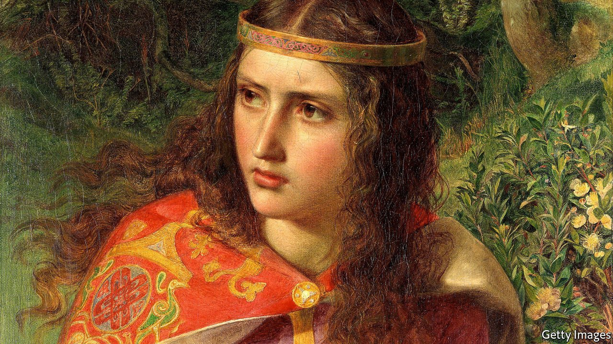

###### On angels’ wings

# A vivid history shows another side of the Crusades 

##### “Queens of Jerusalem” brings forgotten medieval rulers to life 

 

> Jan 22nd 2022 

Queens of Jerusalem. By Katherine Pangonis. Pegasus Books; 272 pages; $28.95. W&amp;N; £20

MEDIEVAL HISTORY shows up on the page in two ways. One is obvious: it is written in pen and ink on vellum and parchment. This sort of history tends to be about battles and bloodshed, conquerors and kings. But some texts offer another kind too—much quieter but speaking volumes nonetheless. This history is told in hints, asides and impressions; it is a history that must be hunted for.


The 12th-century ivory-bound book known as the Melisende Psalter is a good example. At first sight, it offers the usual historical staples: words, dates, religious images. But tilt it, and other shapes appear, scratched into the gilding. In one, you can see feathers engraved in an angel’s wing; in another, you glimpse the word “Basileus”, the signature of the artist. On a different page, the gilding on the feet of Christ has faded—worn away, it is suggested, by the kisses of Melisende, the queen of Jerusalem who once owned the book.

Picturing Melisende, and other medieval queens, is not easy. As with the images in the gilding, the historian must get close to the texts, angle them this way and that, and seek out traces of their subjects. But as Katherine Pangonis makes clear in this vivid history, the effort is worthwhile, adding depth and unexpected detail to the understanding of the past. For instance, the Crusades tend to be remembered, on page and screen, as a manly and Manichean struggle, in which Christian warred with Muslim and cold steel defended iron convictions. As this book shows, the reality was far muddier, more female—and far more interesting.

Take one of the most striking vignettes offered here, about what happened when a Frankish knight arrived in the Middle East and went to the local baths with his wife. Noticing that the attendant’s pubic hair had all been shaved off, and struck by this stylish look, the knight promptly ordered the flunky to shave him too. Delighted by the result, he turned to the attendant and said: “Salim, by the truth of your religion, do it to Madame!” Not a line that has found its way into Hollywood films.

Ms Pangonis’s stories of Middle Eastern and European queens offer similar surprises. Tilt the medieval chronicles and you find leaders who are not the mild maidens of legend but instead women who—in the absence of dead, weak or warring husbands—ruled cities, withstood sieges and, “more mannish than the Amazons”, set off on Crusades themselves. The book’s sub title is “The Women Who Dared to Rule”, but “dared” is not quite the right verb. Rarely did these women actively seize power; more often it was thrust upon them, usually by marriage and often at a startlingly young age. One queen was a widow by 13. Another was married at eight. Medieval monarchy gave little heed to menarche.

The obsession with childbearing and succession leads to a slight weakness in this entertaining book. Occasionally, the profuse details of who married whom, who had how many children, and what the naughty uncles were up to, can make it feel less like a history and more like a gathering of Catholic aunts. But then the narrative tilts again, and there, in the gilding, you see the feathers on the angel’s wing. ■

