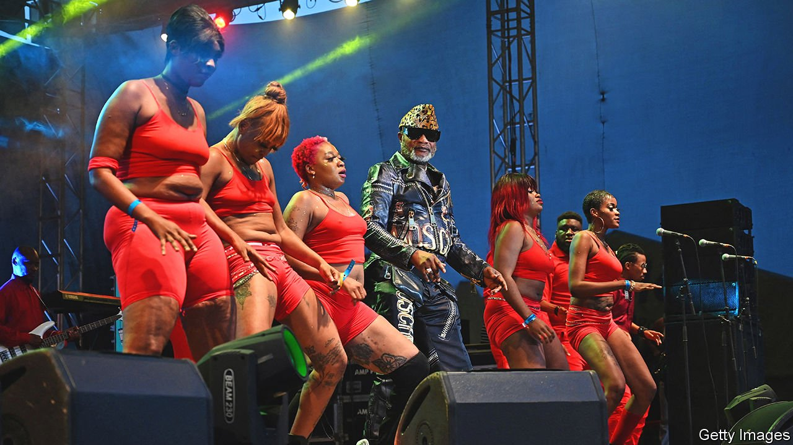

###### The beat goes home

# Beneath the rhythm, Congolese rumba is a link to the past 

##### And the soundtrack of modern politics 

 

> Jan 22nd 2022 

AS YOU CLIMB the dimly lit staircase at La Crèche nightclub in Kinshasa, the capital of the Democratic Republic of Congo, you may hear a man’s high, lilting voice drifting from the rooftop. There, above the traffic-clogged alleys of Victoire, a dense neighbourhood popular with both artists and pickpockets, couples dance to rumba music. Women sling their arms around their partners’ necks and together they move, sinuously, across the roof. The ageing men twanging guitars and playing drums wear scarves and glittery caps. A flamboyant dress sense is a prerequisite for any serious rumba musician in Congo.

In its modern form, Congolese rumba evolved in the 1940s, largely in Kinshasa. Its irresistible rhythms soon echoed across the continent and today it is one of Congo’s proudest, and noisiest, exports. Last month rumba’s status was nudged a little higher when it was added to the “intangible cultural heritage” list maintained by UNESCO, the UN’s cultural agency. It joins Estonian smoke saunas and Polish beekeeping on a register meant to promote “cultural diversity in the face of growing globalisation”. Listen closely, though, and beneath the sultry beat is a tale of transatlantic cultural exchange—and of art’s entanglement with politics.


In a simplistic version of its history, Congolese rumba was inspired by the Cuban kind. That is true, but so is the reverse: the origins of Latin rumba lie in central Africa. The beat was first exported to Cuba by slaves, many of whom were taken from the Kingdom of Kongo (which included modern Congo) from the 15th century onwards. On the island, some fashioned drums from animal skins and hollowed-out trees and began playing their traditional music.

“It was a spiritual music, a way to praise their ancestors who would then relay their prayers to God,” says Lubangi Muniania, a Congolese art historian and journalist. Enslaved people danced to it in pairs, waist to waist, so it was known as nkumba, meaning “waist” or “belly button” in Kikongo, a Congolese language. That morphed into “rumba” and, over the years, the style mingled with the Spanish sounds prevailing in Cuba. The foot-tapping rhythm was embellished with guitars, clarinets and pianos.

For centuries rumba bounced back and forth across the Atlantic. It was re-exported to Congo when Belgian colonisers set up the country’s first radio station in Kinshasa (then Leopoldville) in 1940, and began airing overseas music. The breezy, danceable Cuban tunes, with their familiar cadences, were immediate hits. Musicians in Leopoldville—and across the river in the capital of neighbouring Congo-Brazzaville—reinterpreted the genre. “The funny thing is that for the Congolese people listening to that music, it wasn’t foreign to them at all,” says Mr Muniania. “They were playing African music back to Africans, so there is no wonder they picked it up.”

A well-known haunt for rumba enthusiasts in Kinshasa today, La Crèche was a brothel before becoming a nightclub. A band was first invited in the 1980s to entertain clients on the roof after, or between, their trysts; the staircase is lined with bedrooms obscured by colourful curtains. Another rumba institution is the Un-Deux-Trois club, run by Yves Emongo Luambo, whose father, Franco Luambo, was one of the greatest-ever rumba guitarists and composers. He helped make rumba “our cultural passport”, as Mr Emongo puts it.

Dazzlingly handsome in his youth, the musician was known as “Franco de mi amor” by some female fans and “the sorcerer of the guitar” by others. His legendary band, OK Jazz (later called TPOK Jazz), released an average of two new songs a week for years, totalling well over a thousand. If Franco had tumultuous relationships with women, none were as lengthy or complex as the one he had with Mobutu Sese Seko, who ruled the country for over three decades—a liaison that epitomised the nuanced role of music in Congolese politics.

Sometimes Franco criticised Mobutu. His most radical track was released in 1966, a year after Mobutu came to power. The dictator had four political opponents, including a former prime minister, publicly hanged in a square in Victoire. Franco was in the crowd and wrote a threnody to the victims. Like some of his other songs, it was hurriedly banned; all the copies on sale were confiscated.

Yet he also penned flowery paeans to the despot. By the time of the presidential election of 1984, in which Mobutu was the only candidate, faith in him had evaporated as the public watched him use their money to guzzle champagne for breakfast and charter Concorde for shopping trips to Paris. Even so, Franco released an effusive ode called “Our Candidate Mobutu”. Its refrain was “Mobutu, God sent you.”

This is an extreme example of libanga, a feature of Congolese rumba that attests to its influence. The word means “pebble” in Lingala, the language spoken in Kinshasa. Musicians throw a pebble, or give a shout-out, to wealthy patrons who reward them lucratively. Rumba tracks are peppered with references to politicians, especially ahead of elections. Libanga tends to be mercenary, not ideological, with singers inclined to mention whoever pays them. Werrason, another rumba legend, once named 110 people in a single song.

Today, Congo’s biggest rumba star is 65-year-old Koffi Olomide (pictured on previous page), who performs in sunglasses and tight trousers, as he did recently at a plush hotel in the eastern city of Goma. Mr Olomide turned up late, after everyone was supposed to have gone home due to a pandemic-related curfew. Wearing a leopard-print hat in the style of Mobutu, he called a policeman up on stage to crack jokes about flouting the rules. He might be above the law in Congo, but in France, where he lives much of the time, he was recently convicted of holding four female backing dancers in his house against their will.

The case was a blow to the singer’s fans. In Congo, though, few things are constant. Electricity and water supplies are erratic, statesmen are often corrupt and predatory. But rumba itself is reliable. It has been around, in its various forms, for centuries. It can be heard all over the vast country and is best enjoyed with a beer in hand. From the capital to a village on the banks of the Congo river, chances are you will find a bottle to sip as familiar rumba beats blare from a nearby radio. ■

