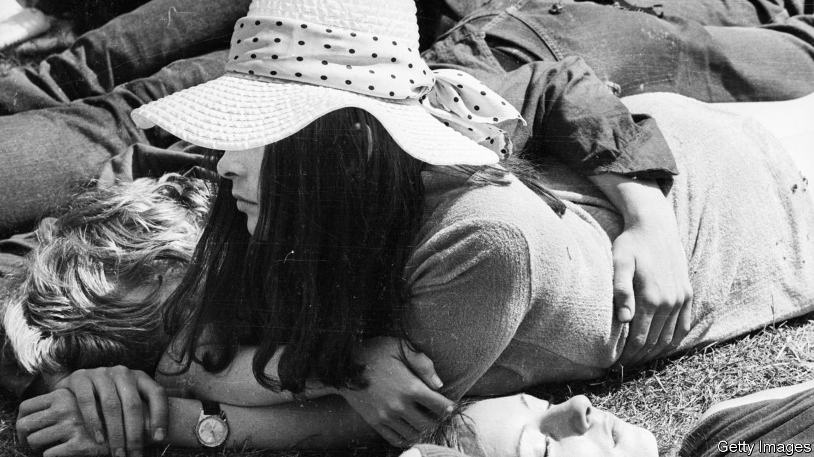

###### Into the swing

# In “Free Love”, a woman finds liberation in “swinging London” 

##### But, in Tessa Hadley’s new novel, freedom comes at a cost 

 

> Jan 22nd 2022 

Free Love. By Tessa Hadley. Harper; 304 pages; $26.99. Jonathan Cape; £17.99

“SHE WAS pleased with her life.” Tessa Hadley’s new novel unravels from this anodyne statement. It is the summer of 1967 and Phyllis Fischer, a 40-year-old housewife, is smugly content in the English suburbs with her husband Roger, a senior civil servant, and their two children—obstreperous, clever, teenage Colette and nine-year-old Hugh. One evening they host Nicky Knight, the son of an old friend. An electric moment between Phyllis and the alluring, outspoken guest jolts her marriage, her life and those of her family.


“Free Love” shares themes with Ms Hadley’s previous books, including her debut, “Accidents in the Home” (2002), and “The Past” (2015): marital discontent, the fluctuating status of women, and the secrets people keep to maintain the social or personal status quo. When Phyllis absconds to join Nicky, the sleek, orderly prosperity of the Fischers’ home is set in stark contrast with the lively hedonism of “swinging London”. The two locales are a train ride apart but seem far more distant.

Nicky, an aspiring left-wing writer, challenges Phyllis’s middle-class preconceptions. He is living in the Everglade—“everyone who was anyone in the counterculture had stayed in the Everglade at some point”—a once-grand, now seedy block of bedsits in Ladbroke Grove. To her exhilaration, Phyllis begins to mix with the younger, more radical generation at a time of often violent upheaval, including the student protests of May 1968 in Paris and heated objections to the Vietnam war. She befriends a nurse from Grenada, whose hopes of becoming a doctor are stymied by prejudice. Meanwhile, rebellious Colette experiences a kind of second-hand catharsis from her mother’s transformation. Hugh is packed off to boarding school.

And Roger, the most compelling character, divulges something about his past that turns out to be more consequential than his wife’s indiscretion. As ever, Ms Hadley’s prose is limpid and measured yet richly sonorous: her story combines a modern sensibility with the psychological realism of writers such as Henry James. As always, she reserves judgment, letting her characters incrementally reveal themselves, the good and the bad. The ending glimmers with possibility—while suggesting that liberation comes at a cost. ■

