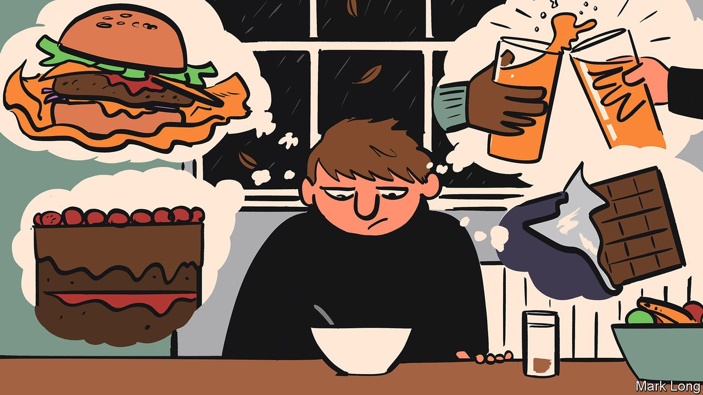

###### World in a dish

# The art of fasting 

##### In a season of abstinence, take a lesson from Ethiopia 

 

> Jan 22nd 2022 

SHORT DAYS, long nights, freezing temperatures, Christmas a swiftly fading memory and the prospect of spring remote—“the cruellest month” is not April, as T.S. Eliot wrote, but January. The garden harvest of frost-tipped kale and collards, and perhaps some beets, carrots and parsnips, is scant if often delicious. January is the season of looking in the mirror and taking stock, of regret, determination and abstinence. It is Dry January, Veganuary, renewed gym memberships, vows to cycle everywhere and spend less time in the pub. In other words, it is fasting season.

These secular rituals have deep religious roots and ancient corollaries, meant to prompt reflection by bringing appetites to heel. For Muslims during the daylight hours of Ramadan, or Jews on Yom Kippur, fasting means abstaining completely from food and drink as a way to draw closer to God. But not every religious fast is all or nothing. Christians often give up meat during Lent. Many Buddhists eschew it periodically to instil compassion, foster progress towards enlightenment and improve their chances of a favourable rebirth. Some Buddhist monks and nuns routinely eat nothing after the noon meal.


Few if any denominations require fasting as often as Ethiopian Orthodox Christianity. Priests and nuns must abstain from animal products, oil and wine for 250 days each year, lay worshippers for 180. For the 40 days of Advent, leading up to Orthodox Christmas on January 7th, the faithful eat just one vegan meal per day. But in an example to ascetics everywhere, that meal need not be dreary just because it is spare.

In Ethiopian cuisine, even austere dishes are richly flavoured. Shiro, for instance, is a stew made from chickpea flour, stirred into hot water and seasoned with berbere—a characteristic Ethiopian mixture usually containing ground dried chillies, black peppercorns and spices such as cinnamon, ginger and cumin. As it simmers, it fills the house with an earthy remix of Christmas aromas. Combined, as it usually is, with braised spiced cabbage and injera, a tangy Ethiopian bread made from fermented teff flour, its velvety texture and warm kick leave you full but not stuffed.

And since it contains neither animal products nor oil, it makes an acceptable fasting dish. Eaten in this context, shiro and dishes like it encourage people to ponder broader questions about their diets and bodies. How much meat, if any, do they really need to eat? Can less food, munched mindfully, be more satisfying than more of it eaten quickly but automatically? Are they happier when driven by their appetites or in control of them?

Giving up booze or burgers for a month can prompt similar questions among the secular. It may not nudge them nearer the divine, but it can bring them closer to an understanding of their own urges. A temporary renunciation is just that: January teetotallers and vegans will mostly be tipplers and carnivores again by February. But they may enjoy that martini or steak more for having forsworn them. Fasting is not just a mortification or denial; it is a reminder of the value and joy of food. ■

