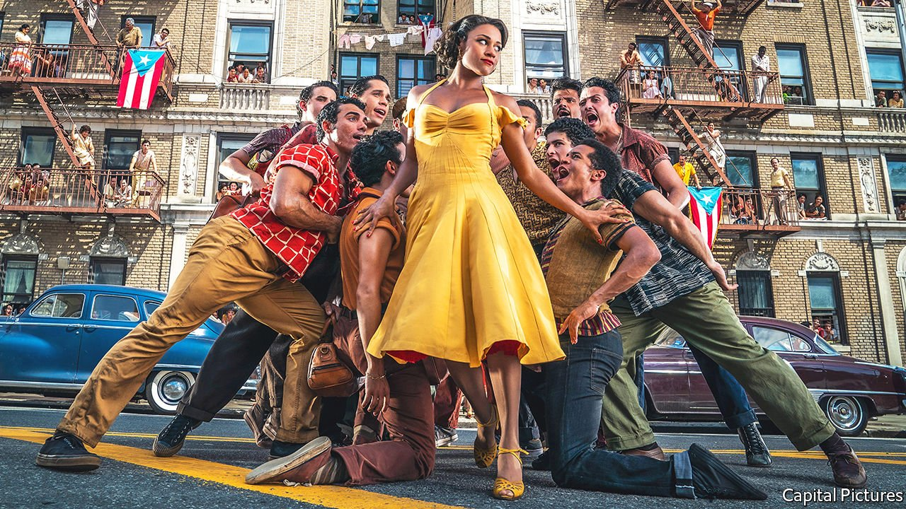

###### Back Story

# “West Side Story” and the magic of remakes 

##### The best are a form of time travel, says our new culture column 

 

> Jan 22nd 2022 

LAST NIGHT she dreamt she went to Manderley again—and again. Another star is born; 12 even angrier men. It is easy to be snooty about remakes, and, in the case of Steven Spielberg’s new “West Side Story”, lots of people have been. It is too woke for some, too retrograde for others, while a few simply ask, why? Remakes, as this reception shows, combustibly bring together commercial instincts, memory and the culture wars. At bottom, they also illuminate the purpose and pleasures of storytelling.

“Shameless revivalism”, the Times of London recently complained of a remake vogue that has spread from cinema to television. To their detractors, remakes suggest a culture gnawing on itself, and risk-averse producers pandering to timid audiences. Often they bomb, because of a flaw in the marketing logic. Viewers curious to assess the revisions to a classic can wind up outraged (if they are drastic) or bored (if they are slight).


Still, film-makers have been betting on known quantities, and critics griping about them, almost since pictures began to move. “The Great Train Robbery” of 1903 was remade a year later. John Huston’s version of “The Maltese Falcon” of 1941 was a remake; Alfred Hitchcock and Howard Hawks had a second crack at their own films. “Hollywood talks a great deal about the future,” lamented the New York Times in 1961, yet “it seems to show an increasing tendency to live in the past.” One of its examples was Charlton Heston’s turn in “Ben-Hur”.

Venality and timidity do not explain this compulsion entirely. For many early remakes, the rationale was technical, as sound and then colour were introduced. These days some producers try to jazz up old films with a couple of stars and some computer-generated whizzery. The recent redo of “Rebecca”, with its smooching and dream sequences, had all the novelty of a bad facelift. Sometimes, though, the spectacle is its own justification. The choreography of the new “West Side Story” stunningly melds beauty and violence; its gorgeous camerawork soars and swoops with Leonard Bernstein’s score. The exuberant staging of “America”, the best number, is worth the ticket price alone.

Alternatively, remakes can open unexplored angles in old plots. Or purport to: in Kenneth Branagh’s glitzy reincarnation of Hercule Poirot, soon to resurface in “Death on the Nile”, the sleuth is miscast as a smartarse with a heart, who subjects his special-effect moustache to some ill-advised action sequences. Reinterpretations may just involve subtracting prejudice and adding sex. But some are subtler, and more worthwhile.

Take the reworking of “The Wonder Years”, a cherished coming-of-age drama set in the late 1960s and early 1970s and broadcast 20 years later. In the current reprise on Disney+, a new adolescent protagonist negotiates bullies, crushes, aloof siblings and a dawning comprehension of the adult world, as the headlines of the same era hum in the background. Except this time he is a black child in Alabama instead of a denizen of white suburbia, a switch that highlights the wrinkles and omissions of nostalgia.

Children offer a clue to the deep appeal of remakes. Anyone who has ever read a fairy-tale to a child—Again! More!—understands the pull of repetition, which can defuse fears and make even villains consoling. According to some analyses, all stories provide a form of this satisfaction, adhering to one of a small number of basic shapes, such as “the quest” or “the hero’s journey”. In this view, every film is a kind of remake.

That is a stretch. Better to say every story remixes known elements with fresh ones. Remakes do that in pure form. As well as the comfort of familiarity, the best supply a kind of magic mirror. Get the tweaks right and, beneath the action, they become a gauge of how much the world has changed since the original was made, and how far you have come since you first saw it.

To some, the basic plots of remakes are “money for old rope” and “one born every minute”. The back story of “West Side Story” shows why the cynicism can be mistaken. Famously, the musical is an update of “Romeo and Juliet” (which, like all stage plays, is remade with every production). But Shakespeare’s star-cross’d lovers can be traced to French and Italian texts of the 16th century, thence to Boccaccio’s version of the myth of Pyramus and Thisbe, and back from the Renaissance to Ovid and beyond. Some stories are worth retelling.

For the back story of Back Story, go to 

