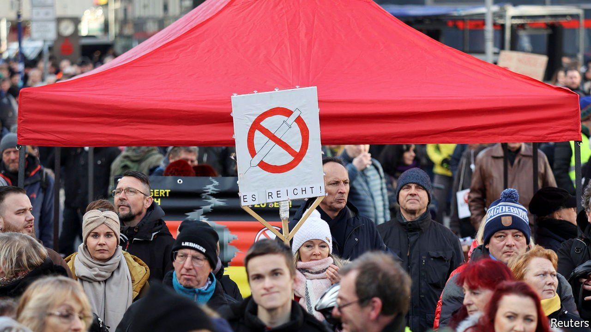
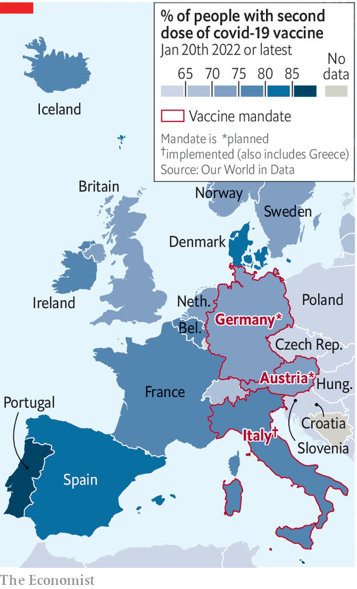

###### Must you be jabbed?

# Arguments over compulsory covid-19 vaccination are raging across Europe 

##### Austria is in the vanguard; others may soon follow 

 

> Jan 22nd 2022 

EARLIER THIS month President Emmanuel Macron said he wished to “piss off” those who had chosen not to be vaccinated against covid-19. France’s 5m unjabbed people will soon be barred from restaurants, theatres and long-distance trains, among other things. Yet they might consider themselves lucky. Italy and Greece have passed laws making vaccination obligatory for all residents over 50 and 60 respectively. Austria has just done so for all adults, and Germany may follow suit.

Most European countries have already excluded unvaccinated people from large swathes of public life, to . In many places jabs are a condition of employment in hospitals and care homes. But facing a stubborn wall of vaccine scepticism, some governments have gone one step further. “I would have preferred to go another way. But…we need to take this drastic step,” said Alexander Schallenberg, Austria’s then chancellor, announcing the plan in November. Austria and Germany have some of the lowest vaccination rates in western Europe.


Many feel queasy at the prospect of governments ordering them to have needles stuck in their arms. Proponents counter that the unvaccinated erode the freedom of other citizens by swamping health-care systems and making new lockdowns more likely. Either way, compulsory vaccination carries several potential risks.

 


Start with the legal and logistical problems. Austria’s law, which will apply to 7.4m people—all residents over 18 bar pregnant women and those with medical exemptions—will take effect on February 1st. From mid-March the unjabbed face fines of at least €600 ($680), with further checks and fines applicable every quarter. But the agency responsible for the vaccine registry says it will not be ready until April. (Spot-checks will apply before then.) The legal system could buckle if many refuseniks opt for fines over jabs. Germany, where parliament will debate vaccine mandates next week, does not even have a registry, making enforcement look yet trickier.

Moreover, constitutional courts will frown on mandates that look premature or disproportionate. Many reckon European governments could do more to balance the stick of restrictions with the carrot of better outreach. Rather than simply impose top-down measures, they could find vaccination champions in communities with large numbers of unjabbed people, including some minority groups.

A second concern is epidemiological. The German and Austrian mandates were proposed when the Delta variant was dominant. But laws may not prove as adaptable as the SARS-Cov-2 virus. What if the next variant requires a modified vaccine, or a fresh booster? For Janosch Dahmen, a German Green MP and doctor, uncertainty surrounding the behaviour of future variants is a strong reason to press ahead with (well-designed) compulsory vaccination now. Others disagree. A leading Austrian virologist urged the country to rethink its plan in the face of the widespread immunity the Omicron wave will confer.

A third worry is backlash. Most Germans support compulsion. But although moving from nudges to mandates may induce some sceptics to get the jab, others may become implacable foes. Anti-vax protests, many of them fuelled by the far right and prone to violence, are spreading rapidly. A vaccine mandate will surely swell them further. To avoid creating social “fissures” the Czechs recently scrapped a plan to oblige over-60s to get jabbed. (The age-limited mandates in Greece and Italy have proved less contentious.)

No one knows if compulsion will work. One Austrian panel found that roughly two-thirds of the 1m remaining unjabbed adults were unlikely to get vaccinated at any cost. But such surveys have their limits. The French, for example, turned out to be more relaxed about jabs than polls had once suggested. As other countries grapple with their vaccine hold-outs, they will be watching the experiments in the German-speaking countries closely. ■

Correction (January 19th 2022): This article gives vaccination rates for Germany and Austria. In the original version we suggested the rates applied only to the over-12s; in fact they were for the whole population. This has been changed.

Dig deeper

All our stories relating to the pandemic can be found on our . You can also find trackers showing ,  and the virus’s spread across .

