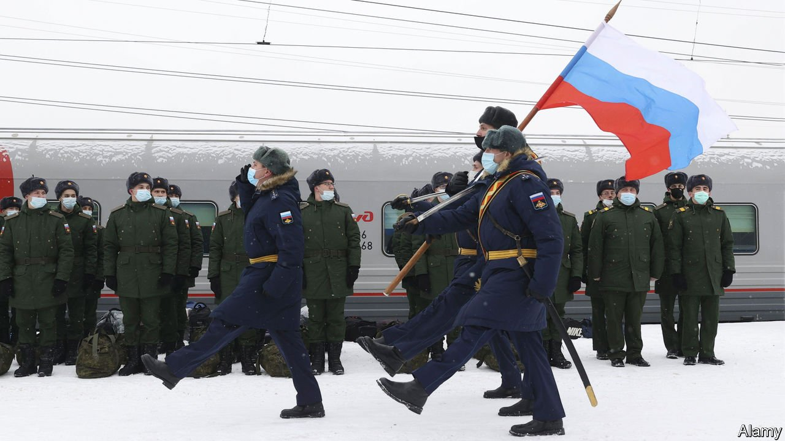
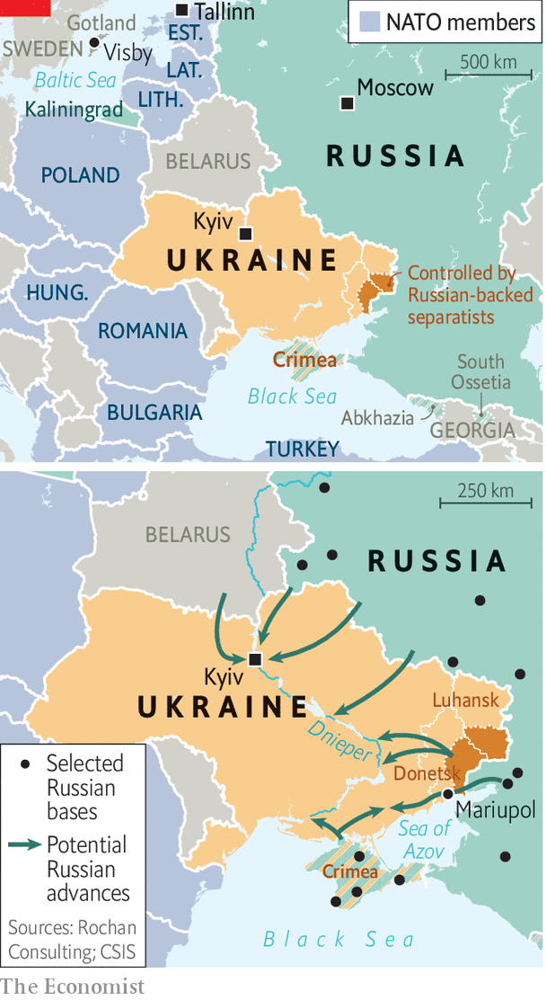

###### The guns of January

# As war looms larger, what are Russia’s military options in Ukraine? 

##### They all have their drawbacks 

 

> Jan 22nd 2022 

“WHAT STANDS in front of us, what could be weeks away, is the first peer-on-peer, industrialised, digitised, top-tier army against top-tier army war that’s been on this continent for generations,” warned James Heappey, Britain’s junior defence minister, on January 19th, pointing to Russia’s build-up of over 100,000 troops on Ukraine’s border. “Tens of thousands of people could die.” Estonia’s defence chief echoed the warning. “Everything is moving towards armed conflict,” he said.

Sergei Lavrov, Russia’s foreign minister, is due to meet Antony Blinken, America’s secretary of state, in Geneva on January 21st. But the prospects for diplomacy are dim. On January 19th Sergei Ryabkov, one of Mr Lavrov’s deputies, said that even a 20-year moratorium on NATO membership for Ukraine would not satisfy Russia. In recent weeks, Russia has mobilised reservists and dispatched troops and missiles from as far away as the North Korean border.


Western countries are bracing for the worst. On January 17th Britain began airlifting thousands of anti-tank missiles to Ukraine. Days earlier Sweden rushed armoured vehicles to the island of Gotland as three Russian landing craft passed through the Baltic Sea, destination unknown. The same day, Ukraine was struck by cyber-attacks which defaced government websites and locked official computers. Meanwhile, the White House said it had intelligence showing that Russia was planning staged acts of sabotage against its own proxy forces in eastern Ukraine to provide a pretext for attacking the country.

 


Such an attack could take many forms. One possibility is that Russia would simply do openly what it has done furtively for seven years: send troops into the Donetsk and Luhansk “republics”, breakaway territories in the Donbas region of eastern Ukraine, either to expand their boundaries westward or to recognise them as independent states, as it did after sending forces into Abkhazia and South Ossetia, two Georgian regions, in 2008.

Another scenario, widely discussed in recent years, is that Russia might seek to establish a land bridge to Crimea, the peninsula it annexed in 2014. That would require seizing 300km (185 miles) of territory along the Sea of Azov, including the key Ukrainian port of Mariupol, up to the Dnieper river.

Such limited land-grabs would be well within the capabilities of the forces mustering in western Russia. What is less clear is whether they would serve the Kremlin’s war aims. If Russia’s objective is to bring Ukraine to its knees and prevent it from joining NATO or even co-operating with the alliance, simply consolidating control over Donbas or a small swathe of land in southern Ukraine is unlikely to achieve it.

To do so would require imposing massive costs on the government in Kyiv—whether by decimating its armed forces, destroying its critical national infrastructure or overthrowing it altogether. One option would be for Russia to use “stand-off” weapons without troops on the ground, emulating NATO’s air war against Serbia in 1999. Strikes by rocket launchers and missiles would wreak havoc. These could be supplemented by more novel weapons, such as cyber-attacks on Ukrainian infrastructure like the ones which disrupted the country’s power grid in 2015 and 2016.

The problem is that such punitive campaigns tend to last longer and prove harder than they first appear. If war comes, stand-off strikes are more likely to be a prelude and accompaniment to a ground war rather than a substitute for it. “I don’t see a lot between them and Kyiv that could stop them,” says David Shlapak of the RAND Corporation, a think-tank.

The aim would probably be to hurt Ukraine, not occupy it. The country is as large and populous as Afghanistan, and since 2014 over 300,000 Ukrainians have gained some form of military experience; most have access to firearms. American officials have told allies that the Pentagon and CIA would both support an armed insurgency.

Russia might consider what America’s army calls a “thunder run”, says Mr Shlapak, a swift and deep assault on a narrow front, intended to shock and paralyse the enemy rather than seize territory. And an attack need not come solely from the east.

On January 17th Russian troops, some from the far east, began arriving in Belarus, ostensibly for military exercises scheduled for February. Russia has said it will also send a dozen warplanes and two S-400 air-defence systems. An attack from the north, over the Belarus-Ukraine border, would allow Russia to approach the Ukrainian capital from the west and encircle it.

“Once they’re within rocket range of downtown Kyiv,” asks Mr Shlapak, “is that a situation the Ukrainians want to live with?” Even if Volodymyr Zelensky, Ukraine’s president, is willing to tolerate a siege, Russia may gamble that his government will simply collapse—and it may use spies, special forces and disinformation to hasten that process.

Wars, though, unfold in unpredictable ways. Russia has not fought a large-scale offensive involving infantry, armour and air power since the climactic battles of the second world war. Countries under attack can just as easily stand firm as fall apart. Ivan Timofeev of the Russian International Affairs Council warns of a “long and sluggish confrontation” that would be “fraught with destabilisation of…Russia itself”.

Even victory would be costly. “The Ukrainians will fight and inflict major losses on the Russians,” says Peter Zwack, a retired general who was America’s defence attaché in Moscow during the Kremlin’s first invasion of Ukraine in 2014. “This is going to be hard for Russia—and they are basically alone.” Coupled with the threat of heavy sanctions being prepared by America and its European allies, and the apparent absence of any domestic support for a new adventure, all this may, even now, be giving Mr Putin pause for thought. ■

Dig deeper

 (Jan 2022)

