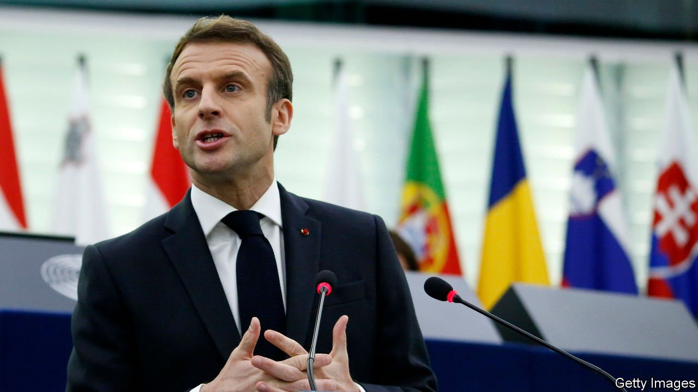

###### An ever-closer union

# Emmanuel Macron’s rivals are less Eurosceptic than before 

##### But Europe still divides the presidential field 

 

> Jan 22nd 2022 

FIVE YEARS ago, when Brexit prompted fears that the European Union would unravel, Emmanuel Macron put Europe at the heart of his political identity. Supporters at his rallies enthusiastically waved the EU flag. So it was no surprise that, with France in charge of the rotating six-month presidency of the Council of the EU since January 1st, the French president headed on January 19th to the European Parliament in Strasbourg to renew his vows.

The EU, declared Mr Macron, represented democracy, progress and peace at a time when each was under threat. Faced with rising authoritarian powers, breaches of the rule of law within the EU and the menace of war on its doorstep, “European civilisation” needed to be upheld and cherished. He pleaded for a “new security order” in Europe. Resolute Atlanticists, especially in eastern Europe, hate the idea, which they think undermines NATO, but it is an abiding French passion. France had hung the EU flag alone under the Arc de Triomphe to launch the French presidency, noted the president—a decision met with howls of protest by his domestic opponents. “I’m proud of that,” he declared.


The French opposition MEPs in the chamber, however (including a presidential candidate, the Greens’ Yannick Jadot), did their best to turn the event into a campaign debate. And miffed as Mr Macron was made out to be, the exercise struck a distinctly domestic note. For the president, expected shortly to confirm that he is running for re-election, is hoping once again to use Europe as a political football.

In some respects, only a brave politician seeks to put Europe at the forefront of a French electoral campaign. The country may be co-architect of the post-war project, but in 2005 the French voted in a referendum against a draft EU constitution. In 2017 48% of the first-round vote at the presidential election went to candidates, such as the nationalist Marine Le Pen, who are Europhobic or Eurosceptic. Last year a poll found that only 53% of the French were optimistic about the EU, compared with 67% of Germans.

France is split over Europe. Hostility to the EU characterises the political extremes. This includes the radical left, whose candidate, Jean-Luc Mélenchon, is better placed than any other on the left. And it marks the hard right, including Ms Le Pen and Eric Zemmour, a polemicist running on a viscerally anti-immigration platform to “rescue France”.

In contrast, there is a broad pro-European consensus among the mainstream candidates. It reaches from Mr Jadot and the Socialists’ Anne Hidalgo via Mr Macron to the Republicans’ Valérie Pécresse. This broadly reflects what the French call Gaullo-Mitterrandisme: a general continuity in foreign policy between Charles de Gaulle, on the right, and François Mitterrand, on the left, over the need for France to retain an independent voice, while remaining a Western ally, notes François Heisbourg of the Foundation for Strategic Research. To this end Europe is a way for France to enhance its voice, not dilute it.

Yet this underlying division over Europe is less clear now than in 2017. Mr Mélenchon no longer promises to tear up all EU treaties, although he still wants France out of NATO. Ms Le Pen maintains that her vision of Europe is the “antithesis” of Mr Macron’s, and wants to pull France out of NATO’s integrated military command. But she has now dropped all talk of Frexit, and no longer vows to take France out of the euro, a policy that proved unpopular. Instead, by promising to protect the French constitution from EU law, her strategy is to try to undermine the union from within, like her friends in Poland and Hungary.

Mr Macron’s most credible challenger, Mrs Pécresse, holds pro-European views that are not so very different from his. She has had to nod to the nationalist wing of her party. She denounced the solo flying of the EU flag, and backs the idea of building barbed-wire walls to funnel migrants on the EU’s external border to reception points. But her underlying sympathies are with the EU as a political project. In short, nobody is quite as enthusiastic about Europe as Mr Macron. But nor are the differences quite as stark as before. ■

