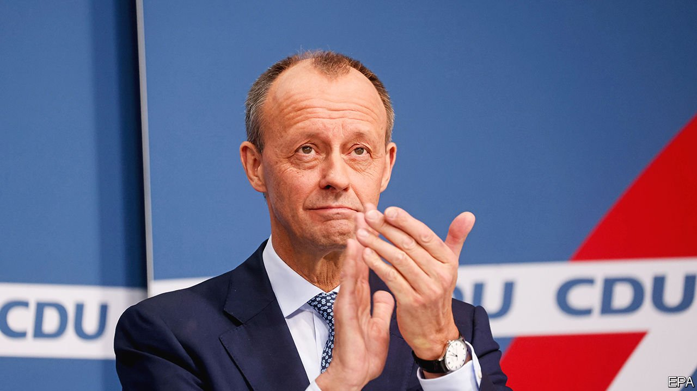

###### A not very new broom

# Friedrich Merz takes over as leader of Germany’s Christian Democrats 

##### Angela Merkel’s old foe finally gets the job 

 

> Jan 22nd 2022 

ANGELA MERKEL’S lethargy covered Germany like a “carpet of fog”, raged Friedrich Merz in 2019. There was never any love lost between Germany’s ex-chancellor and the man she forced out of a top job in the conservative Christian Democratic Union (CDU) in 2002. Tail between his legs, Mr Merz left the Bundestag in 2009, only to re-emerge nine years later to compete for the party leader ship Mrs Merkel had vacated. His candidacy thrilled CDU members seeking conservative red meat. But moderates found his arrogance off-putting. His bid flopped, as did another last year.

But in September the winner of that second contest, Armin Laschet, led the CDU and its Bavarian sister party to electoral defeat. Now licking its wounds in opposition, the CDU has finally turned to Mr Merz, who takes over as leader this weekend. Once known as a macho tax-cutter with a taste for teasing the politically correct, Mr Merz, 66, now presents himself as a moderate. He promises to court women, gay people and young voters, and to pursue social justice.


Will this convince the sceptics? CDU centrists seem willing to hold fire, though some MPs so distrust the ultras around Mr Merz that they have discussed leaving the party. Right-wingers want him to smite the woke. “We need a self-confident civic policy that…clearly positions itself against identity-politics excesses,” says Christoph Ploss, a young CDU MP who has long supported Mr Merz. The new leader’s first test comes in several state elections this year.

At the next federal election in 2025 Mr Merz will hope to lead the conservatives’ bid to unseat Olaf Scholz, the chancellor. For now he will focus on bread-and-butter issues like jobs, industrial change and inflation, now at a three-decade high. Mr Merz says the European Central Bank must follow the Federal Reserve and prepare to raise rates. That the ECB is independent does not matter. Mr Merz wants to dispel the fog.

