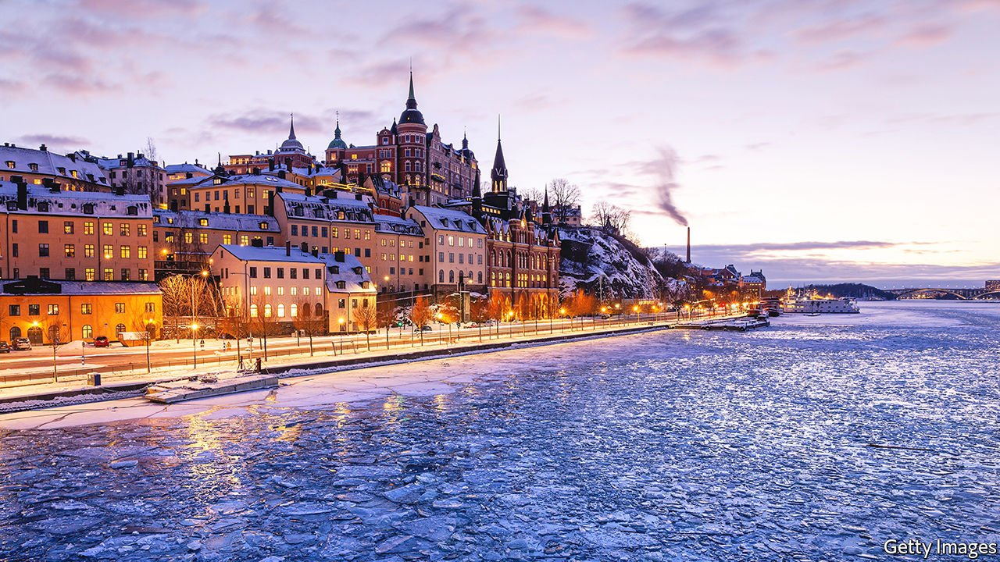

###### Land of ice and social democracy

# The Nordic left is back in charge 

##### But it has yet to define a new version of its admired social model 

 

> Jan 22nd 2022 

THESE ARE happy days for the Nordic left. For the first time since 2001, they are running all four big Nordic countries—all five, counting tiny Iceland. Four of the five leaders are women: Magdalena Andersson, a Social Democrat, became Sweden’s first female prime minister in November. The Nordic model envied by foreign left-wingers (though not always understood) is having a moment.

So one might have expected a satisfied mood among the members of Byggnads, a construction trade union, who met at a Folkets Hus (community centre) in Stockholm in December. Instead they were angry. The LO, Sweden’s trade-union confederation, had just struck a deal with the employers’ association and the government that would reform labour law to make it easier to fire workers. In exchange the state will pay more to retrain them.


“This is only for the benefit of the company owners,” said Felix Gravel, who installs insulation. He fears the proposed law will let firms bully their employees. Byggnads opposes the reforms, and Mr Gravel is questioning his allegiance to the Social Democrats: “Do they stand up for me? I’m just a dirty worker.”

Nordic Social Democrats are winning elections, but they lack their old clear vision of the future. After decades of liberalisation, welfare states are less generous and inequality has risen. Fears of immigration and crime have boosted populists, forcing centre-left parties to move right on those issues, especially immigration. Meanwhile, young woke urbanites are turning to more radical left-wing parties.

Denmark’s Social Democrats have shifted most on immigration. In 2019 Mette Frederiksen became prime minister pledging asylum rules even stricter than the previous centre-right government’s. She is implementing “ghetto laws” to break up neighbourhoods where high rates of immigration and crime coincide. That sucks the air out of the populist Danish People’s Party: its vote halved at the election in 2019.

Ms Frederiksen has also introduced popular leftist policies such as a plan to triple construction of social housing. But while her anti-immigrant turn has won over people who fret about foreigners, it has lost some urban progressives. In municipal elections in November the Social Democrats’ vote share in Copenhagen fell by ten points; the Red-Green Alliance gained ground. Pelle Dragsted, a former Red-Green MP, says young people consider the Social Democrats uncool.

In Sweden Ms Andersson is copying some of Ms Frederiksen’s moves. Sweden took in huge numbers of refugees during the migrant crisis of 2015-16. Gang wars, often involving immigrants, have raised the gun-murder rate, though it is still low. After taking over from Stefan Lofven, the previous Social Democratic prime minister, Ms Andersson vowed to deport more immigrant criminals. It later turned out a company she hired had employed an illegal immigrant to clean her house.

It may be too late to win back many working-class voters. The Sweden Democrats, who began as a neo-Nazi party but are now less extreme, hold 18% of the seats in parliament. The centre-right Moderates once shunned them, but now collaborate with them. Lisa Pelling of Arena Idé, a progressive think-tank in Stockholm, co-wrote a book about neighbourhoods where the Sweden Democrats do well. It is tough reading for leftists. “Voters may suffer from service cuts or bad schools, but they see their problems entirely through the lens of crime and immigration,” she says.

In their heyday, Nordic Social Democrats used to win 40% or more of the vote. Now they are lucky to get 30%. That forces them into fragile coalitions: when Ms Andersson negotiated on pensions with the socialist Left party, the Centre Party retaliated by voting down her budget. Its leader, Annie Loof, said Ms Andersson was betraying the “broad centre”. Ms Andersson was forced to resign after seven hours in office. She returned a few days later heading a minority government, but the opposition passed its own budget in the confusion. She is now stuck with it.

Voters who move right over immigration often become more economically conservative, too. In Finland the populist Finns Party, which once backed more progressive taxes, has turned laissez-faire. Leftists worry that Sanna Marin, Finland’s popular young Social Democratic prime minister, appeals mostly to hip elites. It did not help when in December she missed a phone alert that a colleague had covid-19; she was out nightclubbing with celebrities.

The left’s new vision revolves partly around climate change. Curiously, green parties do poorly in Nordic countries; other leftists take their votes. When Labour won Norway’s election in September, the country’s Greens won just three of the 169 seats in parliament. Yet social democrats’ climate policies are not always ambitious. In their coalition agreement, Labour and Norway’s Centre Party said they would let companies explore for more oil and gas in the country’s vast offshore fields.

Inequality may be a more promising issue. Nordic post-tax incomes are relatively equal for rich countries, but have grown less so since the 1990s. There are sharp rural-urban disparities in health care. In Sweden the Left party’s new leader, Nooshi Dadgostar, the daughter of Iranian immigrants, has mostly ignored identity politics in favour of class issues such as eliminating for-profit private schools.

The clearest vision of the Nordic model’s future is in northern Sweden, where hydroelectricity is powering climate-friendly industries. The huge Northvolt factory will supply batteries for much of Europe’s electric-vehicle industry. The town of Lulea, where a coalless “green steel” plant has just opened, is building 5,000 new homes. Green jobs and public housing are good terrain for the left. Elsewhere the Nordic left’s programme is a bit of a smorgasbord, but its politicians are optimistic. “We have been on the defensive for maybe 30 years,” says Mr Dragsted. “We are going on the offensive now.” ■

