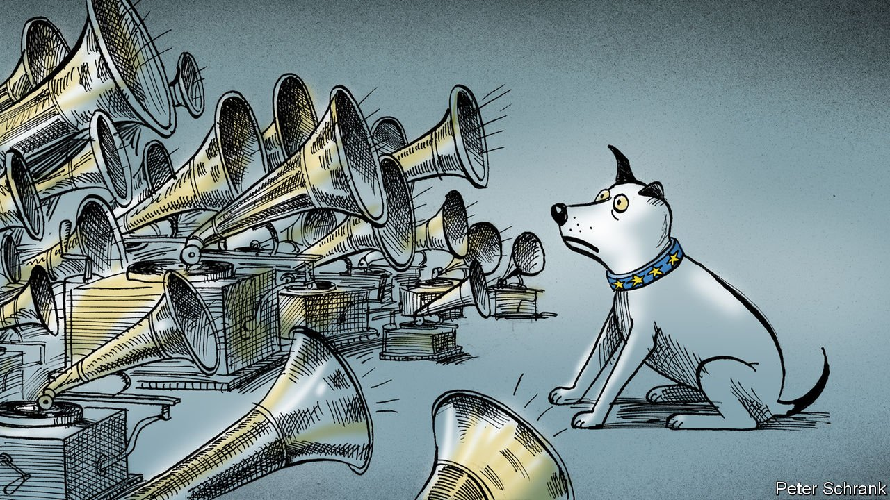

###### Charlemagne

# What China’s bullying of Lithuania reveals about Europe 

##### The EU’s internal indiscipline reduces its geopolitical heft 

 

> Jan 22nd 2022 

WHEN EASTERN EUROPEAN countries about to join the EU in 2003 spoke up in favour of America’s invasion of Iraq, France’s president at the time, Jacques Chirac, haughtily declared they had “missed a good opportunity to shut up”. Their furious response suggested they thought the same of him. Europe likes to stress its collective power, born of an ever-closer union that includes joint foreign-policy ambitions and dreams of an EU army. Yet each country also wants a licence to pursue pet diplomatic forays. While sometimes these policies are sound (like opposing ill-fated invasions in the Middle East, it turned out), occasionally they end up dragging the entire bloc into fights it would rather avoid. If Europe wants geopolitical relevance, it cannot allow every member to foment its own crises.

The EU’S foreign-policy grandees are currently upset and divided about Ukraine. Russia and America, in their stand-off over the country, seem to think of Europe more as a convenient place to meet than as a partner to be included, prompting France’s President Emmanuel Macron to this week renew his calls for greater European autonomy. Germany is at odds with its partners over how to respond to Russia. Fortunately for underemployed wonks another, less-noticed, superpower spat is brewing. China is trying to throttle the Lithuanian economy. The clash pits the world’s most populous country against the EU’s 21st-biggest member. Lithuania is being punished mainly for having allowed Taiwan (which China considers part of its own territory) to use the word “Taiwan” to describe its unofficial embassy, rather than “Taipei Representative Office”, as it does elsewhere at China’s insistence.


Retribution has been swift. In a novel form of bureaucratic assault, Lithuania suddenly disappeared as an option on Chinese customs forms, thus blocking all imports from the Baltic minnow. This was inconvenient, to be sure, but generated little more than muted sympathy in European capitals. What support there was came more out of habit than conviction. Privately diplomats echoed Chirac: Lithuania had piped up out of turn. What on earth did it think it was up to, anyway? Other EU countries had lived for decades with the Taipei fudge.

Perhaps luckily for Lithuania, China’s ire soon morphed into grotesque overreaction. Insults flew in state media. In November Lithuania’s embassy in Beijing was summarily downgraded to a lowlier diplomatic status. Staff, fearing for their safety, had to be evacuated. That left diplomats from other EU countries (and probably beyond) wondering whether they might be next. Then companies from across Europe whose exports to China merely contained Lithuanian components were also targeted for bureaucratic harassment. This was felt—or at least could be construed—as amounting to an attack on the bloc’s vaunted single market. That it inconvenienced German car-part makers probably helped get the attention of politicians there, and thus beyond.

China’s short fuse has helped fire up Lithuania’s claim that the spat is a test case for the rules-based international order, and thus one that the rest of the EU has to get behind. This is happening, albeit with still-grudging enthusiasm. The European Commission, which deals with the EU’s external trade, is diligently putting together a case that China is breaching its obligations as a member of the World Trade Organisation. This might (one day) generate the faintest of blushes in Beijing. The boss of the EU’s foreign-policy apparatus, Josep Borrell, on January 14th promised solidarity and to iron things out at a proposed Europe-China summit in March.

The big member states, whose diplomatic heft underpins the EU’s, have now waded in. France is promoting an “anti-coercion” plan that it hopes would deter bullies such as China, which it wants to push in its six-month stint chairing meetings of EU ministers. (The plan is nowhere near ready, nor agreed.) A German minister visited Lithuania to express support, but Olaf Scholz, Germany’s new chancellor, did not raise the issue in a get-to-know-you call with China’s president, Xi Jinping, in December.

Nobody can hear EU scream

Much of foreign policy involves responding to crises. But Europe makes the job all the harder for itself if those crises are conjured up from within. Blaming Lithuania for the headache now borne in part by its allies is hardly fair: it is China’s ghoulish reaction that is the problem here. Standing up for Taiwan is laudable; arguably a more forceful defence of the place would be sensible EU policy. Yet the manner in which it has had to be done—or not quite done—hardly inspires confidence. In so far as European allies have had to step in, decisions made by one member state have in effect been made on behalf of the whole, yet without their say. Grand strategic planning this is not.

Europe has ambitions to use its limited means to nudge China into changing its ways. An investment agreement both sides were keen on was shelved last year after a flurry of sanctions and counter-sanctions over human rights in Xinjiang. The push and pull of careful diplomacy is constantly at work. But China, like others before it, has found it easy to divide Europe at its convenience. Many eastern European countries a decade ago cosied up to it in a format designed to circumvent the EU’s own structures, known as “16+1” (which Lithuania left last year and which seems to be fading). That now looks a lot like some countries treating the EU as just another club that helps them further their interest—while expecting solidarity when things go wrong.

Lithuania will survive its scrape with Chinese fury. The containers turned away from Chinese ports have been snapped up by Taiwan, which now has enough Lithuanian rum to last a lifetime. The Baltic country has been promised sizeable investment from Taiwanese microchip firms. So it has piped up and avoided catastrophe. Good news, it might feel. But it is also another reminder of just how hard foreign policy is for a club of 27. ■

Read more from Charlemagne, our columnist on European politics: (Jan 15th)

 (Jan 8th) (Jan 1st)

