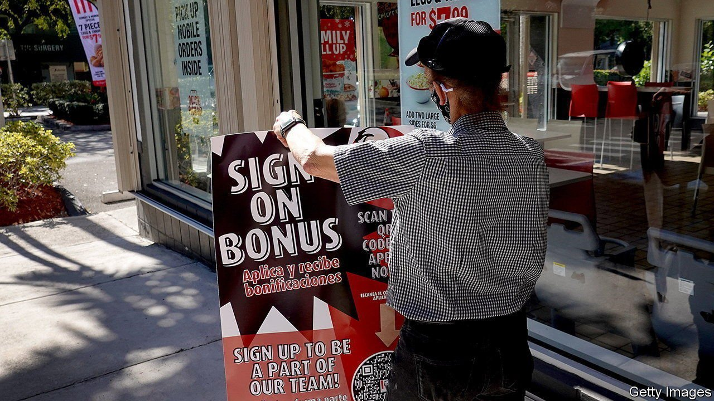
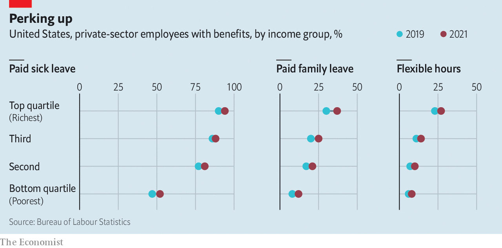

###### On the fringe

# America’s labour shortages have done little to boost perks for workers 

##### Low-paid workers receive more in benefits than before the pandemic. But the disparity with the highly paid is still vast 

 

> Jan 22nd 2022 

THE PANDEMIC has fundamentally transformed the American workplace. More people than ever are working from home. Meetings have moved from offices to screens. Employees are quitting their jobs in droves, pushing job vacancies to record highs. Amid widespread labour shortages, firms are handing out pay rises and bonuses to attract workers. But what about other perks, which make up a big chunk of employees’ overall compensation? If you listen to bosses, firms have expanded benefit plans in the wake of the pandemic, providing workers with more flexible hours, emergency sick leave and mental-health services. But official statistics show only modest gains in fringe benefits since the start of the pandemic. Although the value of non-wage compensation for low-paid workers grew faster than that for better-paid employees last year, the disparity in the level of provision remains vast.

Health insurance, paid leave, pensions and other “fringe” benefits doled out by private-sector firms accounted for 29% of total compensation, on average, in 2021, up from 20% in 1970, according to the Bureau of Labour Statistics (BLS). If perks such as free food were to be included, the figure would be higher still. Although they are harder to measure, amenities such as flexible working hours are valuable, too. A paper published in 2018 by researchers at Harvard Medical School, the University of California, Los Angeles, and the RAND Corporation analysed survey data and concluded that the freedom to set one’s own schedule is worth a pay increase of 9%, and the ability to work from home is worth a raise of 4.1%.


But such benefits, much like wages, tend to be unevenly distributed. Some 94% of private-sector workers in the top quartile of the income distribution have access to health insurance from their employer, compared with just 40% of workers in the bottom quartile, according to the BLS. Similar disparities exist for life insurance (84% v 25%), retirement benefits (90% v 44%) and paid sick leave (94% v 52%). Differences in working conditions make things even more lopsided, according to new research by Jason Sockin of the University of Pennsylvania. Using data from Glassdoor, a website that lets users post anonymous reviews of their employers, Mr Sockin finds that high-paying firms tend to offer better amenities, thereby exacerbating labour-market inequality.

 


Efforts to improve benefits during the pandemic appear to have done little to expand provision to more workers. The latest national compensation survey by the BLS found that access to paid sick and family leave at private firms rose on average by only four and five percentage points, respectively, between March 2019 and March 2021. Flexible working hours, defined as the freedom to set your own schedule, expanded by just three percentage points. Peter Cappelli of the University of Pennsylvania’s Wharton School says that, although some companies have introduced signing bonuses and free university tuition to attract workers, they have been reluctant to shell out for pricier perks. “I think they really are resisting moving towards benefits that are going to cost them much of anything,” Mr Cappelli says.

Although access to benefits has changed little, perks are at least becoming more generous for some recipients. Every year the BLS tots up the value of employees’ compensation costs. In 2021, workers in the bottom tenth enjoyed a 9.2% increase in the real value of benefits, on average, the biggest rise since data were first collected in 2009. In the 12 months ending in September 2021 average benefit costs for service-sector workers including cooks, carers and cleaners rose by 3.3%, compared with 2.6% across the workforce as a whole.

The hope is that such increases continue if labour remains scarce. Mr Sockin says that employees may also be taking stock: “I think the pandemic has led to this recognition among workers that they may want more than just a wage.” But with the value of benefits amounting to less than $3 per hour worked for someone in the bottom tenth of the income distribution, compared with $25 for someone in the top 10%, the gap that needs closing is truly vast. ■

For more expert analysis of the biggest stories in economics, business and markets, , our weekly newsletter.

