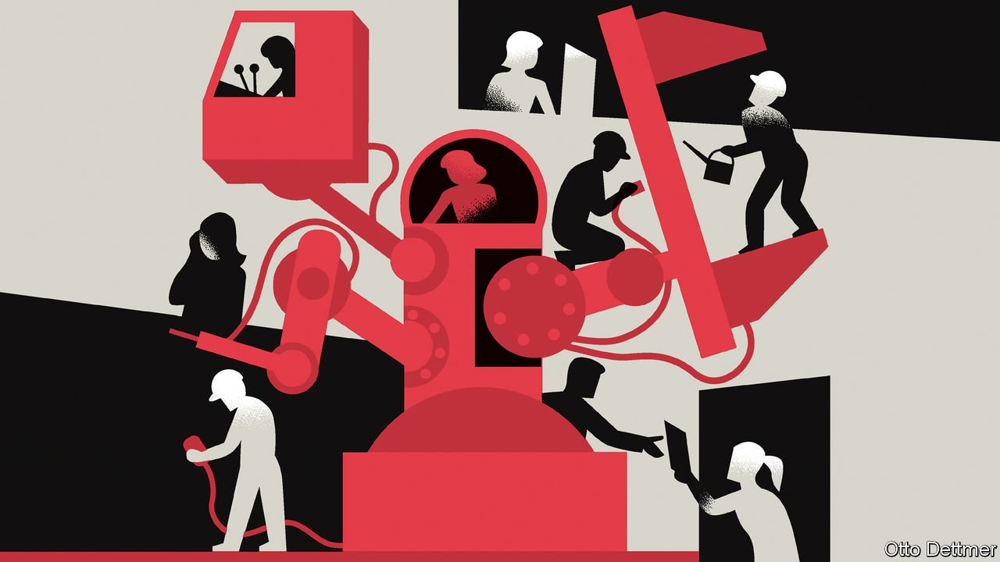

###### Free exchange

# Economists are revising their views on robots and jobs 

##### There is little evidence of a pandemic-induced surge in automation 

 

> Jan 22nd 2022 

WHEN THE pandemic first struck, unemployment soared. Not since the Depression had American joblessness surpassed 14%, as it did in April 2020. But fears of a prolonged period of high unemployment did not come to pass. According to the latest available data, for November, the unemployment rate for the OECD club of mostly rich countries was only marginally higher than it was before the pandemic. By now it may even have drawn level. The rich world’s labour-market bounceback is the latest phenomenon provoking economists to look again at a foundational question in the discipline: whether robots help or harm workers.

The gloomy narrative, which says that an invasion of job-killing robots is just around the corner, has for decades had an extraordinary hold on the popular imagination. Warning people of a jobless future has, ironically enough, created plenty of employment for ambitious public intellectuals looking for a book deal or a speaking opportunity. Shortly before the pandemic, though, other researchers were starting to question the received wisdom. The world was supposedly in the middle of an artificial-intelligence and machine-learning revolution, but by 2019 employment rates across advanced economies had risen to all-time highs. Japan and South Korea, where robot use was among the highest of all, happened to have the lowest rates of unemployment.


Many thought that the pandemic would at last prove the doom-mongers right. In mid-2020 a highly cited paper published by America’s National Bureau of Economic Research argued that covid-19 “may accelerate the automation of jobs”, and another asserted that it was “reinforcing both the trend towards automation and its effects”. A paper published by the IMF wondered whether the jobs lost during the pandemic would “come back”. Part of the logic was that since robots don’t fall ill, bosses would turn to them instead of to people—as seemed to have happened in some previous pandemics. Others noted that bursts of automation tend to occur during recessions.

Two years on, though, the evidence for automation-induced unemployment is scant, even as global investment spending is surging. The rich world faces a shortage of workers—by our reckoning there are a record 30m unfilled vacancies across the OECD—which is hard to reconcile with the idea that people are no longer necessary. Wage growth for low-skilled workers, whose occupations are generally thought to be more vulnerable to replacement by robots, is unusually fast. There is still little evidence from America that “routine” jobs, thought to be easier to automate, are shrinking relative to other sorts of jobs.

Considering that so many doubts about the “robots kill jobs” narrative have arisen, it is not surprising that a different thesis is emerging. In a recent paper Philippe Aghion, Céline Antonin, Simon Bunel and Xavier Jaravel, economists at a range of French and British institutions, put forward a “new view” of robots, saying that “the direct effect of automation may be to increase employment at the firm level, not to reduce it.” This opinion, heretical as it may sound, does have a solid microeconomic foundation. Automation might help a firm become more profitable and thus expand, leading to a hiring spree. Technology might also allow firms to move into new areas, or to focus on products and services that are more labour-intensive.

A growing body of research backs up the argument. Daisuke Adachi of Yale University and colleagues look at Japanese manufacturing between 1978 and 2017. They find that an increase of one robot unit per 1,000 workers boosts firms’ employment by 2.2%. Another study, by Joonas Tuhkuri of the Massachusetts Institute of Technology (MIT) and colleagues, looks at Finnish firms and concludes that their adoption of advanced technologies led to increases in hiring. Unpublished work by Michael Webb of Stanford University and Daniel Chandler of the London School of Economics examines machine tools in British industry and finds that automation had “a strong positive association with firm survival, and that greater initial automation was associated with increases in employment”.

Non-economists can be forgiven for rolling their eyes at the profession’s apparent about-face. But things are not as simple as saying that economists had got it wrong before. For a start, statistical methods have improved since the publication of the foundational papers in robonomics, such as one by Carl Benedikt Frey and Michael Osborne of Oxford University in 2013, which was widely interpreted as saying that 47% of American employment was at risk of automation. The methodology used by Mr Adachi and his co-authors is particularly clever. One problem is untangling causality: firms on a hiring spree may also happen to buy robots, rather than the other way round. But the paper shows that firms buy robots when their prices fall. This helps establish a causal chain from cheaper robots, to more automation, to more jobs.

The onrushing wave…of research

A second qualification is that the “new view” does not establish that automation is “good”. So far, it has had little to say about job quality and wages. But a forthcoming book by David Autor, David Mindell and Elisabeth Reynolds of MIT finds that even if robots do not create widespread joblessness, they may have helped create an environment where the rewards are “skewed towards the top”. Others argue that automation reduces job quality.

Mr Aghion and his colleagues add that even if automation boosts employment at the level of the firm or industry, the effect across the economy as a whole is less clear. In theory robot-adopting companies could be so successful that they drive competitors out of business, reducing the total number of available jobs. Such questions leave researchers with plenty more to investigate. But what seems clear at this stage is that the era of sweeping, gloomy narratives about automation is well and truly over. ■

Read more from Free Exchange, our column on economics: (Jan 15th)

 (Jan 8th)

 (Jan 1st)


