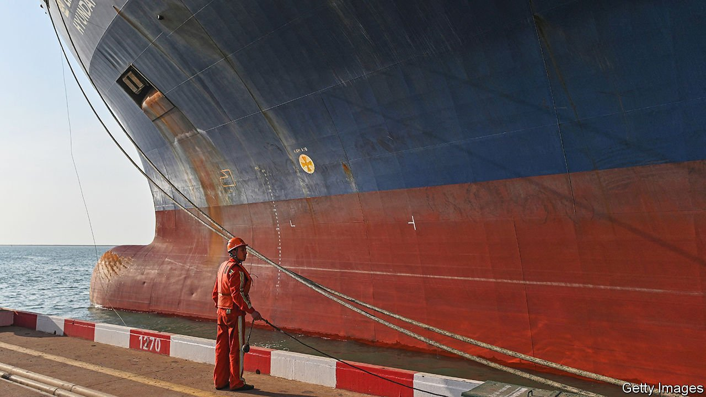
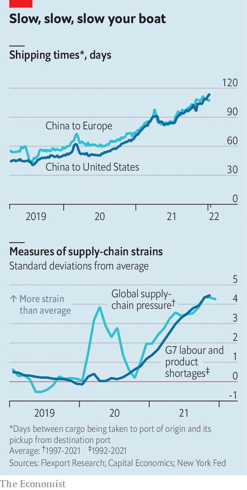

###### Chain reactions

# Just how gummed up are supply chains? 

##### A number of measures suggest that disruptions are historically high—and uncertainty lies ahead 

 

> Jan 22nd 2022 

THE GENERAL public learned far more about supply chains last year than it probably cared to. A host of disruptions to production and shipping interacted with soaring demand for goods to produce bare shelves and rising prices. Although goods have been in short supply, the number of measures tracking supply-chain woes has proliferated at an impressive pace in recent months. All paint a picture of historically high levels of disruptions, and an uncertain path ahead.

One gauge is an “ocean timeliness indicator”, published by Flexport, an American logistics firm. This reports how long it takes a shipment to move from the supplier’s warehouse to the departure gate of the destination port, for two big freight routes out of China: to Europe and America. Three years ago the journey to Europe took just under 60 days, and that to America just under 50. Travel times then rose steadily after the pandemic struck. But the trends for the two routes have diverged a little in recent months. Shipping times to Europe have fallen from above 110 days down to 108. Transport to America, at 114 days’ total journey time, takes longer than ever (see chart, top panel).

 


A global supply-chain pressures index, compiled from a variety of indicators by economists at the Federal Reserve Bank of New York, tells much the same story. Before the pandemic the highest-ever reading of the index (which the researchers have computed back to the 1990s) was in April 2011. Then, troubles associated with an earthquake and tsunami in Japan pushed the index up to 1.7 standard deviations above its long-run average. The measure surged much higher in spring 2020, to 3.9 standard deviations above the mean; last year it rose even further still, reaching 4.4 in October. It has since retreated, but only by a touch, continuing to signal a high level of stress (see chart, bottom panel).


Another indicator, maintained by Capital Economics, a consultancy, takes account of both goods and labour shortages across the G7 group of large economies. It also suggests that stresses remained intense in late 2021. Freight rates, for their part, rocketed during the first nine months of 2021, before flattening off in the final quarter of last year. Yet as high rates become negotiated into longer-duration shipping contracts, elevated costs could persist into 2023 and beyond.

Whether and when matters improve depends on the course that both the virus and the global economic recovery now take. The appearance of the Omicron variant in parts of China could lead to lockdowns and further disruptions at ports. In America, a record number of covid-19 cases has meant that fewer longshoremen and truck drivers are in work. Hopes are dimming that a pause in production, associated with China’s new year holiday in early February, might allow ports to work through existing backlogs.

Respite could come instead from cooling demand in the rich world, particularly in America, which in 2021 displayed a voracious appetite for all manner of goods. Analysts at Morgan Stanley, a bank, have constructed an indicator of supply-chain stress that looks at both supply and demand conditions. Their measure suggests that the latter are mainly responsible for the easing of pressures since late 2021. Trade growth has decelerated, for instance, thanks to reduced demand for both consumer and capital goods.

Flexport predicts that, although Americans’ demand for goods relative to their appetite for services will remain unusually high in 2022, the imbalance should become less pronounced in the months ahead than it was over the past year. If people start to hear a little less about supply-chain snarls, their own shifting shopping habits may explain why. ■

