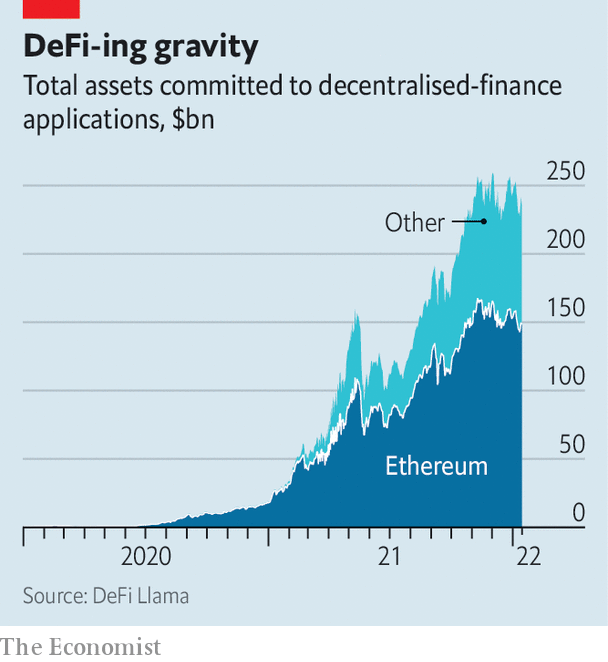

###### Battle of the blockchains

# The race to dominate the DeFi ecosystem is on 

##### Why Ethereum is losing market share 

 

> Jan 22nd 2022 

TO BELIEVERS, OPEN, public blockchains provide a second chance at building a digital economy. The fact that the applications built on top of such blockchains all work with each other, and that the information they store is visible to all, harks back to the idealism of the internet’s early architects, before most users embraced the walled gardens offered by the tech giants. The idea that a new kind of “decentralised” digital economy might be possible has been bolstered over the past year as the numerous applications being built on top of various blockchains have boomed in size and functionality.

Perhaps the most significant part of that economy has been decentralised-finance (DeFi) applications, which enable users to trade assets, get loans and store deposits. Now an intensifying battle for market share is breaking out in this area. Crucially, Ethereum, the leading DeFi platform, seems to be losing its near-monopoly. The struggle shows how DeFi is subject to the standards wars that have broken out in other emerging technologies—think of Sony Betamax versus VHS video cassettes in the 1970s—and illustrates how DeFi technology is improving lightning-fast.

 


The idea behind DeFi is that blockchains—databases distributed over many computers and kept secure by cryptography—can help replace centralised intermediaries like banks and tech platforms. The value of assets stored in this nascent financial system has climbed from less than $1bn at the start of 2020 to more than $200bn today (see chart).


Until recently the Ethereum blockchain was the undisputed host of all this activity. It was created in 2015 as a more general-purpose version of Bitcoin. Bitcoin’s database stores information about transactions in the associated cryptocurrency, providing proof of who owns what at any time. Ethereum stores more information, such as lines of computer code. An application that can be programmed in code can be guaranteed to operate as written, thereby removing the need for an intermediary. But just as Ethereum improved upon Bitcoin, it too is now being usurped by newer, better technology. The fight resembles competition between operating systems for computers, says Jeremy Allaire, the boss of Circle, a firm that issues USD Coin, a popular crypto-token.

Current blockchain technology is clunky. Both Bitcoin and Ethereum use a mechanism called “proof of work”, where computers race to solve mathematical problems to verify transactions, in return for a reward. This slows the networks down and limits capacity. Bitcoin can process only seven transactions per second; Ethereum can handle only 15. At busy times transactions are either very slow or very costly (and sometimes both). When demand to complete transactions on Ethereum’s network is high, the fees paid to the computers that verify them climb and settlement times grow. Your correspondent has paid as much as $70 to convert $500 into ether and waited for several minutes for a transfer from one crypto-wallet to another to take place.

Developers have long been trying to improve Ethereum’s capacity. One prong of that is, in effect, rewiring it. Plans are afoot to shift Ethereum to a more easily scalable mechanism called “proof of stake” later this year. Another idea is to split the blockchain up, through a process called “sharding”. The shards will share the load, expanding capacity. Some developers are also working on ways to bundle transactions, reducing the number of them that must be directly verified.

The problem is that each advance comes with costs. DeFi’s supporters tout the virtue of being able to conduct transactions securely and without centralised intermediaries. But gains in scale could come at a price, by making the platform less secure, or less decentralised. Pooling transactions before they reach the blockchain tends to be done by centralised entities. And it might be easier for hackers to attack a single shard of a blockchain than the entire thing. As a result, Ethereum developers have been slow to make changes.

This sluggishness has made the network vulnerable in a different way—by encouraging rivals. In early 2021 nearly all of the assets locked in DeFi applications were on Ethereum’s network. But in a recent research note JPMorgan Chase, a bank, estimates that the share of DeFi applications using Ethereum fell to 70% by the end of 2021. A growing number of networks, such as Avalanche, Binance Smart Chain, Terra and Solana, now use proof of stake to run blockchains that do the same basic job as Ethereum, but much more quickly and cheaply. Avalanche and Solana, for instance, both process thousands of transactions a second.

The experience of USD Coin illustrates these shifts. The token was launched on Ethereum just over three years ago, but has since been launched on a number of competitor networks, including Algorand, Hedera and Solana. Mr Allaire says that whereas transactions on Ethereum are subject to cost and speed limitations, those on Solana can handle “Visa-scale volumes” with “settlement finality in about 400 milliseconds and a transaction cost of about a twentieth of a penny”. Other DeFi applications, like SushiSwap, an exchange founded on Ethereum, have also launched on several other blockchains.

With the planned changes to Ethereum likely to take at least a year, if not longer, “the risk is that…the Ethereum network will lose further market share”, wrote Nikolaos Panigirtzoglou of JPMorgan. For Mr Allaire, the picture is pleasingly competitive: “Just like with the web, where Windows, iOS and Android all compete, there are competing blockchain platforms, too.” He thinks the ultimate victor will be the platform that attracts the best developers to build applications and therefore reaps network effects.

But the operating-system metaphor may only extend so far, in part because of the nature of open, public blockchains. Anyone can access the data they produce and view their operating code, making it possible to build bridges or applications that work across many blockchains, or which aggregate information from different blockchains. Some applications, like 1inch, already scan exchanges on several blockchains in order to find the best execution prices for various crypto transactions. “Multi-chain” blockchains, like Polkadot and Cosmos, act like bridges between different networks, making it possible to work across them.

For as long as decentralised finance holds promise, competition to be the network of choice will naturally be fierce. But the idea that the eventual winner will take everything, gaining overall control over the digital economy and how it develops, may one day come to seem as outdated as the video cassette. ■

For more expert analysis of the biggest stories in economics, business and markets, , our weekly newsletter.

