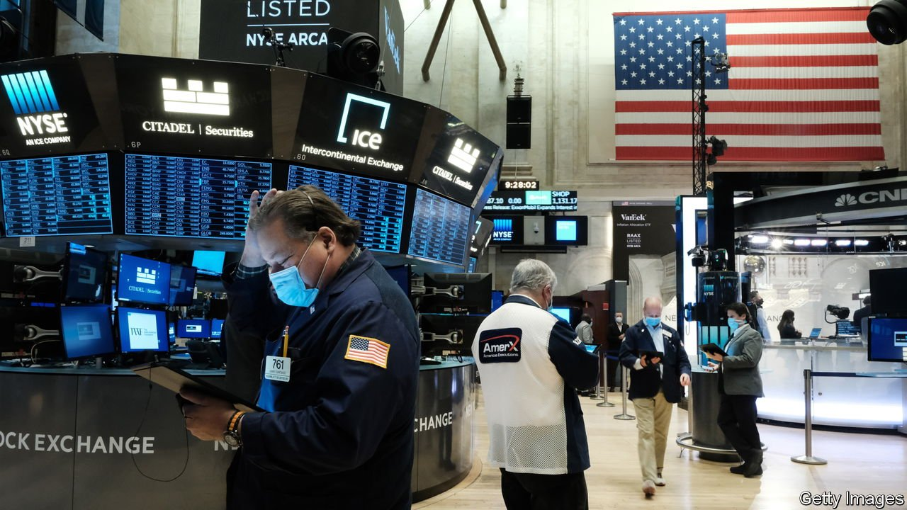
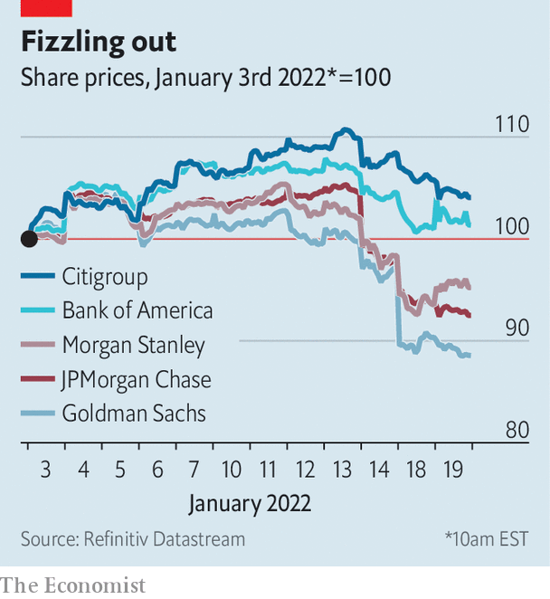

###### Mixed messages

# Why bank stocks are tumbling even as interest rates climb 

##### Higher rates might crimp investment-bank profits 

 

> Jan 22nd 2022 

MUCH AS HIGHER milk prices are typically good news for dairy farmers, higher interest rates are meant to be good news for bankers. Conventional lenders make their money on the difference between the interest they pay out to depositors and the interest they earn on loans and investments. As rates rise, that gap widens. And as interest rates are set by central banks that only tend to raise them when the economy is strong—when jobs are plentiful, spending is high and inflation is climbing—rising rates typically also imply that borrowers will be well placed to repay their debts.

Treasury yields and interest-rate expectations in America have marched higher since the middle of December, when the Federal Reserve announced it would accelerate plans to taper its asset purchases. The yield on ten-year Treasuries climbed to 1.9% on January 18th, its highest level in two years. As recently as October investors expected just a solitary interest-rate increase from the Fed in 2022. But they have rapidly revised expectations as consumer-price inflation has surged, pencilling in between four and five rate rises over the course of the year.


So when six of America’s largest banks—Bank of America, Citigroup, Goldman Sachs, JPMorgan Chase, Morgan Stanley and Wells Fargo—reported earnings for the final quarter of 2021 between January 14th and 19th, their executives merrily offered guidance of greater interest income to come. Jamie Dimon, the boss of JPMorgan, thought that market expectations of interest-rate rises could even be too conservative. “My view is that there is a pretty good chance there will be more than four,” he said on an earnings call on January 14th. “It could be six or seven.”

 


Yet, surprisingly, the lenders’ stock prices have tumbled (see chart). Shares in JPMorgan have fallen by nearly 12% since the bank reported its earnings. Goldman’s shares dropped by 7% in a single day on January 18th, after it released its earnings. What resolves this seeming paradox?

The first potential explanation is costs, and climbing wage bills in particular. Compensation costs at Goldman in 2021 jumped by 33%, year on year, to $17.7bn, an increase of $4.4bn. Citi’s wage bill spiked by 33% in the fourth quarter, compared with a year earlier, and compensation expenses rose by 14% at JPMorgan and 10% at Bank of America over the same period.

Higher wage costs in part reflect booming business: Goldman’s profits for 2021 as a whole were more than 60% above their previous all-time high. But dearer compensation adds to growing unease about how pervasively inflation has taken root in America. “There is real wage inflation everywhere in the economy,” David Solomon, Goldman’s boss, told investors on the bank’s earnings call.

An alternative explanation for the share-price fall is that investors are fearful that higher rates are not unequivocally good news for America’s banks. The flood of cheap money pumped by the Fed into financial markets in 2020 and 2021 helped asset prices reach dizzying new heights. Goldman made $22bn from trading in 2021, the most since 2008.

Easy money also helped fuel a bonanza in company-financing activity. The pace of dealmaking and initial public offerings (IPOs) has been almost bewildering. Global IPOs raised the mammoth sum of $600bn in capital in 2021, compared with around $200bn in 2019. Trading and corporate finance have together generated extraordinary profits for Wall Street firms. Global investment-banking revenues amounted to $129bn in 2021, a 40% increase over those of the year before, according to Dealogic, a data provider.

But now, as inflation hots up and monetary policy shifts, the period of bumper profits that banks enjoyed since the middle of 2020 may be coming to an end. A look at the profits for the final three months of 2021 suggests that the slowdown may have already begun. Trading revenues dropped by 11% at JPMorgan, compared with the same period a year earlier (although revenues were still 6% above their level in 2019).

Considering that bank bosses have been warning for months that trading and dealmaking revenues would eventually return to pre-pandemic levels, their imminent normalisation should, perhaps, have not come as a surprise to investors. The fact that share prices have fallen, then, could hint at a lurking fear. The arrival of extraordinary stimulus prompted an unusual period of profitability for bankers. Perhaps punters are worried that the removal of such stimulus could prove unusually dismal. ■

For more expert analysis of the biggest stories in economics, business and markets, , our weekly newsletter.

