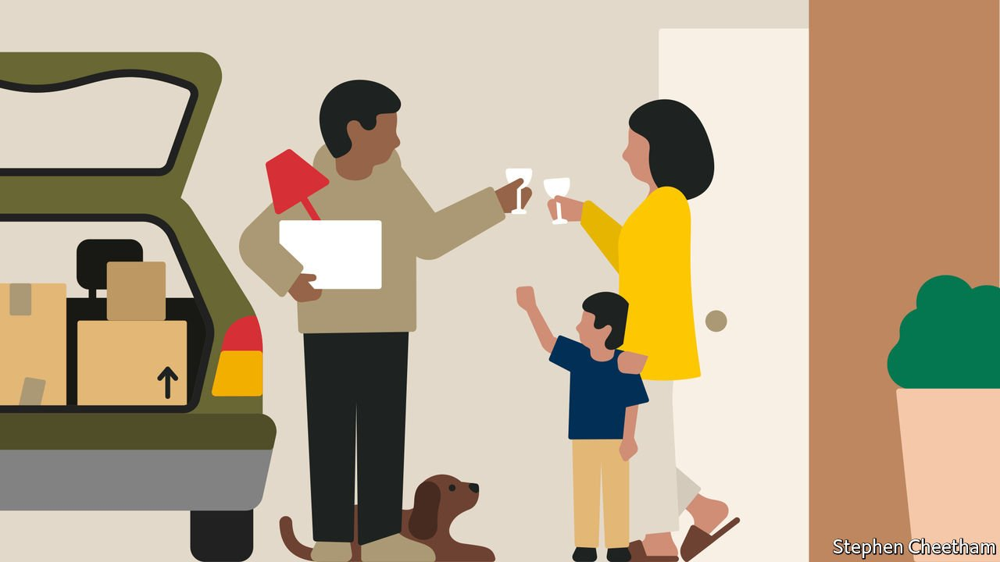
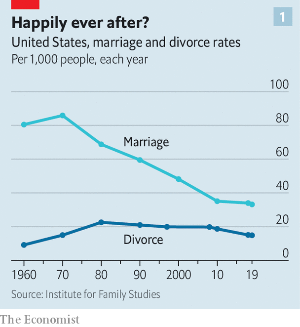

###### Breaking up is easier to do

# Divorce in the rich world is getting less nasty 

##### Reforms are making it cheaper, quicker and a bit less adversarial 

 

> Jan 22nd 2022 

SCOTT AND his then wife, who live in Australia, had a vile but not unusual divorce. Their lawyers, he said, “fired off affidavits and legal letters at each other” for eight months. Their children were put on a federal police watchlist so they could not be taken overseas. The couple reached an agreement before going to court but Scott still spent A$35,000 ($25,000) on legal fees. Had they gone to court, there would have been little money left to divide. It was “like playing a game of poker,” says Scott. “You never show your full hand.” The combatants were forced to be devious. Like so many divorces, it was bitter and costly.

Several years later, Scott and his ex began fighting again—over custody. This time it was less nasty. They used a government-funded mediation service. Mediators and counsellors provided a neutral setting, suggesting ways to soften the arguments. “It may sound cheesy, but the mediators really did just give me a lot of positive and practical advice,” says Scott. He stopped aggressively using the word “you” when bickering and learned how not to provoke defensive responses. The mediation cost a few hundred dollars. When a close friend decided to get divorced, Scott advised him to go straight to a mediator to save time, money and anger.


No one pretends that divorce is ever sure to be amicable. But in the rich world it is gradually being treated more as a relationship problem, less as a legal one. Alternatives to adversarial court battles are becoming more common. Fewer countries require blame to be apportioned. All this makes the process a little less ghastly, for couples and their children.

Last year the government in England and Wales (Scotland and Northern Ireland have separate jurisdictions for family affairs) handed out £500 vouchers (worth $683) to subsidise mediation in divorce. In April this year couples in England and Wales will be able speedily to untie the knot without assigning blame and without having to live apart for at least two years or five years (depending on whether both halves of the couple agree to split). Previously one spouse had to accuse the other of unreasonable behaviour, adultery or desertion. In 2019, 54% of English and Welsh divorces were granted on the grounds of adultery or unreasonable behaviour.

Sweden got rid of the need to blame one spouse in 1915. Australia ditched it in 1975. In 1969 California became the first American state to do so, New York the last, in 2010. The trend is proceeding elsewhere. In “no-fault” jurisdictions the state does not need to know why a marriage is ending, though many countries still require a cooling-off period before the break is formally complete. In many jurisdictions that have waived fault, couples can file for divorce together. “Psychologically, that’s huge,” says Samantha Woodham, a British barrister. Ending the blame game means couples start their divorce in a less rancorous way.

Since 1990, divorce has become easier in at least 30 of the 38 members of the OECD, a club of rich countries. Alternatives to litigation are spreading. In mediation couples seek an agreement with the help of a neutral referee. In Norway and Australia most divorcing couples with children must at least try it. In England they must listen to information about mediation, unless violence has occurred. The Dutch seek mediation without recourse to a court in 41% of divorces.

“Collaborative divorce” is another option. Each partner has his or her own lawyer. But the couple sign an agreement that they will not go to court. Should they fail to reach a deal, they must find new lawyers. This creates an incentive to settle. At least 20,000 lawyers have been trained to help divorcing couples this way, says the American Bar Association.

Australia has won plaudits for trying to make divorce less bitter. In 2006 its federal government began funding “family relationship centres”, mostly run by charities, offering free and cheap mediation. They help families adjust to their new lives. Parents take classes on how divorce can affect their children. Clueless fathers have even been offered cooking lessons. The centres began as an alternative to the legal route. Ireland and some Canadian provinces also offer free or cheap mediation.

Businesses are getting in on the act. DivorceHotel, a firm from the Netherlands with branches in America and elsewhere, offers a “concept based on mediation to ensure a professional, fast and affordable way of divorcing...We see your separation not just as the end of your marriage, but also as the beginning of a new phase in your life.” Couples stay (in separate rooms) at a luxurious hotel where mediation lasts over a weekend; you can have a massage or game of golf between sessions.

Another firm, It’s Over Easy, offers divorcing American couples online legal advice on filling out forms, co-parenting, and changing surnames. Some law firms are marketing themselves as advisers to both halves of divorcing couples, not just to one battling spouse. This has been practised in France, Italy and the Netherlands and is spreading to England.

I bet you’re hiding it

In an adversarial system, lawyers spend much time and energy sussing out “what’s in the pot,” with each side frequently disputing the answer. Such rows tend to be less ferocious when the couple gets the same advice from a single law firm. The parting couple are more likely to honour terms they have both voluntarily agreed to, rather than ones ordered by a judge.

Five years after Australia set up family relationship centres, the number of dispute cases linked to children in courts had dipped by 32%. When the centres were created, 32% of those getting separated and involved with children had a “conflictual or fearful relationship” with their ex. Three years later that had fallen to 15%.

Collaborative approaches save money, too. Therapists and mediators tend to be cheaper than lawyers. Paying one legal team instead of two plainly slashes costs. In an adversarial divorce, lawyers usually charge hourly rates, which creates an incentive to drag the battle out. So the process is getting quicker. Many of the non-adversarial systems have fixed prices.

Even when the division of money is the most contested issue, as it often is with the rich or childless, progress towards less bitter outcomes is being made. In the 1960s alimony was awarded in roughly a quarter of American divorces. It has since dropped to around 10%. Between the mid-1990s and mid-2000s, alimony in Switzerland fell from roughly one-half of cases to one-third. In Germany and several American states the length of time it is awarded can be limited; once an ex-husband has shelled out for, say, seven years, his obligation is over. In England spousal maintenance can be awarded indefinitely, but that is becoming rarer, too. In the Nordic countries hardly anyone pays alimony—the default assumption, rooted in high levels of equality between the sexes, is that both parties are capable of supporting themselves. Judges across the West are getting keener on clean breaks.

Attitudes are shifting throughout the rich world. Big-scale divorce litigation, says Ms Woodham, is “becoming a bit embarrassing”. Celebrities tout the benefits of “consciously uncoupling”. More divorced families are “birdnesting”: the children live full-time in one home, while their parents flit back and forth, like birds taking turns to watch their eggs. The parents may even jointly own a flat, where the off-duty one can reside. A British survey by Co-Op Legal Services found that 11% of divorced or separated British couples have tried to birdnest. “Splitting up Together”, an American sitcom based on a Danish one, depicts a family trying to make it work.

Divorced fathers are spending more time with their children. In Sweden in the mid-1980s only 1% of children with separated parents regularly lived with both; usually they stayed with the mother. Now around 40% do. Other rich countries are witnessing the same trend. Fathers are getting custody more often than before. Some interior-design firms now specialise in decorating their homes. Children who spend at least 35% of their time with each parent after divorce tend to do better emotionally, finds Linda Nielsen of Wake Forest University in North Carolina.

Laws in Australia, Sweden and some American states require judges to consider splitting custody time more or less down the middle. That too marks a cultural shift: more mothers work outside the home and more fathers are involved in their children’s upbringing. Shared custody can be hard, though. Buying two sets of everything is expensive. Parents must find jobs in the same city. Those who make it work are typically richer and better educated.

The misery of winner-takes-all

In Japan, where divorce is far rarer than in Europe and America, many people think shared custody is disruptive for children. Courts don’t award it, though families may privately agree to it. Many divorced fathers are allowed to see their children for only three hours a month. Kizuna Child-Parent Reunion, an advocacy group, estimates that 58% of Japanese children with divorced parents lose contact with the one they are not living with. This winner-take-all system leads to furious divorce battles.

In Scandinavia there are fewer battles over money between divorcing couples. In Sweden the rules over assets are so clear that few couples fight over them: they are divided equally. Courts assess child maintenance, with a monthly minimum of around $185. Shared parenting is the norm. Lawyers are rarely involved.

 


The divorce rate in most rich countries has dipped or stayed about the same since 1990 because fewer people are getting married in the first place (see chart 1). In the EU 18% of babies born in 1993 were out of wedlock. By 2019 that had risen to 43% (see chart 2). The Scandinavian figure is 53%. But arrangements for children whose parents’ non-marital partnerships fail are getting more co-operative, too.

 


Across the world, divorce still involves copious tears, regrets and vituperation. But the removal of the judicial allocation of blame and the trend towards speedier, cheaper and less adversarial ways of ending marriage are surely lightening the burden of unhappiness, especially on children caught in the middle. ■

