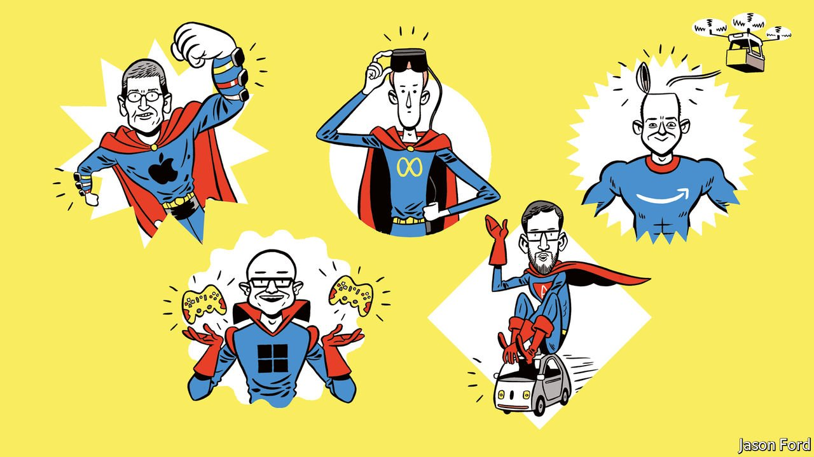

###### The future of technology

# Big tech’s supersized ambitions 

##### From metaverses to quantum computing 

 

> Jan 22nd 2022 

IS THERE ANY limit to the ambition and hubris of big tech firms? In October Mark Zuckerberg renamed Facebook Meta and described humankind’s new future in virtual worlds. On January 18th Microsoft, worth more than $2trn, decided it wasn’t big enough and bid $69bn for Activision Blizzard, a video-games firm, in its biggest-ever deal. These decisions are part of a vast new investment surge at five of America’s biggest firms, Alphabet, Amazon, Apple, Meta and Microsoft—call them MAAMA. Together, they have invested $280bn in the past year, equivalent to 9% of American business investment, up from 4% five years ago.

Big tech wants to find the next big opportunity, and  of deals, patents, recruitment and other yardsticks shows that cash is flowing into everything from driverless cars to quantum computing. The shift reflects a fear that the lucrative fiefs of the 2010s are losing relevance, and the fact that tech’s titans are increasingly moving onto each other’s patches (the share of sales that overlap has doubled since 2015 to 40%). So they are all looking to swoop into new territory.


They also have an eye on the history of technology, which is littered with once-dominant firms that were brought down not by regulators, but by missing the next big thing. Fairchild Semiconductor ruled in the 1950s but now exists only in books. In 1983 IBM was America’s most profitable firm but eight years later was loss-making after botching the move from mainframes to PCs. Nokia, once seemingly invincible in mobile devices, fumbled the shift to smartphones. The MAAMAs spent the 2010s fortifying commanding positions, in business tools for Microsoft, e-commerce for Amazon, social media for Meta, and so on. The pandemic has boosted demand, from bored couch-surfers to startups in need of cloud computing. Apple and Alphabet are now larger than were US Steel and Standard Oil, the two mighty monopolies of the 1900s, measured by profits relative to domestic GDP. Yet past performance is not indicative of future results, and now all of them are limbering up for whatever comes next.

The problem is that nobody knows what it will be. But it will probably involve new physical devices that will supersede the smartphone as the dominant means of connecting people to information and services. Whoever makes such devices will therefore control access to users. This explains why Apple is planning a virtual-reality headset to compete with Meta’s Oculus range and Microsoft’s HoloLens. Alphabet, Apple and Amazon have also all placed expensive bets on autonomous cars. And vast sums are being spent on designing specialised chips, and pursuing new approaches like quantum computing, to provide the processing power for whatever new devices emerge.

The MAAMAs’ other priority is creating software platforms that will allow them to extract rents, by drawing in users, and then relying on network effects to draw in even more. Hence Facebook’s renaming and its $10bn annual spending on immersive online worlds, known as the metaverse. Apple has been expanding the walled garden of services it provides to users of its devices, moving into areas such as fitness classes and television shows.  may help Microsoft provide a richer experience for its gaming customers, while Mesh, a platform for virtual 3D workplaces, is aimed at corporate users. The cloud-computing platforms operated by Alphabet, Amazon and Microsoft literally charge rent to host computing environments for other companies.

Governments, rivals and billions of customers, who already fear these firms are too powerful, may be alarmed by all this. One view is that the companies’ large customer bases, and control of pools of data with which to train artificial intelligence (AI), give them an insurmountable advantage. Won’t the giants use that to squash rivals? Yet all these new areas look competitive for the time being. Many other firms are in the metaverse race, for example. “Fortnite”, made by Epic Games, has more than 300m players worldwide, while Roblox has 47m gamers who spend 3bn hours a month on its platform. Nvidia, a chip firm, is moving into the space, too. Even Microsoft’s Activision deal would raise its market share in gaming to only 10-15%—hardly a monopoly. In autonomous cars, big tech must contend with the likes of Tesla, GM and Volkswagen. Global startups raised $621bn of venture funding in 2021, far more than big tech . And new rivals have emerged with unexpected speed in some areas, such as TikTok in social media.

Moreover, there is an outside chance that the new terrain will prove less prone to domination by centralised platforms. Deep-learning technology, the dominant form of AI today, relies on large amounts of data, but future forms of AI may not. Then there are the decentralised blockchain services owned and operated by users, loosely known as Web3. At the moment these have clunky interfaces, use up lots of energy and are not always as decentralised as they seem. But in one area—decentralised finance, or DeFi—rapid improvements are already .

Nonetheless, the temptation is for regulators to clamp down pre-emptively. In 2020 Lina Khan, who is now America’s top antitrust official, recommended that big tech firms be banned from expanding into adjacent areas. Some big antitrust cases may reach America’s courts by 2023. And Europe may soon pass a sweeping Digital Markets Act, aimed at regulating big technology companies “ex ante”—that is, constraining such firms’ behaviour upfront, rather than punishing them later with antitrust cases (Margrethe Vestager, the EU’s competition tsar, explains all on our “” podcast).

Yet a lighter touch is the best policy. Investment in tech is linked to rising productivity, and the share of cashflows the tech giants are reinvesting has almost doubled since a decade ago. Trustbusters will struggle to predict the technologies of tomorrow. What they can do is block firms from doing deals that give them a monopoly position in new markets today. That is not yet a danger. Indeed, history suggests that tech giants are most often brought down by failing to master emerging technologies. If today’s giants want to spend billions trying to move into new areas to avoid that fate, so far there is no reason to stop them. ■

