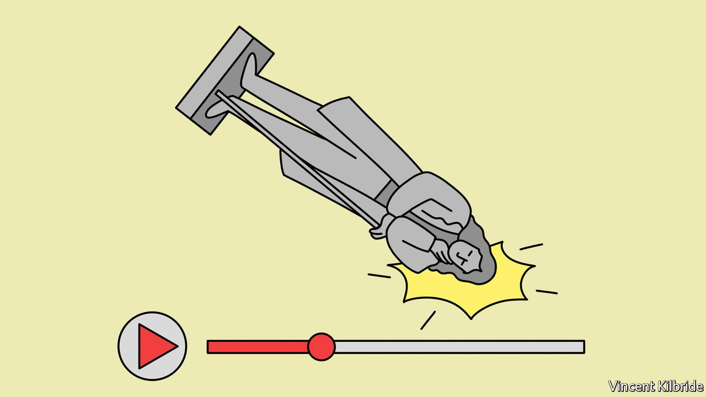

###### The triumph of culture

# Introducing our new Culture section 

##### As politics and culture blur, our coverage is evolving 

 

> Jan 22nd 2022 

THEY TORE down the statue and rolled it into Bristol harbour, and none of them denied it. Yet this month a jury in England acquitted four people over the toppling of a likeness of Edward Colston, an English philanthropist and leading slave-trader who died in 1721. Part of the case for the defence was unusual for a courtroom, and revealing of the intellectual mood in Britain and beyond. The real offence, said the accused, was that the monument to such a monster was still standing. Facing criminal charges, they made an argument about art, and about history.

In an era of rising nationalism and seething partisanship, some borders—including those between countries and political camps—can seem to be hardening. But others are blurring, such as between politics and culture, statecraft and stagecraft. When the news vies for attention with entertainment, and is relished as meme and soap opera, entertainers have a political edge—and from France to Ukraine, television personalities have exploited it. Poets may no longer be the unacknowledged legislators of the world, but activist sports stars and outspoken children’s authors have a pretty big say.


The substance of public debate has evolved with the personnel, not least in the erosion of another distinction, between the present and the past. Witness the saga of Colston, who splashed back into the news 300 years after his death. A decade ago, the idea that Conservative ministers might lambast the National Trust, staid steward of English country houses—as they have over its interest in slavery and colonialism—would have seemed outlandish. (So, to American voters, would one run for the White House by the star of “The Apprentice”, let alone two.) Whoever controls the past may indeed control the future, but from the streets of post-imperial Britain to the school boards of America, they have a fight on their hands first.

Disputes over whose history is told, how and by whom, in part reflect a struggle over claims on power and virtue today. Adherents of “cancel culture”, that dismal oxymoron, believe some people, living and dead, are too discredited to be heard at all. In these rolling culture wars, The Economist has no fixed side. But neither are we neutral. Our liberal principles suggest that controversial voices should generally be audible—and that some statues should come down.

Keen-eyed readers of our contents page will notice a small token of this shift in the intellectual climate. Our Books &amp; Arts section has been renamed Culture and enlarged: two signs of the breadth of subjects it aims to cover. We will still review books and write about artists. But, even more than before, we will trace trends and draw out connections across the arts and beyond (including in , our new culture column).

Culture’s role in politics is not the only way it has become more salient. During lockdown, stories on the page and screen have offered vicarious adventures, and a sense of solidarity in adversity, to people across the world. Even as theatres and galleries closed, the technology of culture has developed to match this craving. If covid-19 has coloured the experience of the arts, meanwhile, in time the reverse will also be true: writers and artists will shape how the pandemic is understood and remembered, and we will be watching.

Our Culture section will try to sate another sort of appetite and crumble one final distinction. Cuisine embodies customs and change and is a vital aspect of culture—as our regular feature, World in a dish, will explore. As  morsel shows, food can be a solace even in bleak times, as can a newspaper. Or, as Herman Melville put it in “Moby Dick”: “If you can get nothing better out of the world, get a good dinner out of it.” ■

