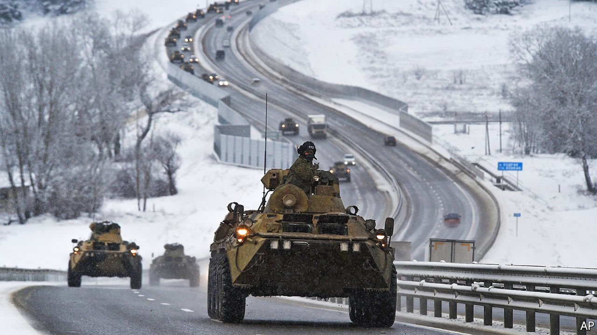

###### Vlad the invader

# Momentum is building for war in Ukraine 

##### Vladimir Putin is courting disaster for Russia’s neighbour—and himself 

 

> Jan 22nd 2022 

THE FIRST WORLD WAR became inevitable once mobilisation orders had been issued in Berlin, argued A.J.P. Taylor, a British historian. The complexities of early-20th-century railway timetables, upon which troop movements then depended, made any alteration virtually impossible. Modern armies do not suffer the same constraints. But as Russia sends more and more units to Ukraine’s borders, a grim momentum is building.

Last week’s diplomacy yielded nothing. Some of Vladimir Putin’s demands are impossible for NATO to accept, as he well knew. (Essentially, he wants NATO never to admit new members, and to remove its forces from any country Russia threatens.) On  President Joe Biden said that he expects Russia to “move in” on Ukraine.


On January 14th hackers sabotaged Ukrainian government websites, getting them to display a poster of the Ukrainian flag and map crossed out, and warning Ukrainians to “be afraid and expect worse”. Over 100,000 Russian troops are massed on Ukraine’s eastern border, with field hospitals and fuel dumps. “Battalion tactical groups” have arrived in Belarus, a Kremlin client state north of Ukraine, in apparent preparation for a two-front attack that would divide Ukrainian forces and menace the capital, Kyiv. Only a trigger is lacking, and America says it has evidence that a “false flag” operation is planned to allow Russia to claim its men had been attacked by Ukraine. The odds of war seem perilously high.

Yet it is not inevitable. The view from a satellite looking down on Russia’s tanks and guns is certainly alarming; the view presented to Russians on their television screens is anything but. The possibility of war is barely mentioned. This matters, because if Mr Putin is determined to invade Ukraine again, you would expect him to prepare the Russian public with a blaze of propaganda, as he did before annexing Crimea in 2014. That he has not suggests, perhaps, that he has yet to make up his mind.

No one knows how Mr Putin assesses the risks and possible rewards of making war. But here are some things he should consider. First, if he invades Ukraine, it will hurt Russia economically. America and the EU have prepared a long list of financial and trade sanctions. Russian living standards will fall further, despite the government’s hefty reserves to cushion the blow.

Second, Ukraine’s forces are more than capable of giving Mr Putin a bloody nose. They cannot stop Russia’s vastly superior forces from seizing a large portion of their territory, but they can make it a nightmare to hold it. Third, there is no support in Russia for a deadly war in Ukraine. For years, pollsters have found that most Russians prefer that their country and Ukraine would be friendly neighbours. Mr Putin’s popularity rating has been declining, like the rouble. A quixotic quest to restore the Russian empire will not revive it, especially if lots of Russians are killed. Even autocrats have to worry about the public turning against them. (Not to mention the elite, whose lives could be made uncomfortable by more sanctions.) A war that goes wrong could cost Mr Putin his grip on power—and all that goes with it. It would be a reckless gamble.

The West has no foolproof way to deter him from taking it. But it should try. America’s secretary of state is due to meet his Russian counterpart on January 21st. He should offer to continue talks on topics where agreement is possible, such as missile deployments and limits on military exercises. He should rally the EU and NATO to present a united front against Russian aggression. And he should search for a face-saving way for Mr Putin to back down (while no doubt claiming victory on Russian news bulletins). War can yet be avoided, but time is running out. ■

