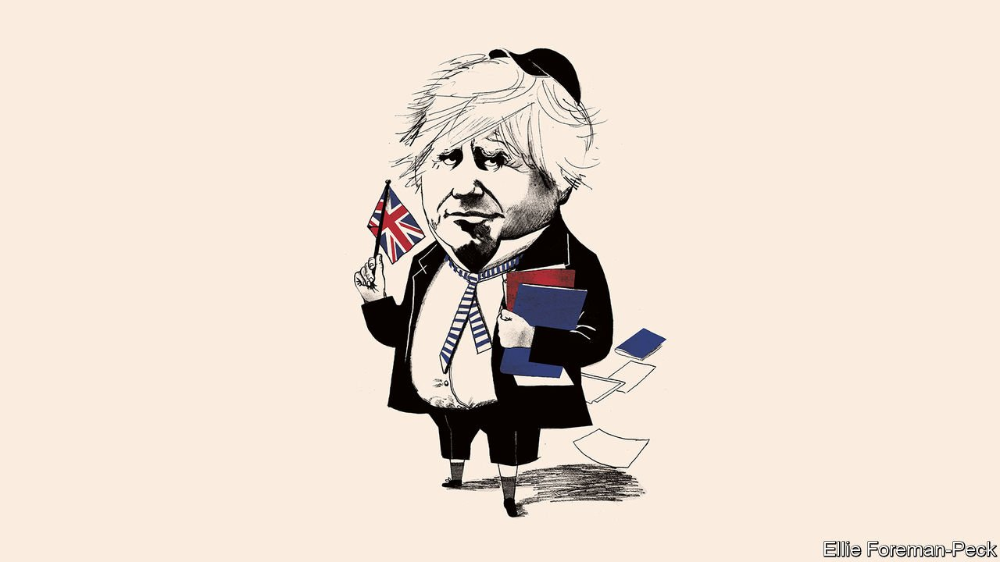

###### British politics

# The parable of Boris Johnson 

##### And what it says about Britain 

 

> Jan 22nd 2022 

IN EARLY SEPTEMBER Boris Johnson set out his vision for beating Margaret Thatcher’s 11-year record, and so to become the longest-serving British prime minister of modern times. Like a bumptious schoolboy, he got far ahead of himself. In the coming days or weeks, he may be kicked out of office by his own MPs. More likely,  in 10 Downing Street under the permanent threat of eviction. Either way, he no longer controls the fate of his own premiership.

The immediate cause of Mr Johnson’s diminishment is, on the face of it, laughably puerile. Downing Street indulged in routine late-night booze-ups while the rest of the country was under strict lockdown. The prime minister’s disingenuous attempts to wriggle out of being blamed did him no good—indeed, they served only to reveal his and his wife’s own carousing.


Tory MPs will measure the lapse in judgment of a serial transgressor against an 87-seat working majority that Mr Johnson conjured out of nothing, his success in bringing about Brexit, a world-class vaccine programme and a gift for making the political weather. Donald Trump still dominates the Republican Party, despite his part in the attack on Congress a year ago. Are sausage rolls and sauvignon blanc really a sacking offence?

For Britain’s sake, they should be. One reason is that the relentless partying is evidence of Mr Johnson’s sense of entitlement, which holds that there is one rule for him and his people and another for everyone else. Double standards at the top tend to corrupt the whole of public life. More important, it raises two other of Mr Johnson’s attributes that plague post-Brexit Britain. They are traits the country needs to overcome if it is to thrive.

The first is Mr Johnson’s childish lack of seriousness about the business of government. Downing Street’s fightback this week, supposedly under the title “Operation Red Meat”, launched a fusillade of Tory-pleasing pledges to abolish the BBC licence fee and stop asylum-seekers from reaching Britain across the English Channel. The government says it will get the Royal Navy to police the seas and send applicants away, reportedly to be processed in Ghana or Rwanda. None of that bluster survived the briefest encounter with reality.

This lack of seriousness has infected the government. This week the Tories took credit for the fact that Britain has the fastest annual growth rate in the G7 and that output regained its pre-pandemic level in November, ahead of forecasts. But they have not grappled with Brexit’s probable long-term hit to productivity, of about 4%. Over five years, Britain’s growth rate has been poor. Inflation, which reached 5.4% in the 12 months to December, a 30-year high, means real average weekly pay is less than in 2007. Business investment is lower than before the referendum.

Mr Johnson’s government has unveiled plenty of big economy-boosting ideas, including levelling up prosperity across Britain, tearing down planning restrictions and making Britain a science superpower. But the government is more interested in fanfare than fulfilment. The big ideas are either still slogans or have been quietly abandoned. At the same time, the Tories have pressed ahead with crowd-pleasing, illiberal bills that trample civil liberties and restrict the rights of new citizens. It is a mark of Mr Johnson’s unseriousness that he tosses aside his vaunted classical liberal beliefs as carelessly as an empty bottle.

You can trace this trivialisation of the business of governing right back to the referendum. To get Brexit done, Mr Johnson agreed on a customs border in the Irish Sea and then proceeded to pretend he hadn’t. He argued that Britain would escape the regulatory straitjacket of the European Union, but he has avoided doing much deregulating—which, however swashbuckling it sounds in a headline, tends in real life to be unpopular. To prosper, Britain needs decent relations with the EU, its closest neighbour and biggest trading partner. But Mr Johnson relishes picking fights instead, because he likes to play to the gallery.

Treating voters as dopes to be bought off with bombast is a feature of the demagoguery that Mr Johnson rode to power. It is an example of the contempt with which populist leaders treat the people they govern. So, alas, is the other trait that has infected post-Brexit Britain: lying in politics.

Mr Johnson has crumbled because he repeatedly failed to tell the truth to Parliament and the nation about Downing Street’s bacchanals. First he declared that his staff did not hold parties. When that was disproved, he denied knowing about them. When it emerged that he had been at one, he said he had not realised they counted as parties. And when it was claimed that he had been warned they did, he seemed to suggest that he misunderstood the rules his own government had drafted. It is a pattern that stretches back to his time as a journalist, when he lied to his editors; to when he was an editor, when he lied to his proprietor; and to when he was a shadow minister, when he lied to his party’s leader.

The untruths go beyond one self-absorbed man. Where populism thrives, it subordinates the facts to tribalism. That may be why, according to polling by Opinium released on January 17th, almost half of Conservative Party members still believe that Mr Johnson’s account of Number 10’s revels is true, compared with just 13% of all voters in a poll published a few days earlier. Again, you can trace the pattern to Brexit, when campaigners who knew better said that Turkey was about to join the EU, that the EU had more to lose from a breakdown in trade than Britain did and that leaving would free up £350m ($480m) a week to spend on the National Health Service. It is no accident that, after the vote, Remainers’ advice was rejected just because of who they were.

Democratic politics has always been about pleasing the crowd, as well as plugging away at policies. Brexiteers were right to sense that a run of technocratic British governments had lost touch with voters. But the excesses of Partygate have shown that the post-Brexit Tory party has lost touch with reality.

It is a strength of the parliamentary system that MPs can bring about a rapid change of direction. If the Conservative Party is to find its way, it will need a . If reforms are to take root, they will need detailed planning and sustained application. If Britain is to make the most of the opportunities presented by Brexit, it needs to face up to the difficult choices ahead. ■

Dig deeper

 (Jan 22nd) (Jan 22nd) (Jan 19th) (Jan 15th)

