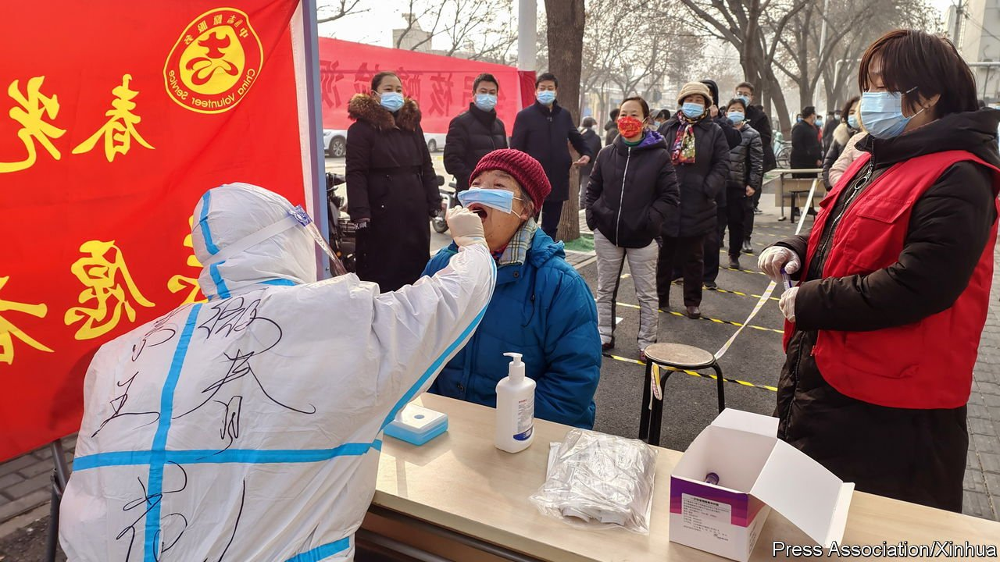
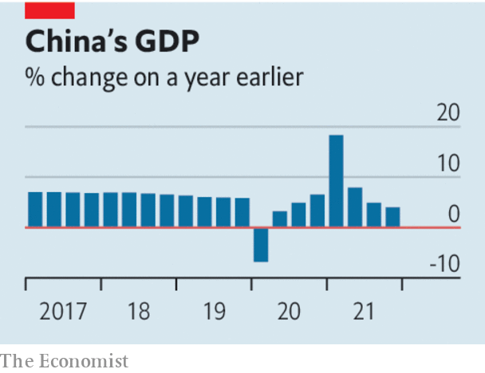

###### Pragmatism over pride

# The rising cost of China’s property and pandemic curbs 

##### It needs to recalibrate both 

 

> Jan 22nd 2022 

NOT LONG ago China stood out for its economic resilience in the face of the pandemic. Today it is a $17.7trn source of vulnerability in the world economy. A sharp slowdown in its most important sector, property, caused in part by a clampdown on financial excess, threatens growth. So does its zero-tolerance approach to covid-19, which requires doing whatever it takes to extinguish outbreaks. The spread of the Omicron variant, which was reported in Beijing for the first time on January 15th, makes that strategy ever harder and costlier to sustain.

Neither property woes nor the pandemic stopped the economy growing by more than 8% in 2021, according to  released this week. Exports boomed as rich-world consumers, encouraged by stimulus, binged on goods. In dollar terms GDP exceeded even pre-pandemic forecasts, thanks to a stronger yuan. Yet China cannot repeat the trick in 2022; it must confront its problems.


So far it is getting the macroeconomic policy response broadly right. A tough set of policies designed to clamp down on dangerous property excesses has been moderated, to avoid inadvertently causing a crisis. Its strict limits on borrowing pushed overextended developers—most notably Evergrande—into default. This spread unease among homebuyers, who worried that flats they had bought in advance might never be built. Recently, the government’s rhetoric has become less hawkish, mortgages have become slightly cheaper and some cities have made it easier to purchase homes.

 


At the same time Beijing has taken steps to revive the broader economy. It has sped up some of the “mega” public-investment projects outlined in its latest five-year plan and encouraged local governments to issue more infrastructure bonds. The central bank has also cut interest rates.

In contrast to its macroeconomic pragmatism, China remains zealously committed to its hardline approach to the pandemic. It celebrates its success as proof of its superior social model. That could prevent the fresh thinking it will need as the pandemic evolves. Even before Omicron arrived, the risks of a zero-covid strategy were clear. In December, after local officials in Xi’an, a central city of 13m people, failed to stop an outbreak of the Delta variant quickly enough, the entire city was placed in a lockdown so strict that it led to food shortages. Both Samsung and Micron, which make chips in the city, said output would be affected. China’s sporadic restrictions have also inhibited consumer spending: after inflation, retail sales shrank in December, compared with a year ago.

The Omicron variant will make zero-covid ever harder to sustain. There will be more cases. Each case will put a wider circle of people at risk. And infections may remain undetected for longer because more cases are mild or asymptomatic. Disruption, therefore, will become more frequent. Mass testing in the port city of Tianjin in response to an Omicron outbreak this month forced Toyota and Volkswagen to pause carmaking in the city.

China cannot ditch zero-covid overnight, but it ought to find a route out before the costs become extreme. It should abandon its vaccine nationalism and approve Western mRNA jabs that offer the most protection. It needs good antiviral drugs and to prepare a weak hospital system to cope with the wave of serious illness that will inevitably occur when a variant, even a milder one, eventually spreads through the population.

China’s approach to both property and the pandemic reflect its “campaign style” of governing, which rallies cadres to enforce slogans and pronouncements from the top. Such campaigns can develop an unfortunate momentum of their own. In recent weeks the government has woken up to the danger that its overzealous efforts to restrain the property market might sink the economy. It should now come to the same realisation about how it is fighting the pandemic. ■

