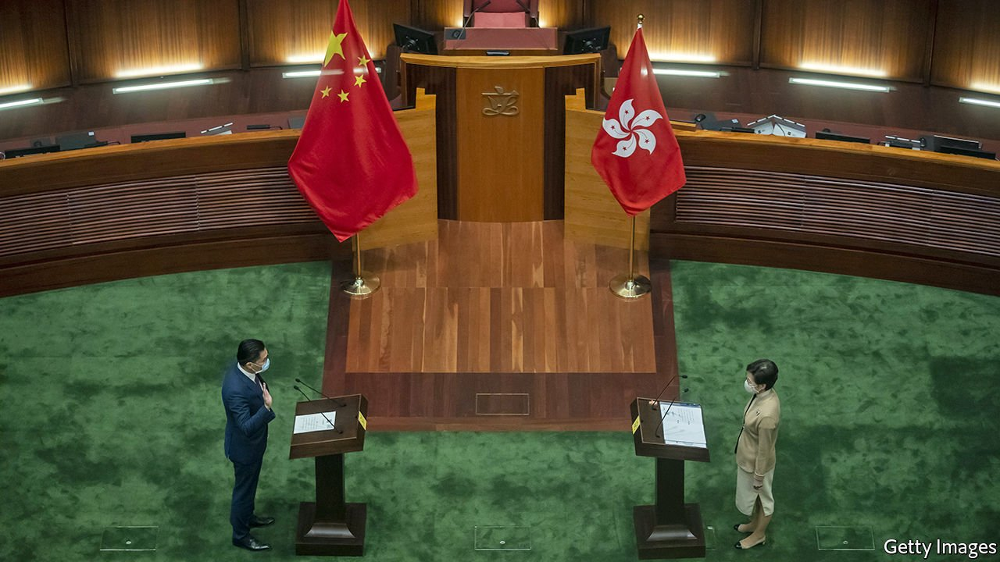
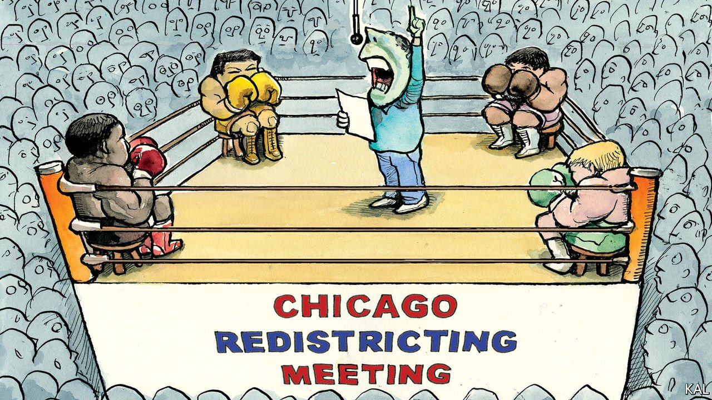
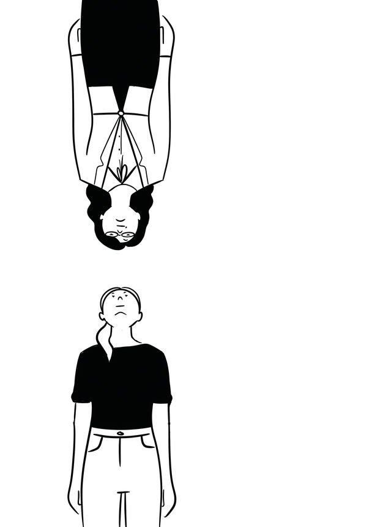
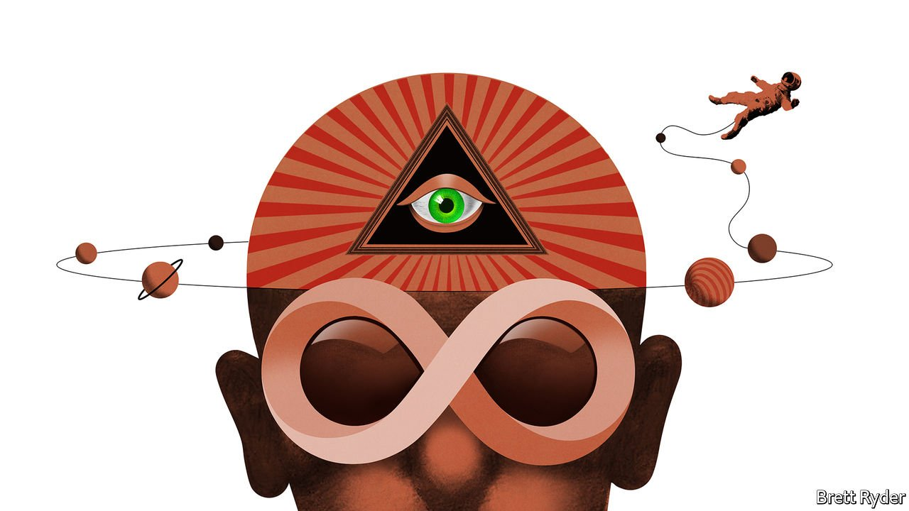

###### On Hong Kong, Chicago, voting reform, north-south divisions, the metaverse

# Letters to the editor 

##### A selection of correspondence 

 

> Jan 22nd 2022 


Elections in Hong Kong

I was appalled by your description of the swearing in of Hong Kong’s new legislature as “a mockery of democracy” (“”, January 8th). The Legislative Council election was open, honest and fair, returning 90 legislators from different political backgrounds. It was facilitated throughout in the same way that other elections have taken place in Hong Kong since its establishment as a special administrative region of China in 1997. All of the elected legislators are committed to act in the interests of Hong Kong and the country. No country, by its constitution or ethics, would allow treasonists, traitors, foreign agents or other forms of non-patriots to take part in its political system.


Your serious but baseless accusation that the polls were “rigged” is shameful. If anything was rigged it was the deliberately distorted image of Hong Kong that has been manipulated from the dark side of one’s personal internal bias. Voters were and will continue to be free to cast their ballots and make their own choices. There is legislation specifically in place to prevent anyone from rigging polls.

The right to vote, stand for election, and the freedoms of speech and of the press are enshrined in the Basic Law. The exercise of these rights, as covered in the provisions of the International Covenant on Civil and Political Rights applied to Hong Kong, is well protected, provided that it is done within the confines of the law, such as not endangering national security. Any legal actions taken by the Hong Kong police are strictly based on evidence and in full accordance with the law.

No country has a monopoly on democracy. The democratic development of Hong Kong has been well defined under the Basic Law; it will be progressive and accord with the actual situation of Hong Kong, in adherence to the principle of “One Country, Two Systems”. The violence and lawlessness in 2019, fuelled by foreign interference, threatened not just the personal safety and security of Hong Kong. It also threatened Hong Kong’s rule of law and judicial independence; judges were targeted for intimidation and courts damaged by petrol bombs. The National Security Law has swiftly and effectively restored stability and security.

JOHN K.C. LEE

Chief secretary for administration

Hong Kong Special Administrative Region

 


Political boundaries

captured the political challenges Chicago faces over political-ward maps, which should be a progressive and technical issue (January 1st). The Chicago Advisory Redistricting Coalition, an independent group, has developed a “people’s map”. Unlike the backroom gerrymandered maps drawn by the city’s council members, the people’s map is based on the input of residents across the city through commissions and transparent public hearings. It keeps neighbourhoods intact and in the same ward, strengthening the voice of communities. It also does away with the infamous “lobster ward” and other oddly shaped tracts. Adopting the people’s map would be a welcome progressive act in the Windy City, where politics blows hot and hard, even in frosty January.

TIM SMITHChicago

 


Honeycombing for votes

As someone who has tried to introduce the Penrose square-root method of voting to an association of associations, I was intrigued by the concept of quadratic voting (“”, December 18th). Experience, however, tells me that the system is likely to go the same way as that of Penrose because there is no simple way to explain it. Like the European Union and United Nations, the British Beekeepers Association looked at it and decided not to adopt it. We struggled to find any significant organisation that had. Elegantly worked examples, of which we produced several, can explain the benefits of these voting systems, but change requires those who disproportionately benefit from the existing arrangements to agree to a new system that waters down their votes. As the saying goes, turkeys never vote for Christmas.

MARTIN SMITH

Past president of the British Beekeepers Association

Stoneleigh, Warwickshire

 


Looking down their noses

“” (December 18th) looked at north-south antipathies around the world. The power of these stereotypes is impressive. One factor is the dichotomy that up=higher and down=lower. It may also reflect an unconsciously anthropomorphic view of the world, mapping the body onto the Earth. So the north represents the head and mind, whereas the south is associated with organs of procreation and elimination.

RICHARD WAUGAMAN

Clinical professor of psychiatry

Georgetown University

Washington,DC

The perceived distinctions between north and south goes beyond international differences, such as the euro zone’s frugal north versus its Club Med south, or even inter-regional ones, as in Belgium or Italy. It also applies within cities. In Chicago, for example, the North Side is seen as prosperous and safe in contrast to the South Side, so much so that a few years ago the French foreign ministry issued an advisory to French citizens visiting the city to avoid the latter. And when I lived in London years ago we rarely went south of the river, other than trips to Wimbledon and the National Theatre, as the attitude was that there was little worthwhile there.

ANIMESH GHOSHAL

Des Plaines, Illinois

Massachusetts definitely has this dynamic along the coast. Cape Ann is seen as serious, hard-working and no-nonsense, especially compared with Cape Cod, the quintessential tourist destination in New England. I also lived for a bit in California. In San Francisco I wasn't surprised to hear Los Angeles derided as a place of lazy layabouts. But in LA I was surprised at the contempt for people from San Diego. Angelenos thought it was they who lived in a hard-working city, whereas San Diego was the place for layabouts.

ALEX MASLOW

Boston

 


Virtual, not virtuous, reality

Arthur C. Clarke predicted the metaverse in “The City and the Stars” (, December 18th). The book describes an advanced but stagnant civilisation on Earth, where “sagas” provide “all that anyone could desire”:

They were the inevitable end product of that striving for realism which began when men started to reproduce moving images and to record sounds…In the sagas, the illusion was perfect because all the sense impressions involved were fed directly into the mind and any conflicting sensations were diverted. The entranced spectator was cut off from reality as long as the adventure lasted; it was as if he lived a dream yet believed he was awake.

Once folks figure out how to connect directly to the human neurostructure, rather than through our present crude access of eyes and ears, we might expect a portion of the population to disappear into the electronic pipe dreams of metaporn and metadrugs. O brave new world.

PETER TURCHI

Santa Fe, New Mexico

