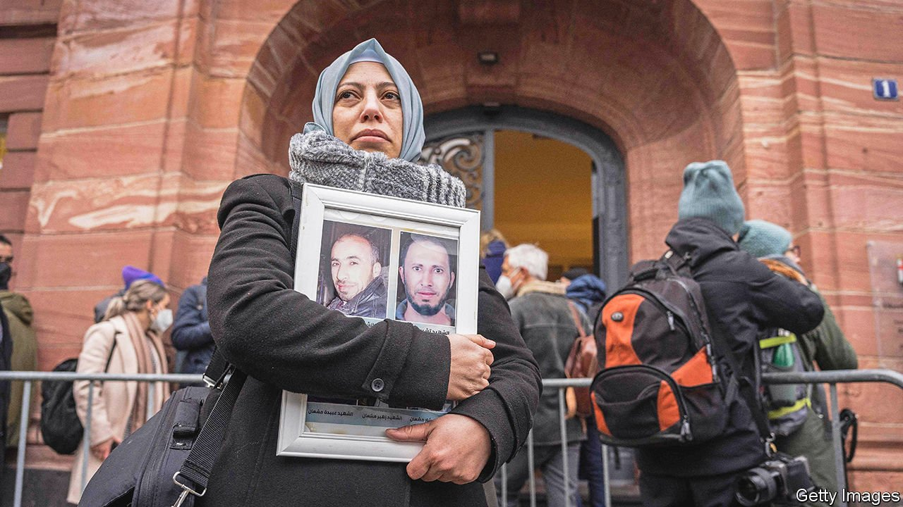

###### Torturers on trial

# Middle Eastern legal dramas play out in far-off courts 

##### Despots won’t prosecute their own henchmen. So victims seek justice abroad 

 

> Jan 22nd 2022 

IT WAS JUSTICE on a microscopic scale. On January 13th Anwar Raslan, a former Syrian intelligence officer, was sentenced to life in prison for crimes against humanity. The verdict followed more than 100 court sessions at which witnesses told of beatings, electrocutions and rapes in Branch 251, the prison Mr Raslan ran for two years. At least 27 detainees were killed and 4,000 tortured during his tenure.

Horrific as it was, the testimony covered one small corner of a sprawling security apparatus. Bashar al-Assad’s regime is responsible for numerous atrocities in a war that has killed perhaps 500,000 people and displaced more than half of Syria’s pre-war population of 22m. Yet Mr Raslan is the first official convicted for taking part (a low-ranking employee was jailed last year). The wheels of justice turn slowly.


They only turned at all because Mr Raslan was prosecuted in Germany. Courts in the Middle East tend to offer a mockery of justice. Mr Assad will not hold his own torturers to account. Nor do international efforts give much hope. The tribunal that investigated the assassination of Rafik Hariri, a former Lebanese prime minister, worked for 11 years to secure one middling conviction. A growing number of high-profile Middle Eastern cases are instead being heard in foreign courts, a trend that raises legal and diplomatic questions.

An obvious problem is catching alleged abusers. Mr Raslan had his day in court because he defected from Syria and was granted asylum in Germany. On January 19th a court in Frankfurt began hearing a similar case, that of a Syrian doctor accused of torturing injured detainees. He moved to Germany in 2015. But Mr Assad and his circle tend to avoid any jurisdiction that might hold them to account.

Even trying people in absentia can require co-operation from unco-operative governments. Take the case of Giulio Regeni, a student whose mutilated body was found in a ditch outside Cairo in 2016. He had been detained by Egyptian police, who are accused of subjecting him to days of torture. The authorities are suspected of organising a hasty cover-up, saying Mr Regeni was in fact abducted by a gang that preyed on foreigners. The gangsters were conveniently killed by police and are thus unavailable for questioning.

Unlike most victims of Egypt’s dictatorship, Mr Regeni was an Italian citizen. Urged on by his family, Italian prosecutors have charged four Egyptian officials with his murder. But a judge halted the trial in October, saying she had no proof the defendants were aware of the charges, and sent it back to preliminary hearings.

Politics are another complication. A Turkish court is trying 26 Saudis in absentia for the murder in 2018 of Jamal Khashoggi, a Saudi journalist butchered at the kingdom’s consulate in Istanbul. Recep Tayyip Erdogan, the Turkish president, was once enthusiastic about the case. But his enthusiasm has waned in recent months as he pursues a rapprochement with the Gulf states. He is expected to visit Saudi Arabia next month and meet Muhammad bin Salman, the crown prince, who is widely accused of having ordered Khashoggi’s murder (the prince denies this). The trial has now stalled, and is unlikely to resume until summer.

Prince Muhammad himself faces two lawsuits in America, one filed by Khashoggi’s widow, the other by Saad al-Jabri, a former Saudi intelligence official who accuses the prince of plotting his murder. Both invoked a 1991 law that allows American courts to hear civil suits against alleged foreign torturers.

Heads of state can assert sovereign immunity. That does not help Prince Muhammad, though: he is the de facto ruler but does not yet hold the top job. His lawyers have sought to shield him on other grounds, including “conduct-based immunity”, which protects officials acting in their official capacity. It sets up a curious paradox. Prince Muhammad has said that he did not order Khashoggi’s murder. To claim immunity he must argue that, if he did order whatever he denies ordering, he did so on behalf of the state.

Not every case is so dark. Depositors in Lebanon have found themselves largely locked out of their foreign-currency accounts since October 2019, when the country slipped into financial crisis. They have begun to sue Lebanese banks abroad to seek restitution. Banks insist they have no jurisdiction. In at least two cases, however, judges have ruled that European consumer-protection laws do grant standing to sue (though none of the claimants has yet recovered any money).

There is some hypocrisy to all of this, of course. Western courts tend to be less diligent about prosecuting their own citizens for crimes they commit in the Middle East and Africa. There have been no serious convictions over the CIA’s torture programme. Former President Donald Trump pardoned soldiers and contractors accused of wartime atrocities.

UN investigators say Erik Prince, the founder of Blackwater, a security firm, has repeatedly violated the arms embargo on Libya, sending guns and mercenaries to a warlord there. He has not been charged with anything and denies the claims. There is not total impunity in America, though. On January 13th the Justice Department announced that two Florida men who worked at a dive shop had been sentenced to jail time for trying to export rebreathers (a banned item) to Libya. The wheels of justice turn slowly indeed. ■

